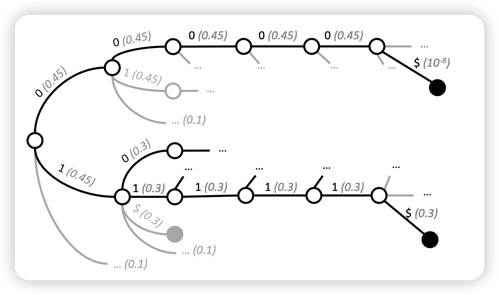

## [Grammar-Aligned Decoding](https://arxiv.org/pdf/2405.21047)

这篇论文探索了一个简单的问题：如何保证模型的解码符合某种特定的结构(比如json)。有一类方法会用一个类似自动机的方式每个token中屏蔽掉导致结构被破坏的candidate token。作者提到，自动机类的方案会破坏模型原来的distribution，进而使得生成的样本效果很差。作者提出了一种改进方案

> 这篇研究的问题其实就是之前我们想做的"tool learning"。其实还有些退化的可能性，比如一个语法我不能在任何时候判断，但如果我在n个token时可以判断前n-10个token是不是合法的，是不是也可以开发对应的算法呢？

