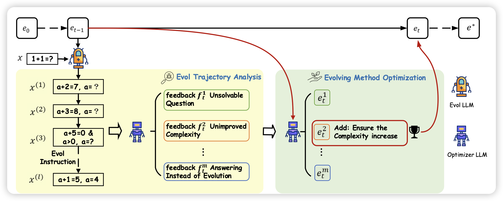
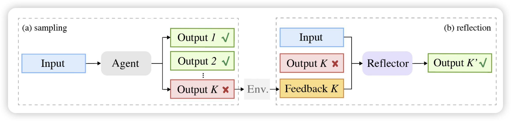
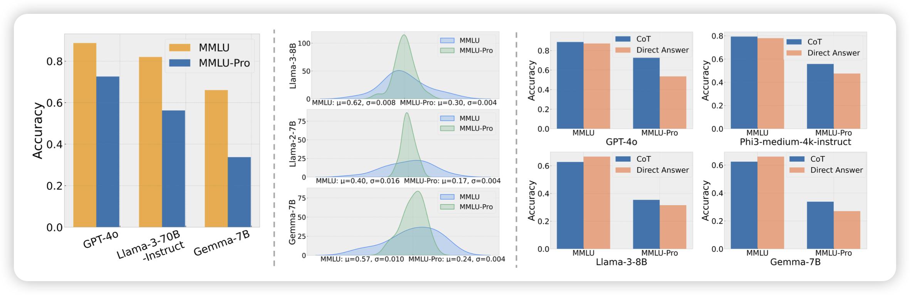

153篇……足足是昨天的两倍

## [Automatic Instruction Evolving for Large Language Models](https://arxiv.org/pdf/2406.00770)

Wizard团队的文章，作者提到之前的eval-instruct方法依赖人人工定义eval的方案，这不一定是最优的，因为人类也不能预期到下游的instruction具体长什么样子。作者希望设计一套“自动设计eval方法”的方法。他真干了，而且效果还行。

> 如果这个可行，再结合之前那个Mammoth2从预训练数据集里自己挖掘可行的q-a pair……是不是能搞出阿西莫夫那个递归工厂：自己挖掘q-a，再自己进化，甚至挖掘和进化的方法自己也在进化。
>
> 模型自己给人类世界找bug？

## [**Reflection-Reinforced Self-Training for Language Agents**](https://arxiv.org/pdf/2406.01495)

我挺喜欢的一篇论文，作者研究了经典的self-training(ReFT)：在问题集合上sample一堆样本，挑出来答案正确的，作为正样本训回模型参数里。作者发现这种方案依赖于生成出来的高质量样本，但实操上并不容易拿到。如果找到另一个模型把错误改对呢？作者发现这种方法可以生成更多好的样本，并且在各个下游任务上都比正常的ReFT好很多

> 感觉这个可以和之前那个R-Tuning组成双子星……

## [**MMLU-Pro: A More Robust and Challenging Multi-Task Language Understanding Benchmark**](https://arxiv.org/pdf/2406.01574)

挺好的一篇论文，作者发现MMLU现在已经被刷到接近90%，结果变得没那么可行。所以作者想搞一个新的，所以剔除掉了里面歧义的、和过于简单的问题，然后把选项从4个改成了10个，并且提升了对reasoning的依赖。希望以后能成为"下一个MMLU"

