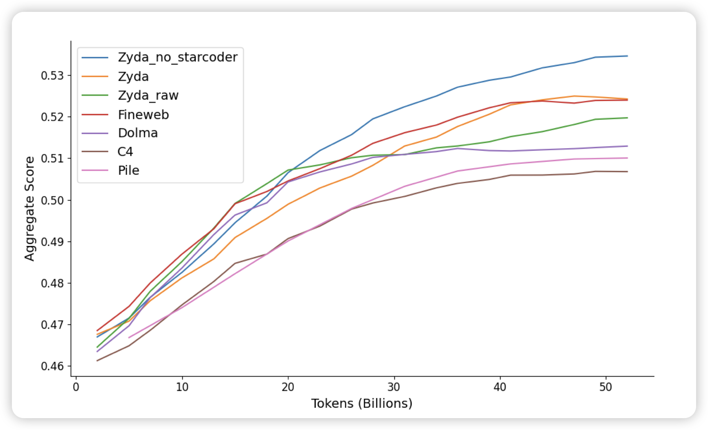
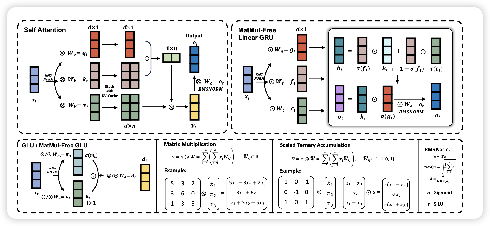

## [Zyda: A 1.3T Dataset for Open Language Modeling](https://arxiv.org/pdf/2406.01981)

一个开源的清洗后的预训练语料，如果大家关注了昨天huggingface那个 FineWeb-edu，这个的逻辑差不多

## [Scalable MatMul-free Language Modeling](https://arxiv.org/pdf/2406.02528)

很硬核的论文，有一种不明觉厉的感觉：所谓了matmul-free是指，传统的LLM中得矩阵乘是时间和空间的大头。如果一个模型的前向整个都不使用矩阵乘，效果会怎么样呢？作者实现了2B的matmul-free model，发现在scaling曲线上，越大的matmul-free模型和传统模型的差距就越小。最后，作者在一个FPGA上实现了高效算子，只需要13w就能跑起来2B的matmul-free model。

