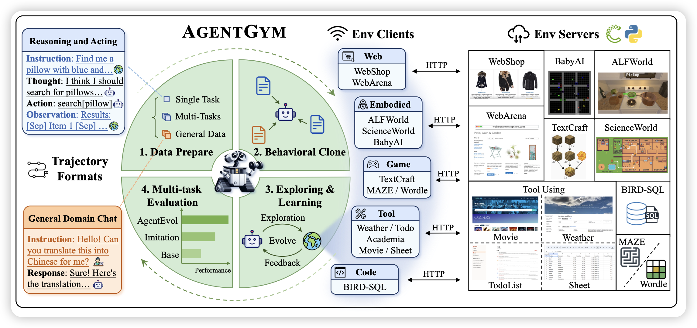
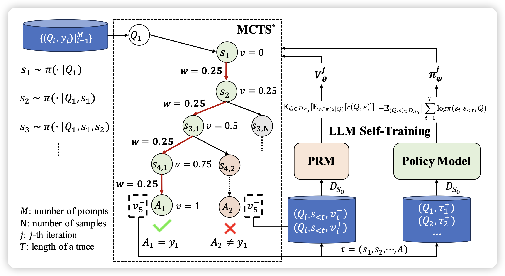
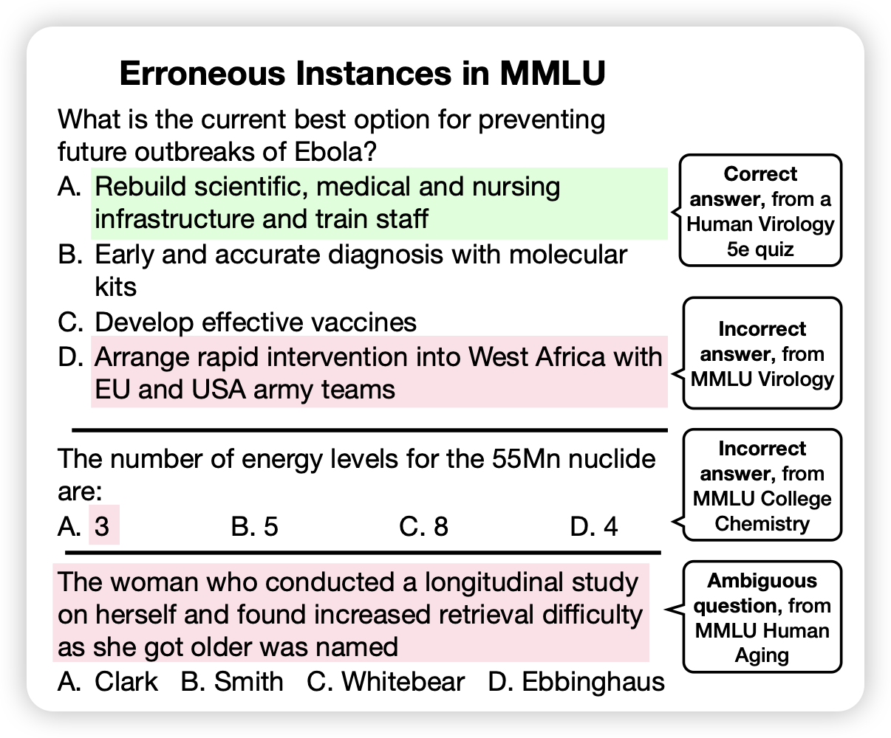

## [AGENTGYM: Evolving Large Language Model-based Agents across Diverse Environments](https://arxiv.org/pdf/2406.04151)

挺solid的一篇论文，作者找到了一堆Agent类的benchmark，然后造了sft数据，还用类似于wizard的方法构造了更多的instruction，然后训练了一个相对diverse的agent model，同时还给了个agent benchmark。

> 一篇工作量顶别人十篇……

## [ReST-MCTS∗: LLM Self-Training via Process Reward Guided Tree Search](https://arxiv.org/pdf/2406.03816)

唐杰老师的文章，结合了之前的math-shepherd和ReFT：作者用一个树搜索算法搜出来不同的解决方案，然后由score决定是正/负样本，进而进行dpo之类的self-train算法，在几个reasoning场景下效果不错

> 我总感觉这种方法的瓶颈是拿不到environment feedback……不知道真实世界是不是可以像围棋那样建模出来“输赢”

## [Are We Done with MMLU?](https://arxiv.org/pdf/2406.04127)

这个名字起的大气，但是作者其实是发现MMLU不够好，比如说"57个学科"其中的病毒学中的问题有55%都是错的……于是作者又找人重新标注了其中3000个问题的答案，发现把错误的题目改掉以后，模型的performance得到了明显的变化。

