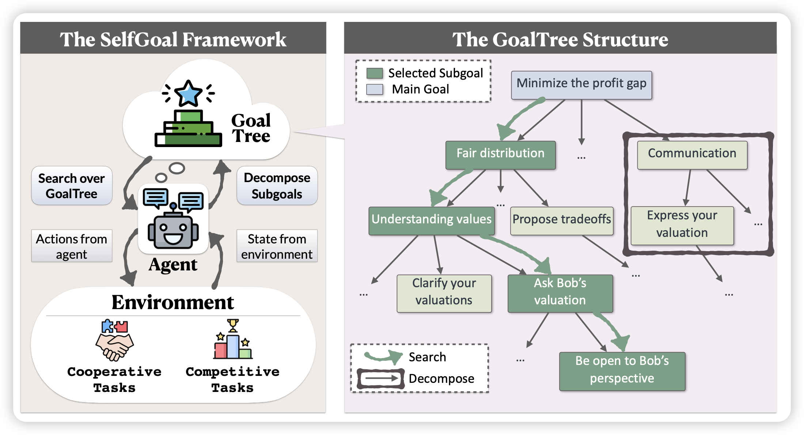

急死了……想看wwdc，想看AI(Apple Intelligence)

## [SELFGOAL: Your Language Agents Already Know How to Achieve High-level Goals](https://arxiv.org/pdf/2406.04784)

对于传统的agent，模型其实很难自己去发现一些high-level的目标，因为这些东西的奖励往往会延迟很久才能拿到。作者思考能不能让Agent在不借助human-prior的情况下自己学会这种能力：所以作者定义了任务树的概念，从上到下分别代表high-level到low-level的目标，然后随着模型的执行逐渐迭代任务树

> 这不是XAgent吗……不过确实没发论文

