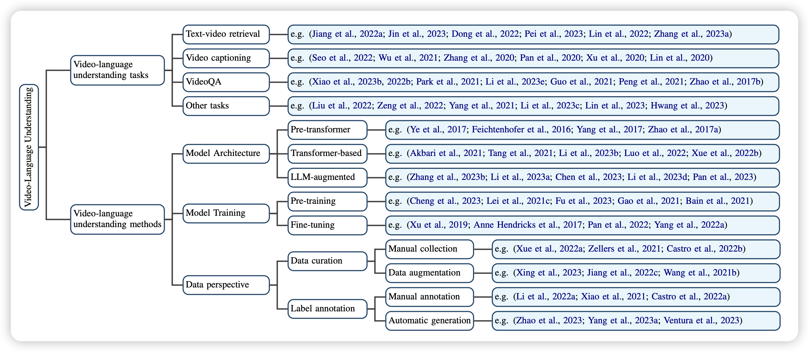
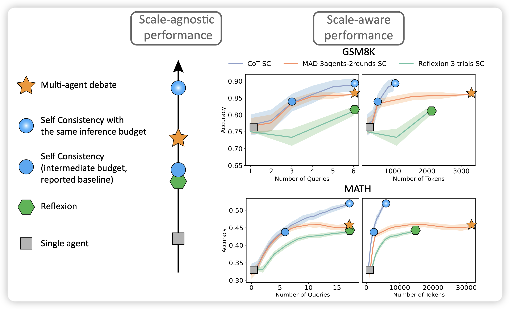

apple还真出了自己的模型，但是端侧：https://machinelearning.apple.com/research/introducing-apple-foundation-models

## [Autoregressive Model Beats Diffusion: Llama for Scalable Image Generation](https://arxiv.org/pdf/2406.06525)

这篇是cv track的论文，但感觉挺牛的，就放上来了，名字在致敬OpenAI那个“diffusion model beats GAN”。作者用llama的方式做了图片生成的工作。作者发现，经过好的设计，Autoregressive的形式其实比latent diffusion效果更好，然后速度还快5倍。

> 这玩意看起来是不是一行一行刷新出来图片……再套个投机推理、再套个MoE，水出来100篇论文

## [Video-Language Understanding: A Survey from Model Architecture, Model Training, and Data Perspectives](https://arxiv.org/pdf/2406.05615)

一篇关于视频理解模型的综述，感觉还挺全的。挺好挺新的一个领域，如果想要入坑这个可以看看。

## [Reasoning in Token Economies: Budget-Aware Evaluation of LLM Reasoning Strategies](https://arxiv.org/pdf/2406.06461)

作者认为，目前学界对于reasoning module的研究太乐观了，主要是因为测试时只考虑效果，不考虑消耗的资源。换句话说，在消耗同等计算资源的情况下，self-consistency的效果可能比目前所有的reasoning类方法都要好。还有就是，multiagent和reflexion相关的方法可能在进一步提升计算资源的情况下，效果变得更差。

> 底下这个图，越看越经典

