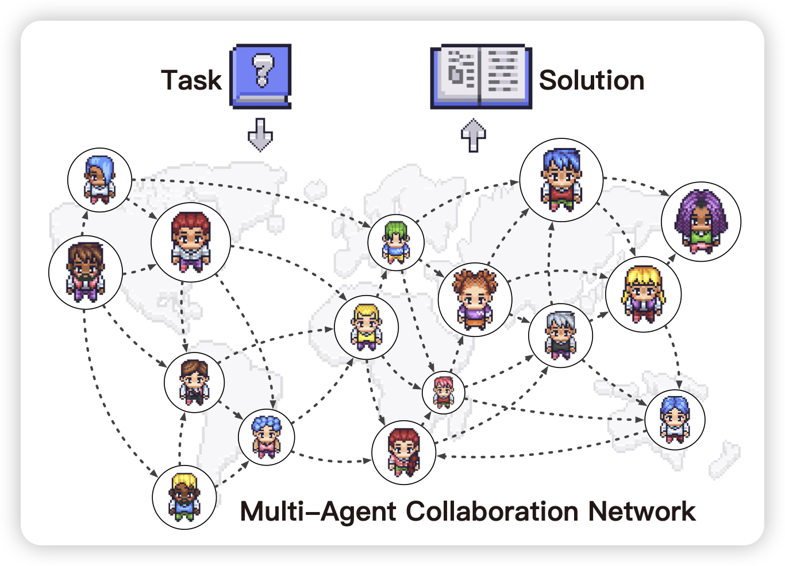

## [Improve Mathematical Reasoning in Language Models by Automated Process Supervision](https://arxiv.org/pdf/2406.06592)

如果我说MATH + Prm，大家可能会觉得被水烂了。但是deepmind上来scaling到了1.5M的样本，用mcts自己找trace。通过这个方法，可以把Gemini在MATH上的表现从50%提升到70%……

> All roads lead to money……

## [ TextGrad: Automatic “Differentiation” via Text](https://arxiv.org/pdf/2406.07496)

作者重新定义了automatic prompt tuning, 总体目标是让智能系统可以从自然语言的反馈中找到“梯度”，进而指导后续的自我优化。作者设计了一个框架，可以用类似pytorch的语法跑“backpropagation”

> 感觉很多人都在思考类似的东西，但是好像没人做的很好……我一直觉得这是不是optimizer的问题，比起设计"textgrad"，不妨说设计"AI-based optimizer"

## [Scaling Large-Language-Model-based Multi-Agent Collaboration](https://arxiv.org/pdf/2406.07155)

宣传一下我们组的工作：作者用DAG图的形式定义出来了任意规模的multi-agent network，并由此在这些系统上做了实验：发现在multiagent network领域，几乎也是符合scaling law的。

