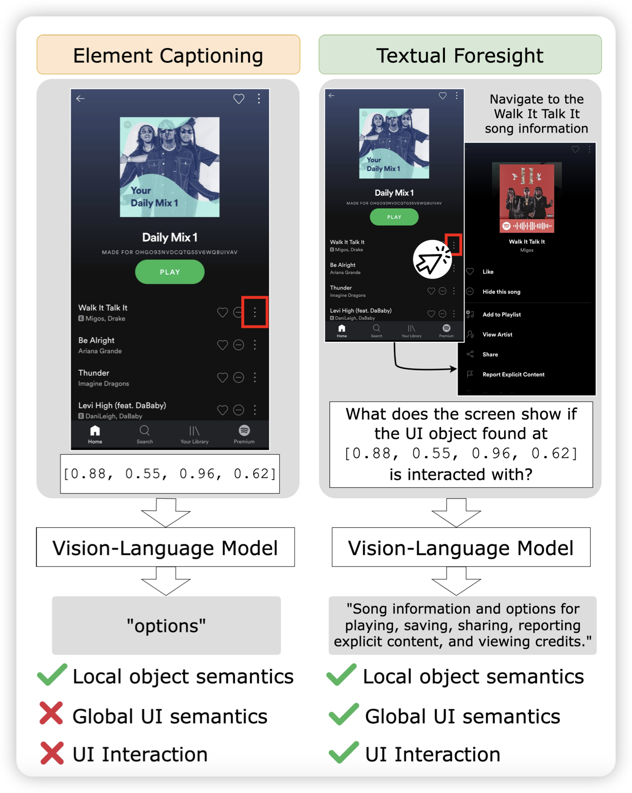
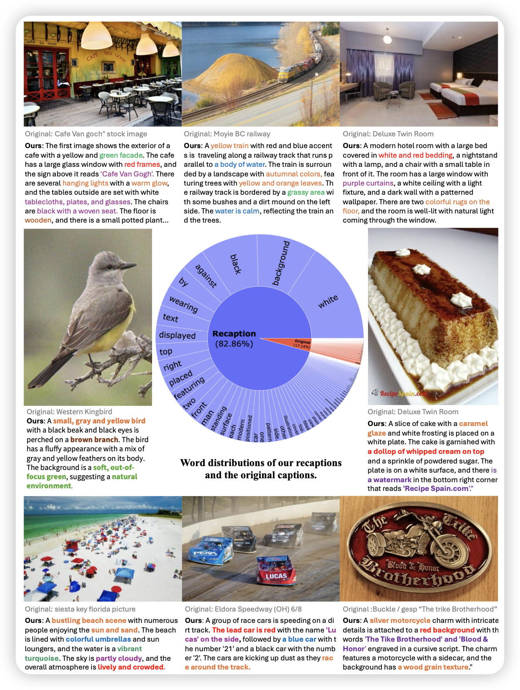
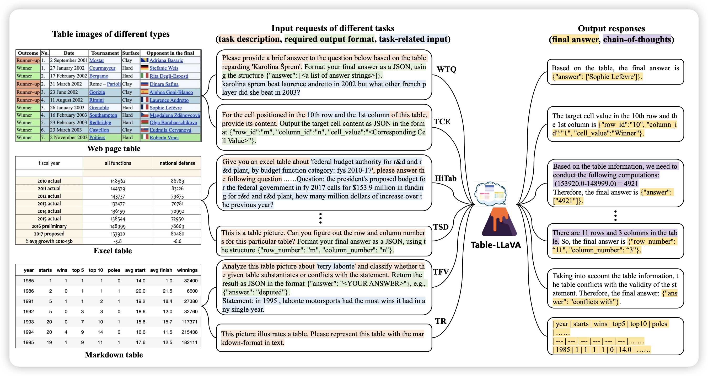

今天几篇推荐全是VLM的……压力来到LLM这边

## [Tell Me What’s Next: Textual Foresight for Generic UI Representations](https://arxiv.org/pdf/2406.07822)

挺好玩的一篇工作：作者找到了一个scaling GUI数据的方法。他设计一个游走算法在手机上随机点，然后每个state1-action-state2这样的组都能标注一个对action的解释。然后训练模型的时候不给看state2，模型就能蒸馏这个“priori knowledge”了。作者发现，这样的数据效率比前面的Ferret类型高很多

## [What If We Recaption **Billions** of Web Images with **LLaMA-3**?](https://arxiv.org/pdf/2406.08478)

作者目标明确，找了llava新出的Llava-Next-Llama3-8B，把DataComp-1B里面的所有caption重新标注了一遍。然后训练CLIP和diffusion，发现效果起飞。这说明，如果有更多的钱、或者更牛的caption model，还能再起飞

> 冒充DALL.E 3

## [Multimodal Table Understanding](https://arxiv.org/pdf/2406.08100)

作者研究的是比较小众、但我比较喜欢的问题：table understanding。让模型用开放问答的形式完成table理解、推理、识别等等任务。作者提到，已有的模型往往依赖于图像、文本双模态的输入，他们想做成纯图片的VLM版本。所以构造了高质量SFT数据，发现还真行

> 挺好的文章，如果每个VLM领域都能有这么一手，把所有SFT数据扔在一起就是gpt-4o了

