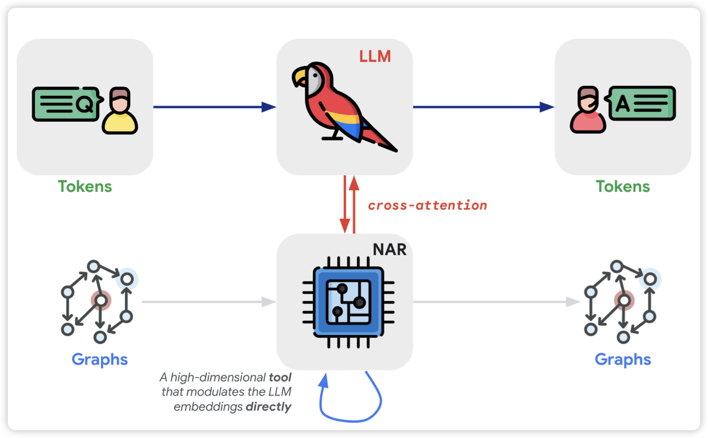

## [Transformers meet Neural Algorithmic Reasoners](https://arxiv.org/pdf/2406.09308)

google deepmind的研究，作者关注一个有趣的领域：能不能让LLM自动遵循某些graph-based algorithm，由此作者设计了一套crossattention类的算法，发现引入Transformer确实可以提升在这个领域的效果。

> 我其实没太看懂，但是感觉还挺牛的

