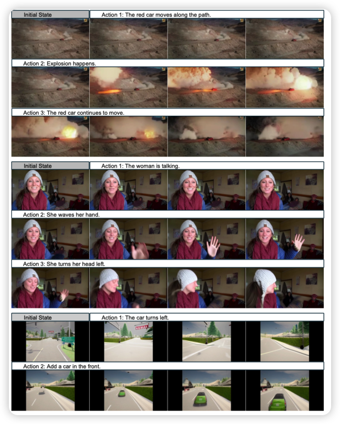
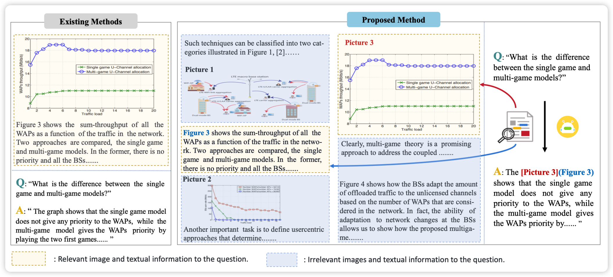

## [Pandora: Towards General World Model with Natural Language Actions and Video States](https://arxiv.org/pdf/2406.09455)

arxiv的最后一篇论文，差点略过去了，没想到这么好玩：一篇视频生成的文章。作者认为视频本身就是带时间信息的，目前的视频生成模型都是给一段caption，生成一整个视频。如果已经有个视频了，能不能给定这个视频的前缀，再用自然语言说后面希望发生什么，让模型接着生成呢？作者发现可行，而且这个认为本身更像是"世界模型"的训练任务。

> 感觉这个特性是产品设计比较关键的：大家做video生成肯定没人会一轮成功的，这样子一轮轮迭代才是这个领域产品的形态。
>
> 另外，这个任务本质上是需要很多时间戳对齐的caption数据，如果是这样，那么对应的video understanding模型好像也能搞？把loss token换成text就行了

## [VEGA: Learning Interleaved Image-Text Comprehension in Vision-Language Large Models](https://arxiv.org/pdf/2406.10228)

作者讨论了在多图输入的VLM场景下，常常存在冗余的、干扰的信息，模型能不能正确地忽略这些信息呢？作者由此构造了一个benchmark，发现现在的模型确实还有进步空间。最后，作者搞了一波数据，发现finetune完以后的模型会好很多

> 经典ACL风八股文，不过作者提的这个问题我挺喜欢的

