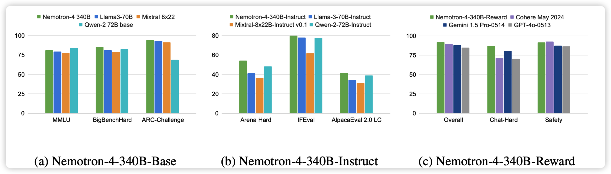

310篇论文，前无古人

## [Super(ficial)-alignment: Strong Models May Deceive Weak Models in Weak-to-Strong Generalization](https://arxiv.org/pdf/2406.11431)

推荐yankai师兄的工作：大家都知道weak-to-strong generalization，更强的模型能从更弱的模型的表现里学习到任务的目的，进而表现的比弱模型更好。但是，还有一种相反的情况：如果弱模型做得一塌糊涂，强模型会不会把意思理解反，还以为是在做另一件事情，进而表现得比弱模型更差呢？

作者发现还真是，然后设计了方法去缓解这个情况

## [CodeGemma: Open Code Models Based on Gemma](https://arxiv.org/pdf/2406.11409)

如果大家还记得google的gemma，今天出了code版，还额外放送了数学能力。

> Phi3-coder在哪，到你的回合了

## [Meta Reasoning for Large Language Models](Meta Reasoning for Large Language Models)

之前Denny Zhou出了一篇self-discover，今天出了一个Agent场景的self-discover。把ToT这些也涵盖到了备选池子里

## [Nemotron-4 340B Technical Report](https://arxiv.org/pdf/2406.11704)

nvidia新出的340B的dense模型，训了8T token。开源的。

> 牛，只能说

