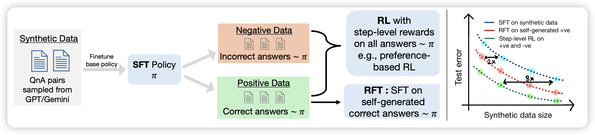
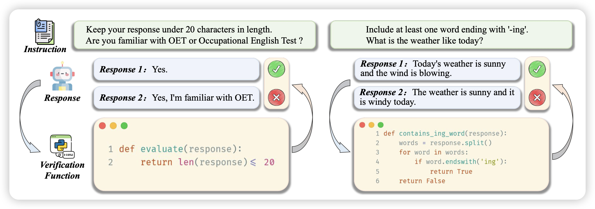
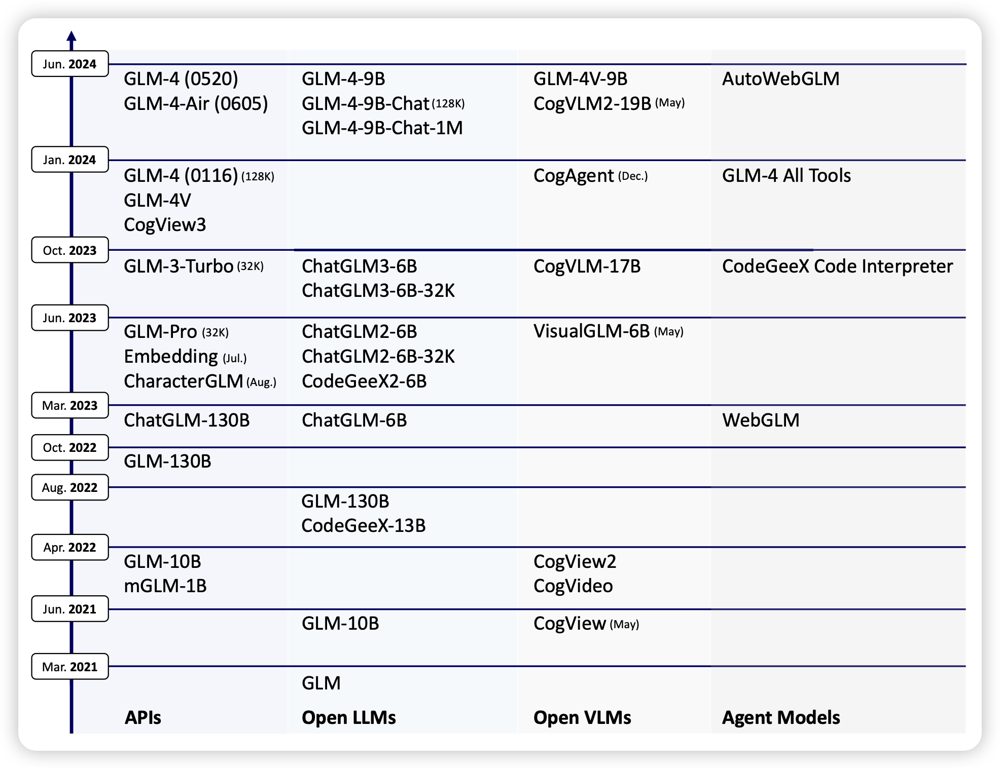

是因为周二周三太多了，导致周四没论文了吗……

## [**RL on Incorrect Synthetic Data Scales the Efficiency of LLM Math Reasoning by Eight-Fold**](https://arxiv.org/pdf/2406.14532)

deepmind那个self-train团队的新作，他们发现一个神奇的现象：经典的self-train，自己sample一大堆，然后在正确的样本上finetune，这个方法在数据越来越多以后反而表现会下降，这是因为对应的假阳样本太多了。作者发现，在训练中引入少量比例的、自己生成的、错误样本反而会让效果变好回来，作者认为这是因为恢复了原本的数据分布。

> 神奇的self-train……

## [**Self-play with Execution Feedback: Improving Instruction-following Capabilities of Large Language Models**](https://arxiv.org/list/cs.CL/recent?skip=100&show=25)

挺好玩的思路：作者发现instruction-follow领域的一些instruction可以有自动化(代码)的方式检查，所以作者要求模型自己生成了一大堆这样的需求，以及对应的检查代码。然后让模型生成一堆样本，通过自动生成的检查代码给出instruction follow得分，进而做dpo。

> 这个思路本质上是希望模型学习去按照代码要求生成文本，感觉和前两天deepmind那个NAR论文挺像的？

## [ChatGLM: A Family of Large Language Models from GLM-130B to GLM-4 All Tools](https://arxiv.org/pdf/2406.12793)

把GLM系列的模型整个梳理了一下，整体报告了一下相对的得分和每个模型适用的场景

