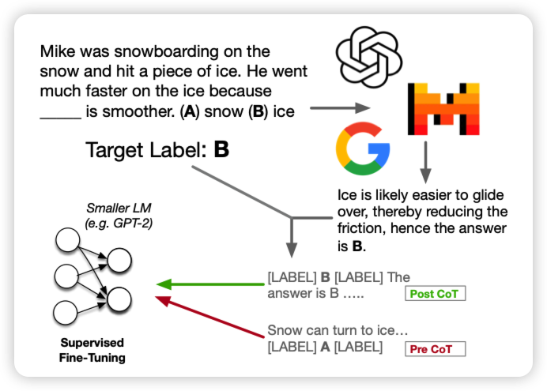
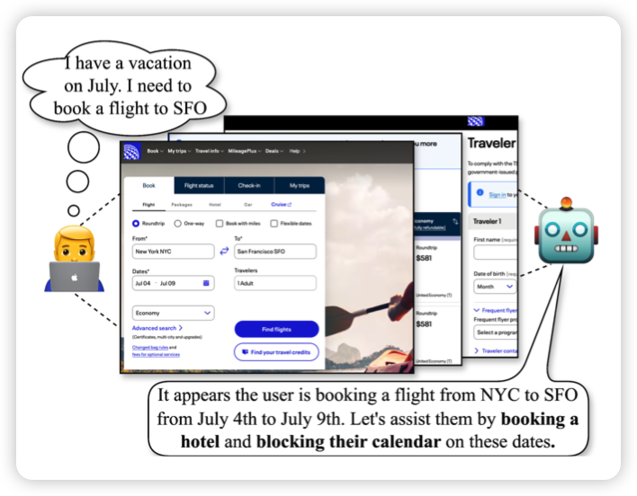
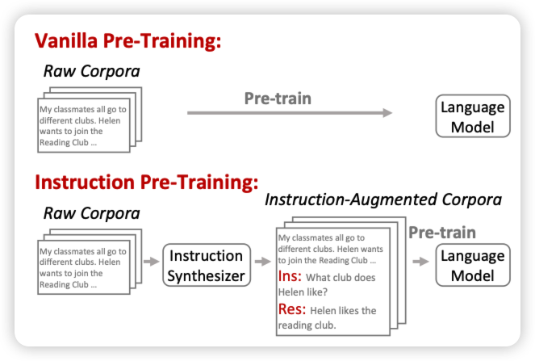

## [Investigating Mysteries of CoT-Augmented Distillation](https://arxiv.org/pdf/2406.14511)

如果大家还记得我在里讲到的关于reasoning-anchor的讨论，今天有个工作发现了类似的现象：他们研究了带有CoT标注的数据集的finetune，发现把CoT chain放在answer后面实际上会让下游任务表现变得更好。而且，其实CoT trace是错误的可能也没有这么敏感，关键是提到几个关键词。

## [Identifying User Goals from UI Trajectories](https://arxiv.org/pdf/2406.14314)

google做得非常有趣的工作，作者发现对于GUI Agent来说，基本都能和用户一起再电脑上“结对编程”。那么Agent能不能主动发现用户面临了什么困难、进而去提供帮助呢？

作者在Gemini、gpt上做了实验，发现还行，但效果没human好。

> 我感觉这才是GUI Agent该研究的方向

## [Instruction Pre-Training: Language Models are Supervised Multitask Learners](https://arxiv.org/pdf/2406.14491)

Furu Wei的工作，作者发现instruction Tuning先找到任务再找标注，效果好，但是数据很难scaling。如果自顶向下呢？先从预训练数据集里找到instruction和response，再和原始语料丢到一起pretrain。作者发现这样效果很好，搞了400M的pair以后，llama3-8B超过了llama-70B

