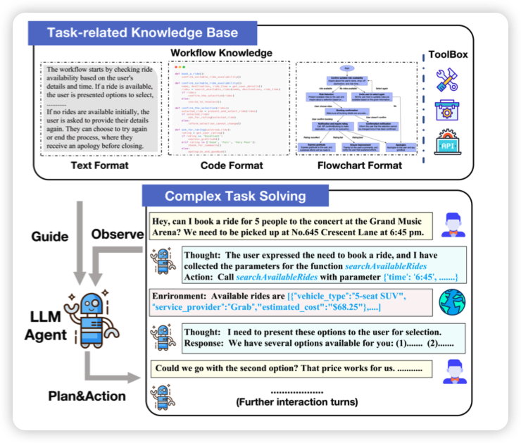

## [FlowBench: Revisiting and Benchmarking Workflow-Guided Planning for LLM-based Agents](https://arxiv.org/pdf/2406.14884)

我还以为ProAgent发完没啥动静，因为Workflow领域"死群"了，没想到今天看到引用了：作者merge了几个有流程知识的场景，然后整合成了ReAct的格式，做了一个benchmark。

> 感觉还挺好的

