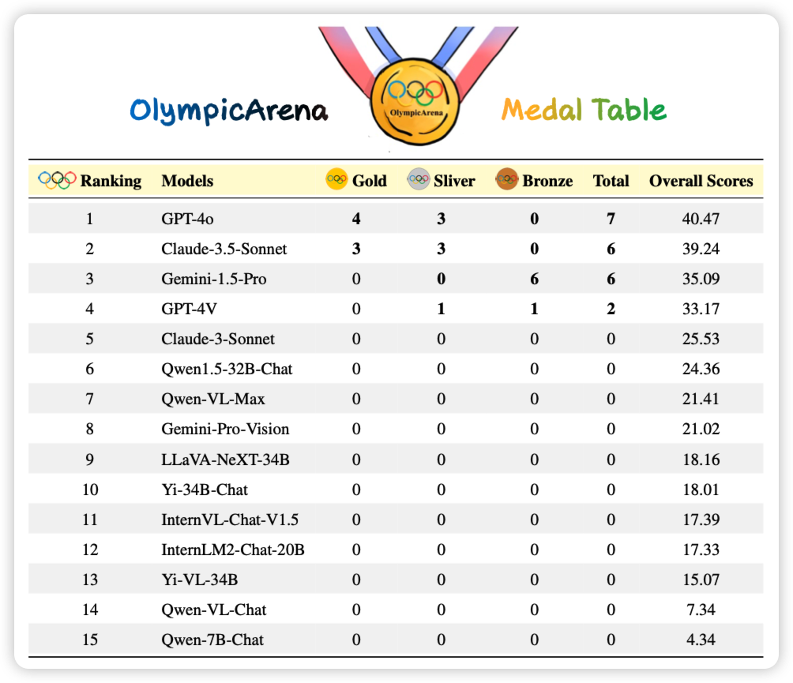

今天开始，引用量超过阅读量了，线性增长终究打不过指数增长。

## [Large Vocabulary Size Improves Large Language Models](https://arxiv.org/pdf/2406.16508)

一个有趣的短文：大家都知道，如果词表越大，平均一个token的string-len就越大，同样的corpus需要的tsequence length就越小。作者探索了能不能把一个小词表模型在预训练完以后按照大词表去做continue pretrain，看起来效果还行。不过看起来setting优点简单

> 说回来，这种"continue pretrain"似乎等价于把训练语料按照不同的tokenize方式组织成多个batch。因为同一个string在一套词表下有不同的tokenize方式？这算是投机推理吗……

## [OlympicArena Medal Ranks: Who Is the Most Intelligent AI So Far?](https://arxiv.org/pdf/2406.16772)

之前pengfei组出了个OlympicArena，全是竞赛题。今天他们测试目前最强的系列模型，最有噱头的是：作者还按照每年的金银铜牌的分数给模型发了奖牌。

> llava-next有这么强？有种预感，这个巨好发推送，后面百模各家可能都拿来宣传: "四冠王4o和3冠王claude"……

