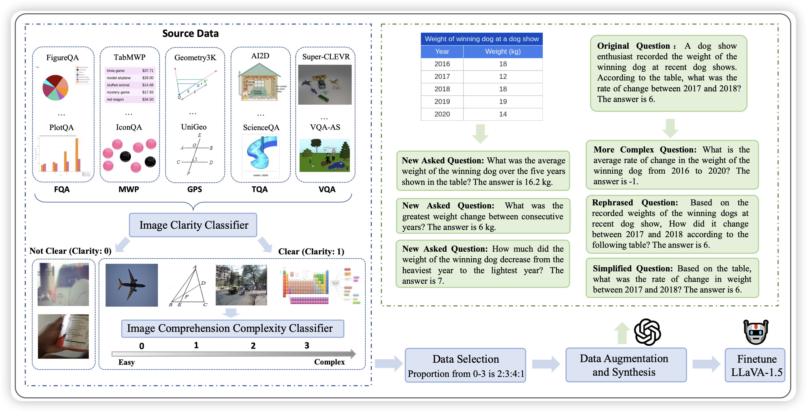

## [Math-LLaVA: Bootstrapping Mathematical Reasoning for Multimodal Large Language Models](https://arxiv.org/pdf/2406.17294)

作者找了一堆dense text场景的源数据，找GPT-4v标了360k的q-a pair，在上面训了一个llava，然后发现在VLM math和MMMU上涨分巨多。

> 只能说，不如叫metamath-v

## [The FineWeb Datasets: Decanting the Web for the Finest Text Data at Scale](https://arxiv.org/pdf/2406.17557)

前两天挂的博客，今天终于挂论文了，huggingface在commoncrawl上清洗了15T token的数据，对于各种筛子做了消融实验，发现了相对较好的数据清洗方法。另外，还附赠了1.2T token的质量更高的fineweb-edu数据。

> 再讲讲数据重写，就把llama3破解完了

