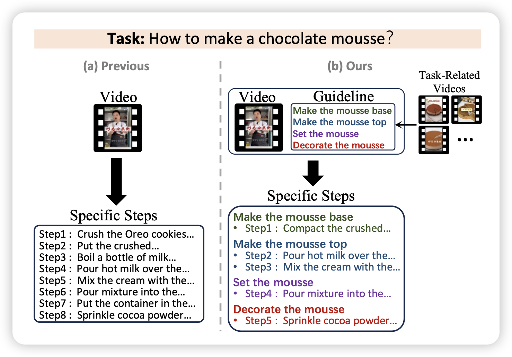
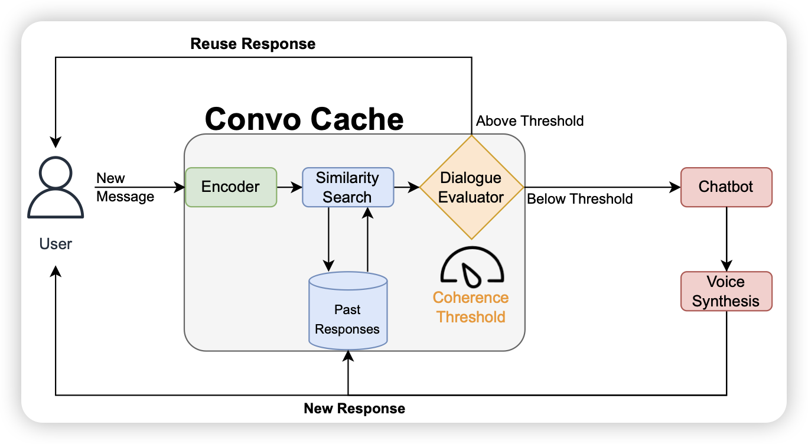
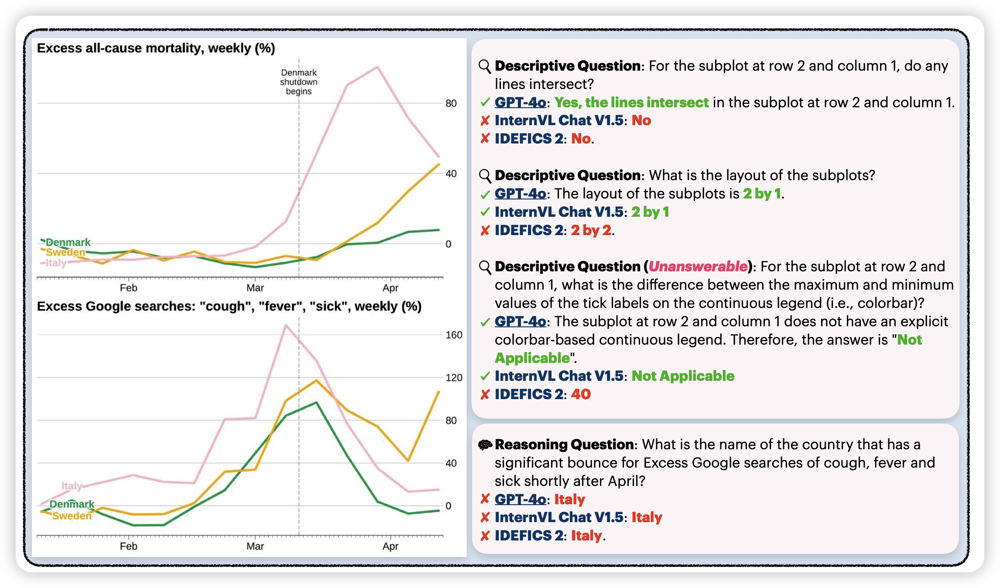

今天竟然也是101篇，我还以为arxiv bug了

## [GUIDE: A Guideline-Guided Dataset for Instructional Video Comprehension](https://arxiv.org/pdf/2406.18227)

作者发现，目前的视频理解数据(教程视频)的标注粒度太粗了、然后没有层次结构。作者找了3.5k个教程视频，标出了细粒度的task和task的层次结构，在时间上对齐。

> 感觉工作量还挺大的，不知道后面大家能不能把这个数据玩出什么花样。

## [ConvoCache: Smart Re-Use of Chatbot Responses](https://arxiv.org/pdf/2406.18133)

作者发现真实的LLM系统里，用户的query总是大差不差，如果加了一个cache系统，当输入和数据库某个输入非常像的时候，就复用输出，能不能加速这个系统呢？

> 其实我觉得”reuse“这个概念不太好，因为输入差一点点可能输出差很多。但是再接一个投机推理是不是就好了，比如输入的前面n个token和语料里的前n token很像，就把语料里的后n-gram拿过来做一次验证，运气好的话直接出来n个token……这算infini-LLM吗……

## [CharXiv: Charting Gaps in Realistic Chart Understanding in Multimodal LLMs](https://arxiv.org/pdf/2406.18521)

danqi出品，一般都是精品。昨天有个llava-math，今天来个charXiv。作者发现目前的ChartQA这些数据集太简单了，而且简单的换一些图标的样子，模型就炸了。所以作者爬了arxiv上3000个真实的表格，人工想了两类query，然后测了一波，发现模型几乎全都不行。

> 看来是想取代ChartQA呀……

