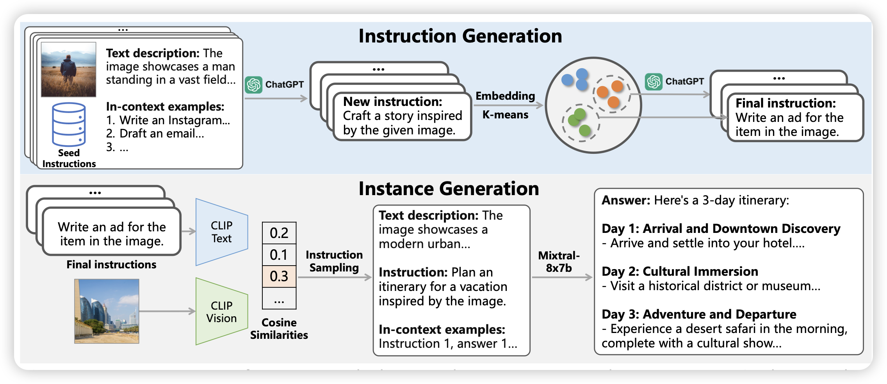

前两天github好像挂了没法push……今天才push上这两天的论文

## [MM-Instruct: Generated Visual Instructions for Large Multimodal Model Alignment](https://arxiv.org/pdf/2406.19736)

作者搞了一套机造VLM SFT数据的机制，还挺有意思的：会根据k-means做平衡，同时为了解决self-instruct领域在VLM中需要额外condition on image 的问题，作者先生成抽象的instruction，再根据clip embedding找到类似的图片过来适配实际的instruction。用这种方式，作者构造了个SFT数据集。

> 不知道是不是被cambrian卷得挂arxiv了……

## [Read Anywhere Pointed: Layout-aware GUI Screen Reading with Tree-of-Lens Grounding](https://arxiv.org/pdf/2406.19263)

Erxi Xing的工作，他们提了新的GUI QA场景：pointed QA，其实就是Ferret里面讲的"ref"：用户在提问时可以附加一个区域，说明问题focus在这个区域。这个场景其实在GUI Agent应用中是显然的。作者根据点击的位置对accessibility tree做了筛选，让Agent可以更好地看到点击位置附近的gui。

