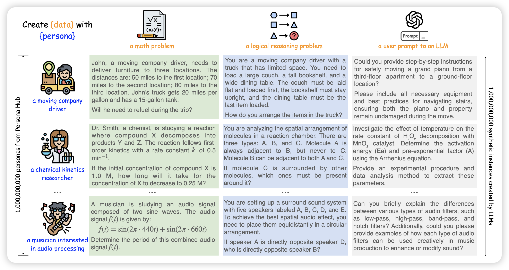

## [**Scaling Synthetic Data Creation with 1,000,000,000 Personas**](https://arxiv.org/pdf/2406.20094)

腾讯的论文，一个很"贵"的论文。作者合成了足足1B的persona，他们把persona定义成了system prompt "You are a xxx"这种描述。同时在各种合成了场景的SFT数据，通过这个方案，作者在很多benchmark上让7B模型分刷得巨高。不知道有没有data contamination问题

> 只开源了其中的200k……可惜

