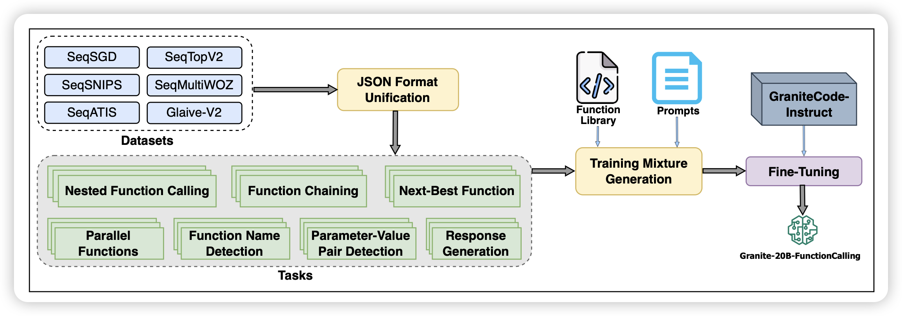
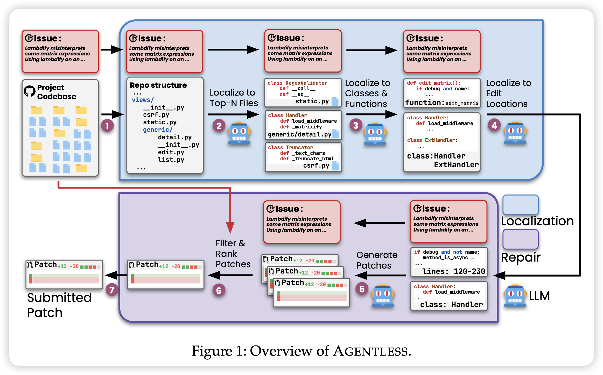
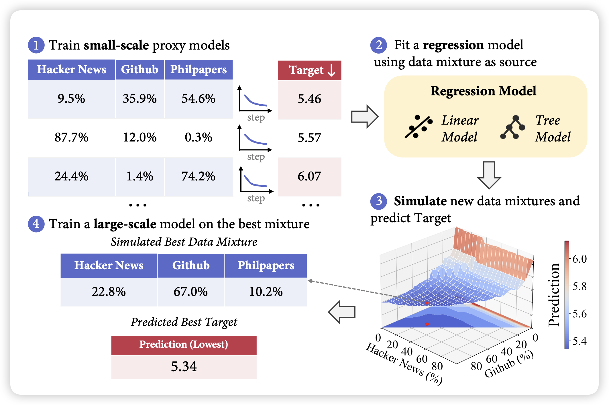

这周二的155篇比起上上周的310篇，只能说是远远不及

## [**Granite-Function Calling Model: Introducing Function Call- ing Abilities via Multi-task Learning of Granular Tasks**](https://arxiv.org/pdf/2407.00121)

IBM的工作，现在好像挺少看到他们的工作：作者目标是OpenAI的json-mode，搞了一大堆数据，开源了一个20B模型，基本达到了json-mode水平，可以理解json-format，进行function call，甚至还有parallel function call功能

## [AGENTLESS:Demystifying LLM-based Software Engineering Agents](https://arxiv.org/pdf/2407.01489)

又是一篇反套路文，可能也没那么反套路？作者研究了一下SWE-Bench，发现目前大家卷这个bench都是很多复杂pipeline设计，他们想：能不能化简这些框架，搞成简单的code repair任务呢？结果去掉了一堆pipeline设计以后，acc反而达到了27%，而且只花0.34$就能完成任务。同时，作者研究了一下SWE-Bench的case，发现里面有些case是错的、或者又问题，就搞了个新的benchmark SWE-Bench Lite-S

> 遇到科研实在人了……

## [REGMIX: Data Mixture as Regression for Language Model Pre-training](https://arxiv.org/pdf/2407.01492)

pretrain data selection相关的论文，这个方向的祖师爷是DoReMi。作者这次考虑了一个基本假设：不同大小的模型应该享有相同的"最优数据配比"，即最优数据配比下训练小模型和大模型应该都是最优的。所以作者用不同数据配比训了一堆小模型，在performance上训了一个回归模型，然后找到最优配比，再由此训大模型。作者发现这样搜出来的配比比人工挑出来的配比效果要更好

> 感觉挺有实用价值的，但是这个假设不一定对：现在有些人觉得小模型capability不够，有些mixture学了也是白学，如果承认这个理论，那这个论文的假设可能不够好？
>
> ……话说我本科有个大作业就是这么刷榜的……

