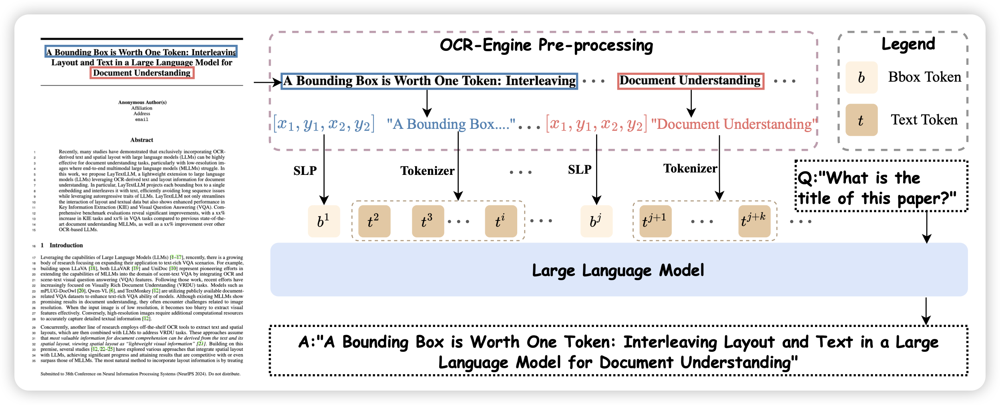

昨天的论文，arxiv今天才更新

## [A Bounding Box is Worth One Token: Interleaving Layout and Text in a Large Language Model for Document Understanding](https://arxiv.org/pdf/2407.01976)

字节的工作，这篇论文的focus比较窄：作者发现在doc understanding领域，把数据里的一些内容和图片里的bounding-box对齐，会极大提升模型能力。然而已有方法对于一个bounding-box都会组织成很多token，作者尝试了一下把box token压缩成一个token，发现效果很好，同时能省下很多token

