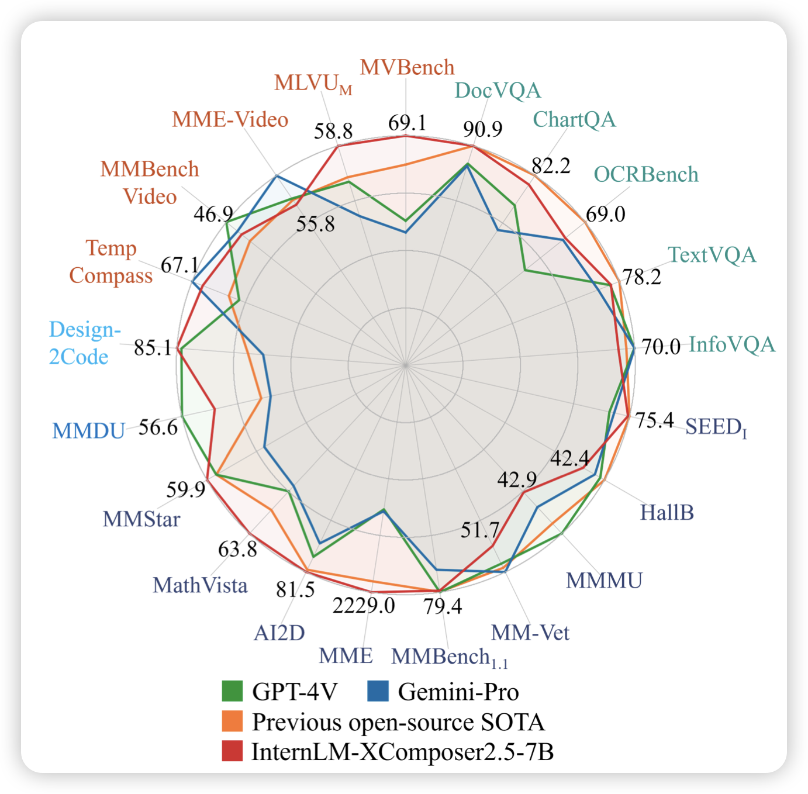
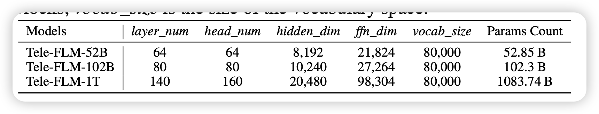

## [InternLM-XComposer-2.5: A Versatile Large Vision Language Model Supporting Long-Contextual Input and Output](https://arxiv.org/pdf/2407.03320)

首位开源long-context VLM来了，96k sequence length，同时和之前版本效果相当，保留了超高清的能力。同时额外放送video-understanding和vlm-many-shot

> 话说internLM的每篇论文都要在右上角画个大雷达图吗……

## [52B to 1T: Lessons Learned via Tele-FLM Series](https://arxiv.org/pdf/2407.02783)

一篇短文，作者介绍了训练52B模型中的一些经验，然后迁移到了更大的模型，说后面会开源一个1T参数的dense模型。

> 现在论文已经可以透支了吗……之前llama3 400B也是

