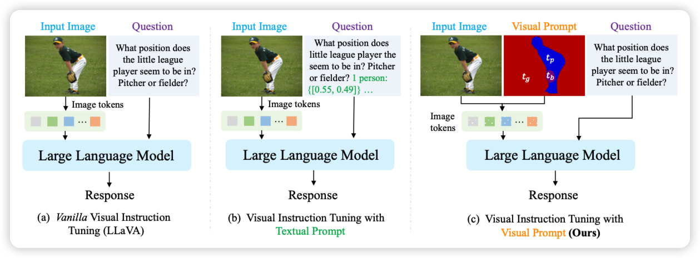
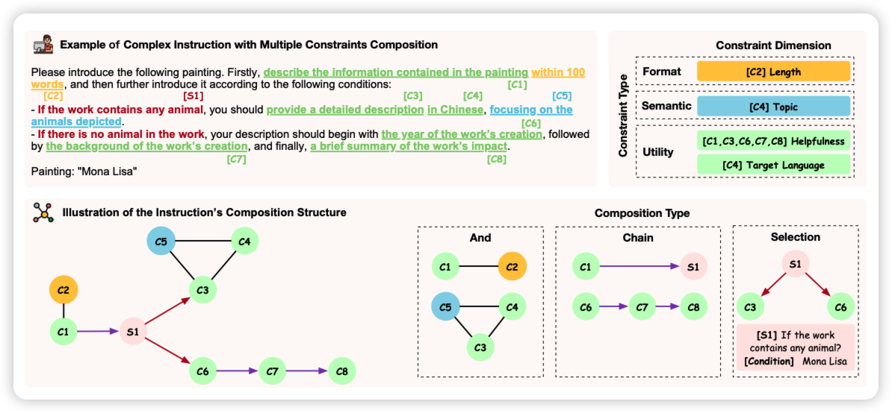

上周五好像是美国独立日，没有论文

## [Rethinking Visual Prompting for Multimodal Large Language Models with External Knowledge](https://arxiv.org/pdf/2407.04681)

很有趣的工作：之前microsoft有一篇工作让一个VLM结合一堆CV domain model(比如OCR)的输出去加强回答的质量。这次作者更进一步：能不能让domain model的结果直接在hidden-state而不是text层面结合呢？作者发现这样更省token，而且效果也挺好

> 抽象一下，这就像是《变形金刚2》里面那个组合机器人，把一堆模型黏合在一起了？

## [Benchmarking Complex Instruction-Following with Multiple Constraints Composition](https://arxiv.org/pdf/2407.03978)

黄民烈老师的文章，作者想要增强模型的instruction following能力，作者构造了一些constraint类型，然后根据原始query构造对应的instruction，然后搞了个benchmark，对应让模型来看是否满足所有要求。

> 和前几天那个自己写代码检查输出是否满足要求的工作有点像，也许可以结合一下？

