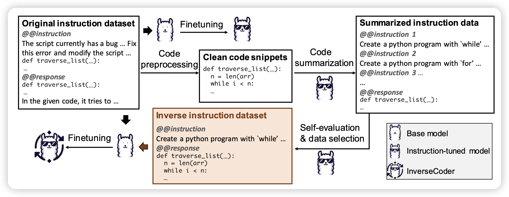
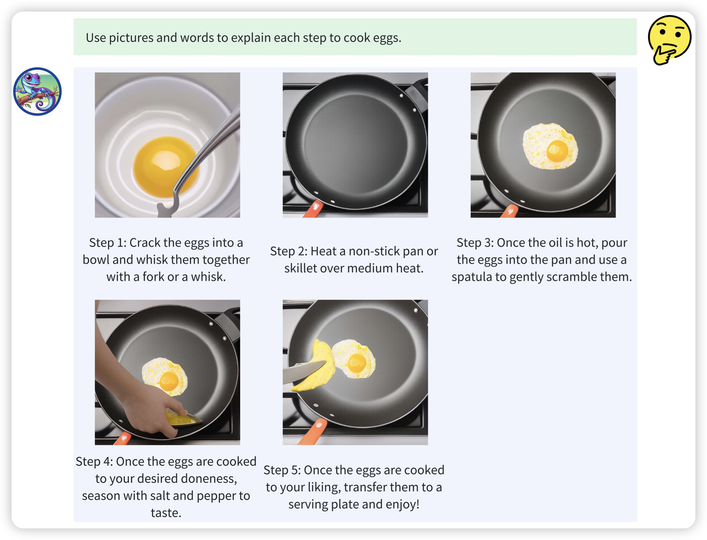

## [InverseCoder: Unleashing the Power of Instruction-Tuned Code LLMs with Inverse-Instruct](https://arxiv.org/pdf/2407.05700)

有趣的思路，作者发现code-instruction这种pair中，instruction生成是更简单的任务。所以作者基于code去生成instruction，再反过来造code场景的instruction tuning数据。

> 我怎么感觉这个思路我见过，好像是微软的orca团队做过一个这样的code instruction tuning数据集？

## [ANOLE: An Open, Autoregressive, Native Large Multimodal Models for Interleaved Image-Text Generation](https://arxiv.org/pdf/2407.06135)

如果大家还记得meta的chamleon，今天pengfei老师把基于他finetune了一个新版本，这次image token也要有loss，所以模型可以同时生成文档和其中的图片。而且是用Autoregressive的方式生成图片，就是那种像老电视一样你看着他一点点刷新出来

> 开源

