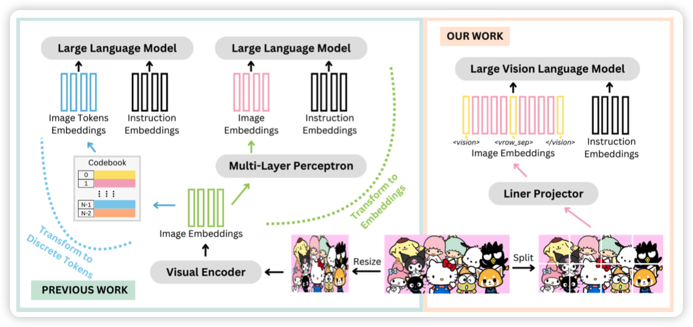
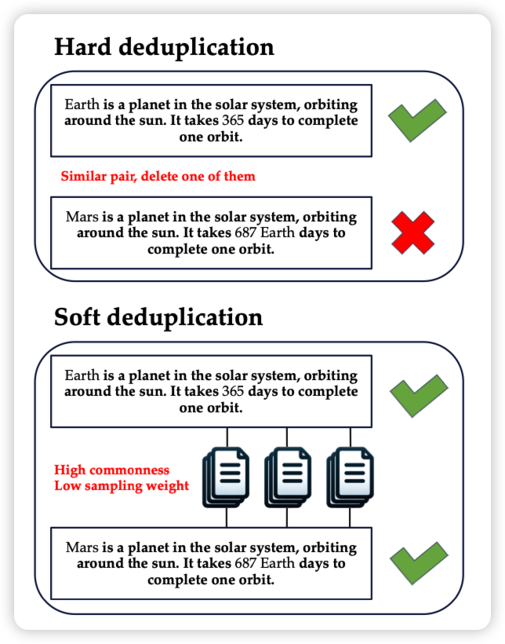

## [**A Single Transformer for Scalable Vision-Language Modeling**](https://arxiv.org/pdf/2407.06438)

Heng Ji老师的工作：第二个开源的early-fusion 模型，这次作者对标的是llava-1.5-7B。作者给出了模型设计、训练、评测，发现这样的模型尤其擅长于visual math场景。

## [SoftDedup: an Efficient Data Reweighting Method for Speeding Up Language Model Pre-training](https://arxiv.org/pdf/2407.06654)

一篇讲预训练数据选择的论文。作者这里发现，已有的方法对于语义重复的数据往往是删掉其中一个(去重)，这里作者想的是能不能降低sample概率。作者发现这种soft的去重，会比正常的去重训练数据高很多 

