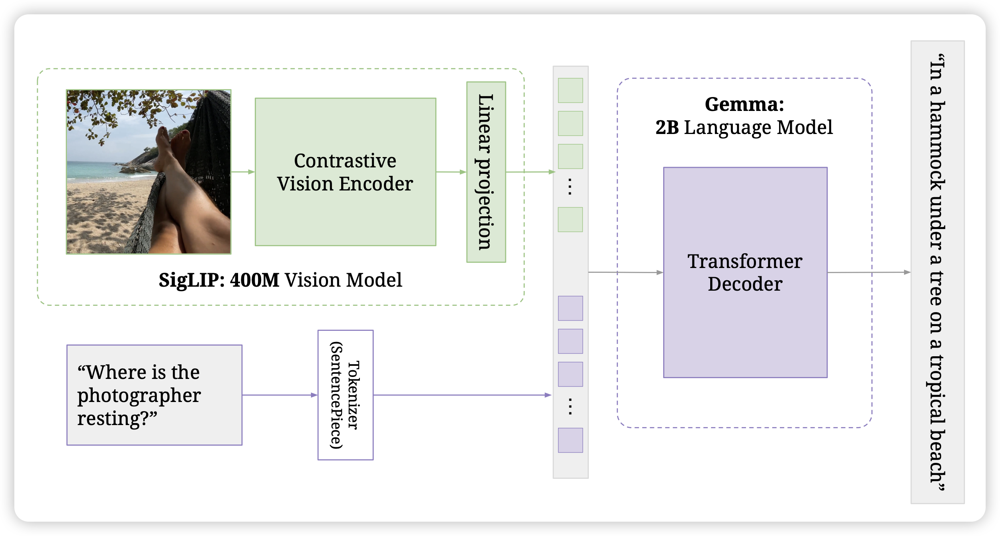
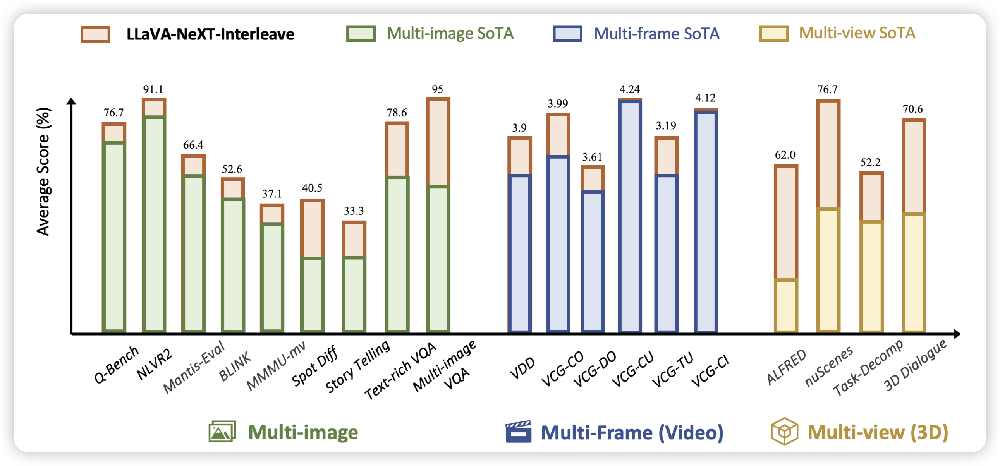

感觉现在进入VLM时代了，现在出的模型好像没谁是text-only了

## [**PaliGemma: A versatile 3B VLM for transfer**](https://arxiv.org/pdf/2407.07726)

Gemma团队的开源VLM来了。google自己做的3B小模型，benchmark分数刷的很高。他们自己的描述很有意思：It is trained to be a versatile and broadly knowledgeable base model that is effective to transfer. 另外他还有挺有趣的设计：image和text-instruction部分使用prefixLM，只有输出部分才是causal mask

## [LLaVA-NeXT-Interleave: Tackling Multi-image, Video, and 3D in Large Multimodal Models](https://arxiv.org/pdf/2407.07895)

llava团队的新作，这次瞄准的是多图输入，作者发现多图输入有四个场景：多图、视频、3D场景的多视角、一个大图切分多个小图。作者由此构造了大概1M训练数据，发现结束以后llava-interleave在各个benchmark上都达到了SOTA

