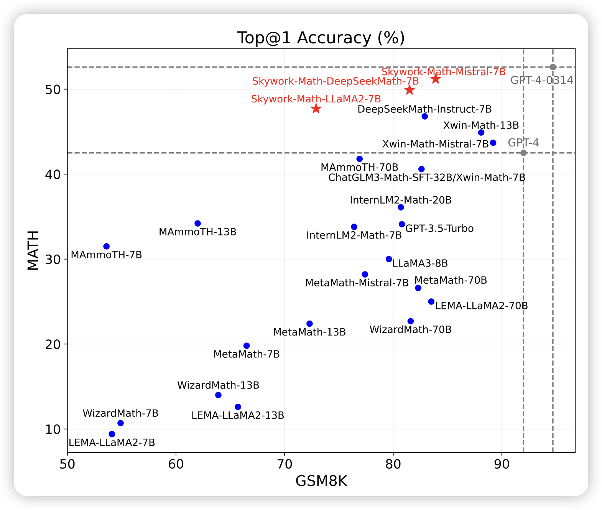
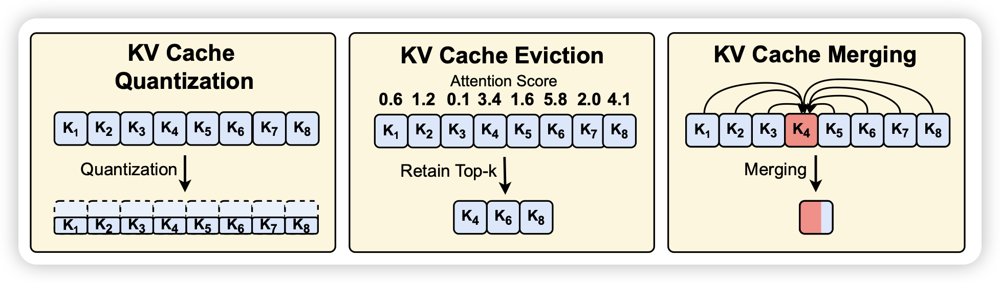

## [**Skywork-Math: Data Scaling Laws for Mathematical Reasoning in Large Language Models — The Story Goes On**](https://arxiv.org/pdf/2407.08348)

作者搞出来了2.5M的合成数据，做出来了一个开源的7B模型，把MATH top1卷出了新高度。

> 让我想起前几周google给gemini卷了1M PRM数据训到70% top1的那个工作……

## [**Model Tells You Where to Merge: Adaptive KV Cache Merging for LLMs on Long-Context Tasks**](https://arxiv.org/pdf/2407.08454)

挺好玩的工作：作者发现目前kvcache类工作都在瞄准kvcache压缩或者drop(memorizing Transformer)，但是作者发现kvcache是非常稀疏的。能不能别做丢弃，干脆来个merge做一个many-to-one的映射呢？计算资源和drop一样，理论上的信息丢失还更少。作者发现还真行

