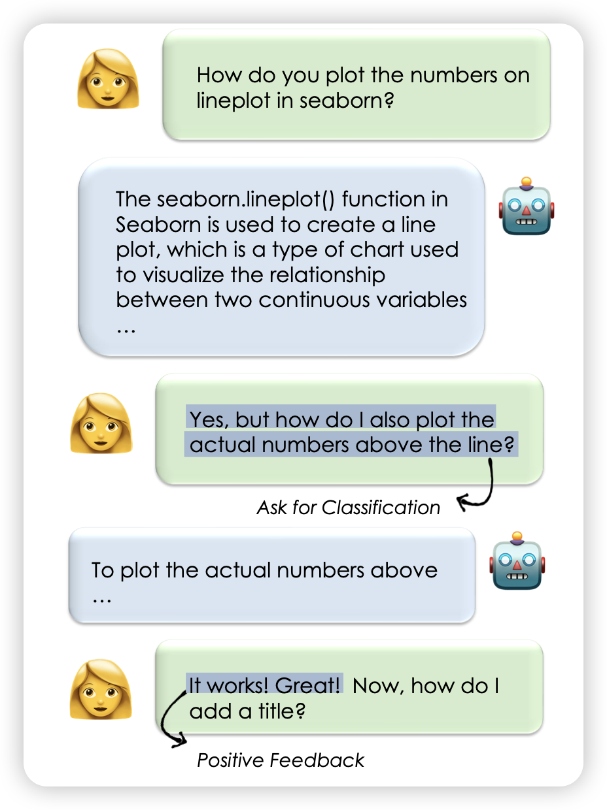
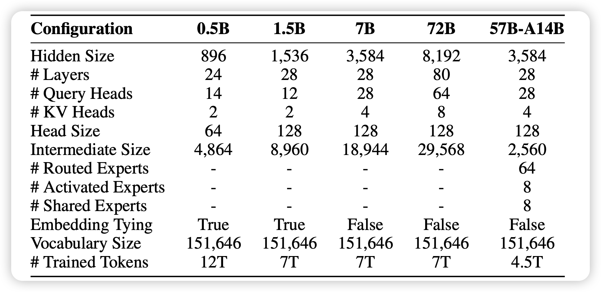
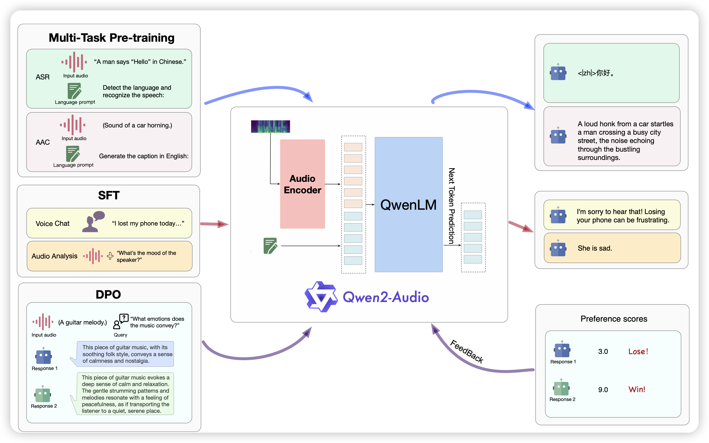

引用破500了，估计很难冲到1000了，不知道有没有破千的一天

## [Learning from Naturally Occurring Feedback](https://arxiv.org/pdf/2407.10671)

挺有趣的工作：作者想要从大规模的human-assistant chat数据里找到人类反馈。作者通过human annotation，发现大约30%的multiturn chat含有反馈信息，由此其实可以做出一条自动化的、提取人类自然语言反馈数据的pipeline

> 这个方法和之前RL领域那个RL from language-reward结合一下……是不是能成

## [**Qwen2 Technical Report**](https://arxiv.org/pdf/2407.10671)

 qwen升级了，出了Qwen2。基本上是常规升级，不过额外放送了一个MoE的版本。

## [**Qwen2-Audio Technical Report**](https://arxiv.org/pdf/2407.10759)

这篇工作和上面那个我就当成一篇了：作者在这里探索了能不能有语音、text双模态输入，text模态输出的模型。作者做到了这件事情，让模型可以提供以下服务：

1. 用户可以直接输入声音，模型不仅可以理解用户的意思，还能体会到用户的情感
2. 可以对比、区分不同的声音

> 怎么有一种style transfer的感觉，这篇工作是注重不同声音作为不同的style的任务了……

