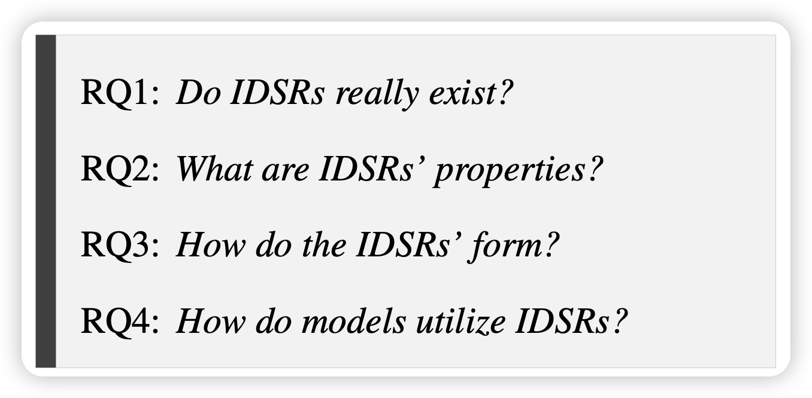

去新疆玩了

## [States Hidden in Hidden States: LLMs Emerge Discrete State Representations Implicitly](https://arxiv.org/pdf/2407.11421)

shengding师兄参与的工作：作者发现目前的SOTA model可以在没有CoT的情况下直接回答15位数加减法结果，或者10个两位数相加的结果。作者认为这是一种emergent ability。作者观察了LLM的激活情况，初步发现LLM，虽然没有经过专门的训练，但是在这种数据集自己就把hidden-state组织成了类似于discrete state的形式，即IDSR假设(implicit discrete state representation)。

