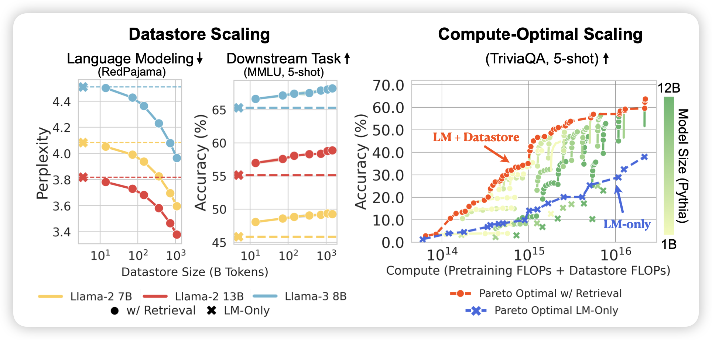
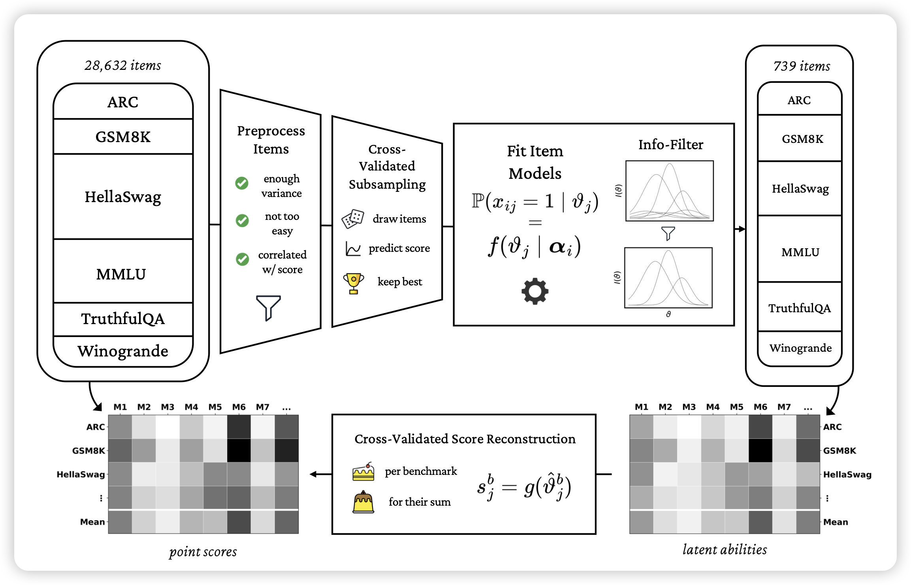
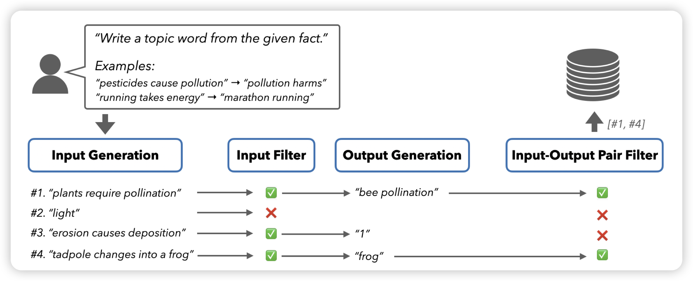

## [Scaling Retrieval-Based Language Models with a Trillion-Token Datastore](https://arxiv.org/pdf/2407.12854)

刘奕群老师之前做过一个RAG的scaling law研究，刚刚拿了best paper。今天这个也是研究RAG中的dataset-size scaling，更进一步，作者还研究了同时考虑训练flop和inference flop下的最优模型参数，发现和LLM-only的模式是不同的。

## [metabench: A Sparse Benchmark to Measure General Ability in Large Language Models](https://arxiv.org/pdf/2407.12844)

我很喜欢的工作：如果大家还记得observational scaling law的论文，作者通过多个LLM在多个benchmark的得分直接分解出了每个benchmark的特征值，再做scaling prediction。这篇工作在instance-level做，作者认为目前的benchmark有很多的冗余、重复的知识，能不能在已有benchmark上找到一个子集，使得只用子集的得分就能确定完整benchmark的得分呢？作者发现，只用3%的数据就能得到接近99%的准确率……

> 这算什么？testing time core set吗……

## [SELF-GUIDE: Better Task-Specific Instruction Following via Self-Synthetic Finetuning](https://arxiv.org/pdf/2407.12874)

Neubig的工作，一篇合成数据的小品文章：作者认为在合成数据生成的过程中，最好不要依赖别的模型、也不依赖人。作者的思路是每个任务有一些input output pairs，然后由此构造更多的input output pair，最后生成更多的SFT数据

