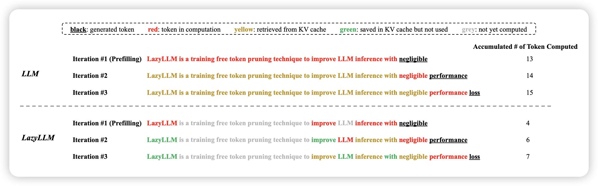

旅游回来足足欠下了一周的论文没读……最近越来越多kv-cache操作的论文了，要不后面写个阅读笔记调研梳理一下吧

## [**LazyLLM: Dynamic Token Pruning for Efficient Long Context LLM Inference**](https://arxiv.org/pdf/2407.14057)

apple和meta的联名文章，真得看一眼。作者认为目前LLM的推理是两个阶段：一阶段算出来所有kv cache并保存，二阶段每个token使用保存的kv cache，同时存下来最新token的kv cache。作者的思路是，每个阶段模型能不能自己选用某些token，然后一旦算过都可以存下来留待下次使用。

