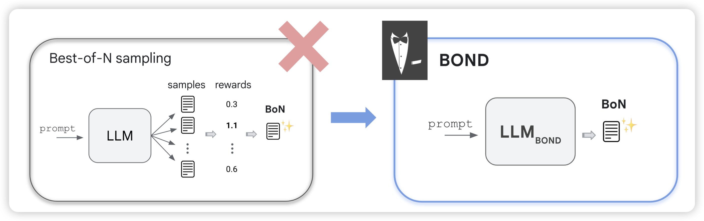
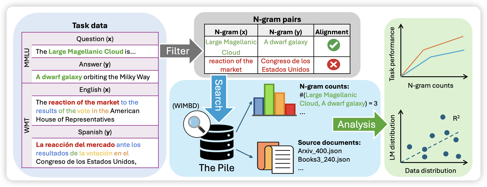
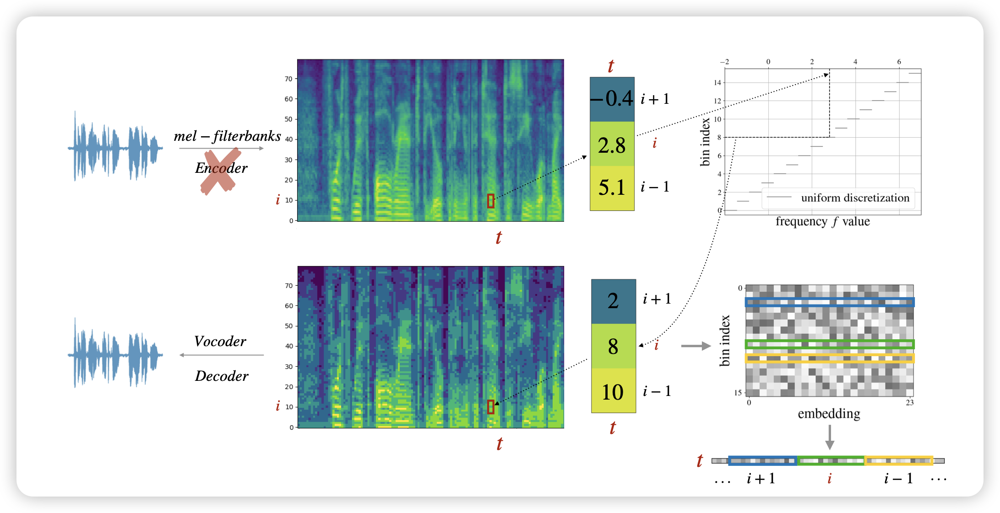

## [BOND: Aligning LLMs with Best-of-NDistillation](https://arxiv.org/pdf/2407.14622)

看名字就像是deepmind那个self-train团队的工作，果然是。作者探索的是模型对于一个question生成一堆答案，选最好的做训练来提升模型能力。大家会想到：这不就是llama2 align部分提到的reject-sample training吗？还真是，但是作者奉送了一个新的训练算法，让效果比正常的SFT好很多

## [Generalization v.s. Memorization: Tracing Language Models’ Capabilities Back to Pretraining Data](https://arxiv.org/pdf/2407.14985)
王威廉老师的工作，作者探索了之前grokking领域的general回路和memory回路的问题，作者想到：对于一个特定的输入，模型用什么回路是否和该问题在pretrain corpus的出现频率有关。所以，作者统计了每个test instance中的n-gram在预训练数据集的出现次数，证明了这个现象，并且发现，对于越大的模型，出现次数多的n-gram对于结果的提升越明显，也是就说模型获得更强的训练集泛化性

> 我之前似乎看到一篇在VLM里做这件事的工作：好像叫 VLM can not zero-shot

## [dMel: Speech Tokenization made Simple](https://arxiv.org/pdf/2407.15835)

Apple的论文， 最近越来越多见到他们的工作了，苹果这是下狠心准备狠狠进军AI研究了吗。这篇瞄准speech tokenizer领域。细节我没开看懂，看起来作者找到了一种无损的、且压缩率高的tokenize方案，并且效果也很不错。这是准备朝着apple-omni发力了？

> 话说现在研究大模型真是越来越难了……什么模态的知识都要学，想起了被《信号处理原理》支配的恐惧……

