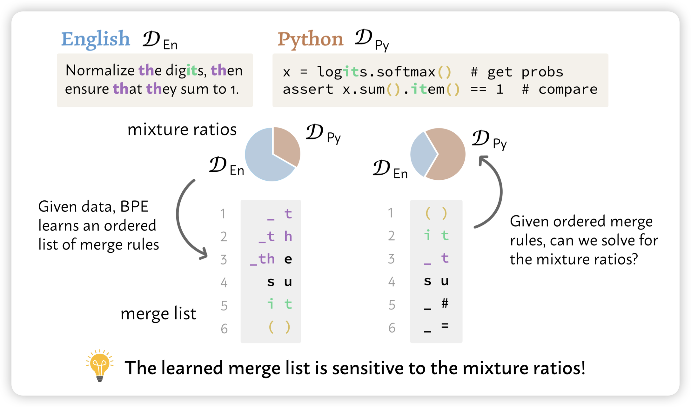

## [*Data Mixture Inference:* What do BPE Tokenizers Reveal about their Training Data?](https://arxiv.org/pdf/2407.16607)

Yeijin Choi又来了，这个工作非常有趣：作者发现，虽然LLM的训练数据不可见，但是tokenizer是可见的。而tokenizer的训练过程就是BPE：每次选择最高频的n-gram扔进去，再选下一个最高频n-gram。如果我们有一个tokenizer，能不能猜到是用哪些mixture、什么比例训出来的呢？

作者发现还真可以，而且发现从(带顺序的)tokenizer可以推断出来一些闭源模型的训练细节，比如说claude和GPT的训练数据中包含非常大比例的代码数据

> 什么大破解时代

