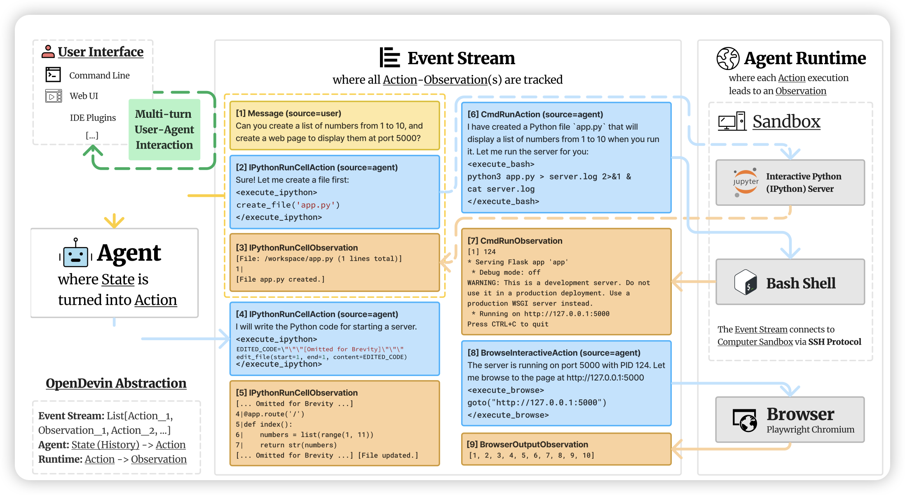
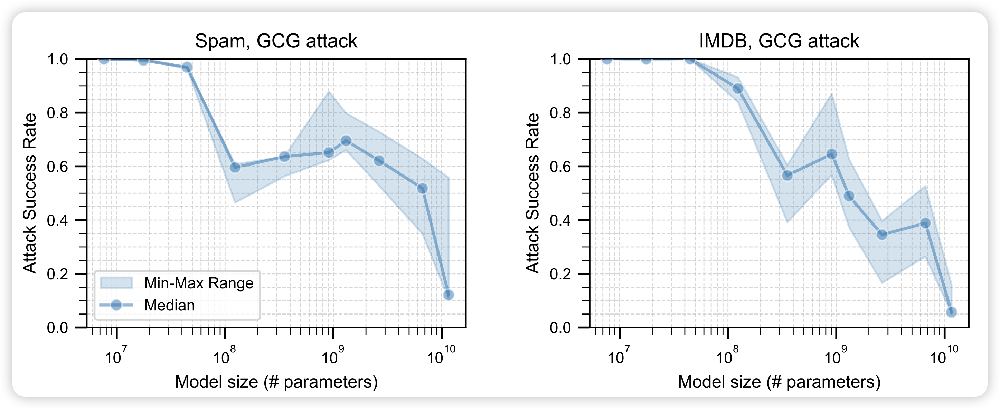

今天仔细拜读了一下llama3 technical report，写的真好啊，里面每一页的工作量都堪比arxiv的一整篇论文了……推荐大家都去读一下

## [OpenDevin: An Open Platform for AI Software Developers as Generalist Agents](https://arxiv.org/pdf/2407.16741)

Neubig的工作，我猜是因为track分类AI还是software而被arxiv卡住延期发布了。是一个开源agent框架社区，大家一起搭建可以写代码、执行代码、运行command line和web browsing的agent。

## [**Exploring Scaling Trends in LLM Robustness**](https://arxiv.org/pdf/2407.18213)

一篇研究攻击+scaling的工作，作者验证了一个结论：在LLM中，是否越大的模型越不容易遭受攻击。发现对于LLM和之前的vision model都是相似的特质。

> 感觉得到了一个大家都能想到的结果，不过研究的角度挺好玩的

