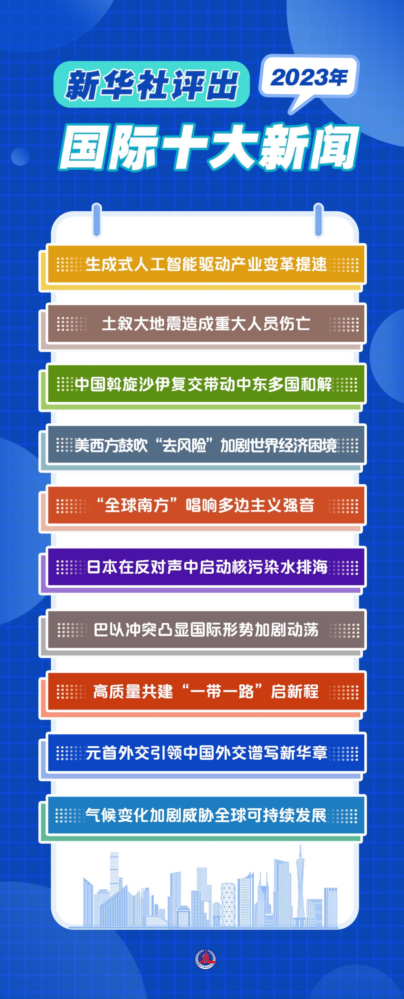

上次写总结还是在2023-9-29, 没想到下次再写竟已经是3个月之后了，到了2023年的最后一天。每到年末，各种APP就喜欢来个xxx年度总结：B站总结、steam总结、网易云音乐总结……不过今天看到一个"新华社年度十大新闻"觉得挺有意思，我就想，能不能给我自己也列一个"年度十大新闻"呢？

<!-- more -->

总结十大新闻是一个很重要的事情，也许10年、20年后，我都已经忘记了2023年发生过什么，但可能还会记得之前总结的"十大新闻"，在这个意义上，这其实就代表了整个2023年对我的印象。就像杨大伯之前说的"每门课上完，你最少记住一句话，记住一辈子"。大概就是这个道理

然而，总结年度十大新闻也是一个很难的事情，因为很多事件的影响可能很难在年底就出现，可能更应该来个时间检验奖，2023年更容易评出来"2013年年度10大新闻"，大家也就姑且一听吧:

1. 本科毕业：2023-06
2. 研究生入学: 2023-09。还是华子，还是贵系
3. 和TLE的1000天纪念：2023-06
4. 去成都旅游：2023-08
5. 第一次发Twitter：2023-08
6. 第一次得新冠: 2023-01
7. 尝试纹理烫：2023-02
8. google scholar 100引用：2023-08
9. end2end做饭：2023-07
10. 凑齐apple全家桶：2023-06

不知不觉，本科都已经毕业了，变成研究生了……前几天拉着室友一起回到十一学校去帮清华招生宣讲，突然感觉自己变得好老，高中学弟说的高中生活、本科学弟说的本科生活，好像全都已经离我远去了。明明研究生才开始一个学期，但心态似乎已经完全不同了。说起来，本科生活似乎也没有很"多彩"，各种行动不管是实践或者运动，好像也大都有某种目的性。虽说大学的优化目标比较多比高中多，看似非常的diverse。但各个项目都要优化、都和某些利益挂钩，反而会让所有事情都隐约套了个目的性的壳：运动是为了阳光打卡，科研是为了保研，社工是为了评奖……到了研究生，优化目标反而纯粹了，这种目的性的东西基本没有了，希望可以更多的做一些纯兴趣的东西，比如来场随心的旅行

华子的传统是每年的跨年敲钟时都要宣布一个有利于生权的好事。2019年跨年时邱宝敲钟完宣布校园网流量从一个月20GB升级到了50GB。今年的好消息看来是"清华和北大不限制双向入校"。仔细想了想，虽然感觉华子不怎么关心生权，但把尺度放大，从我入学到现在，想达成的几个生权的好事基本也都达成了：

- 无限量校园网，在21年校庆的时候完成
- 白天可以洗热水澡，22年校庆的时候完成

希望等研究生毕业的时候下面这几件事也能完成：

- 洗衣机免费
- 食堂可以卖冰淇淋(手工)
- 为计算机系同学提供免费的算力，比如1xA100/ person
- 学校里可以有电动车充电桩

喊了一年的新系馆，23年最终还是没住成，现在又改口说是24年3月搬，无所谓吧，反正这已经是第5次改口了，就像美国的国债限额，大概快到时间了还会再延期吧。西体育馆终于建成了，我记得18年暑校的时候辅导员就在提冰雪场馆，19年入学的时候好像就围起来了，最终23年终于可以滑冰了。虽然还没有体验过，不过看同学们反馈都不错，24年真得去试一试。现在东边的足球场又围起来了，听说要建一个最大的地下学生活动中心，还挺期待的，希望我毕业的时候能用上。

华子每年都在盖新的楼，每年也都有新盖好、装修好的楼投入使用；同学每年都在提新的需求，每年也都有需求被满足……希望我也一样，每年都能有新的回忆产生，每年也都能找到新的目标，也能交到新的朋友
