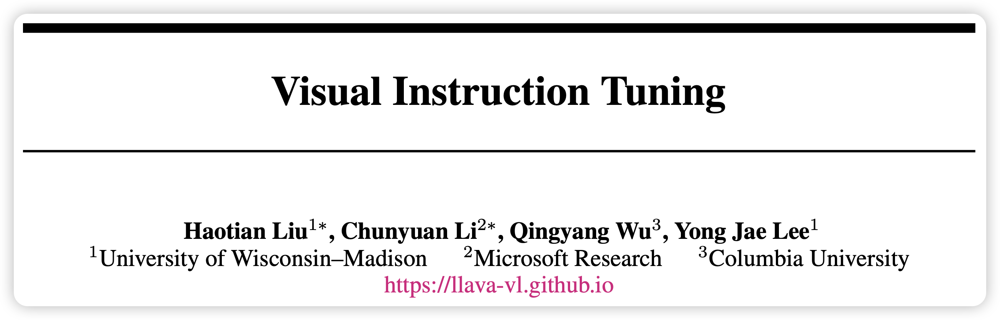
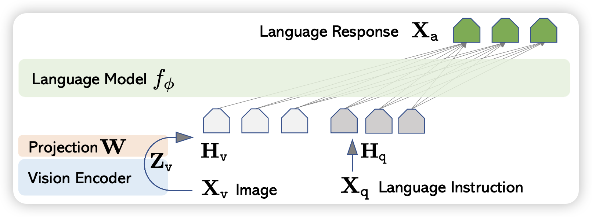
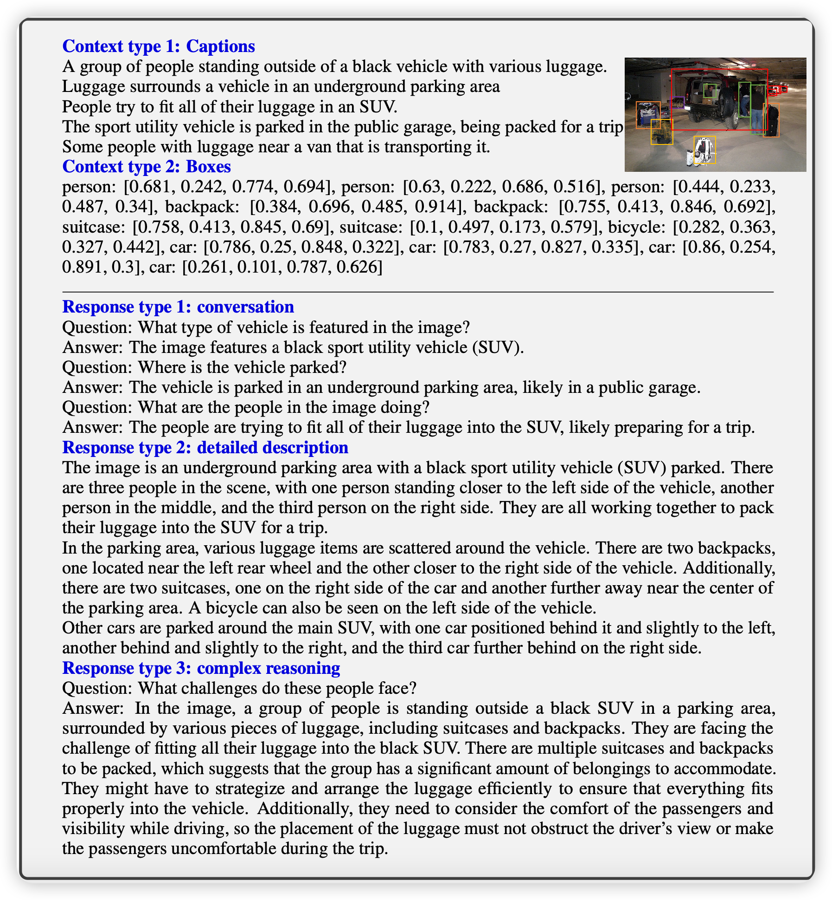
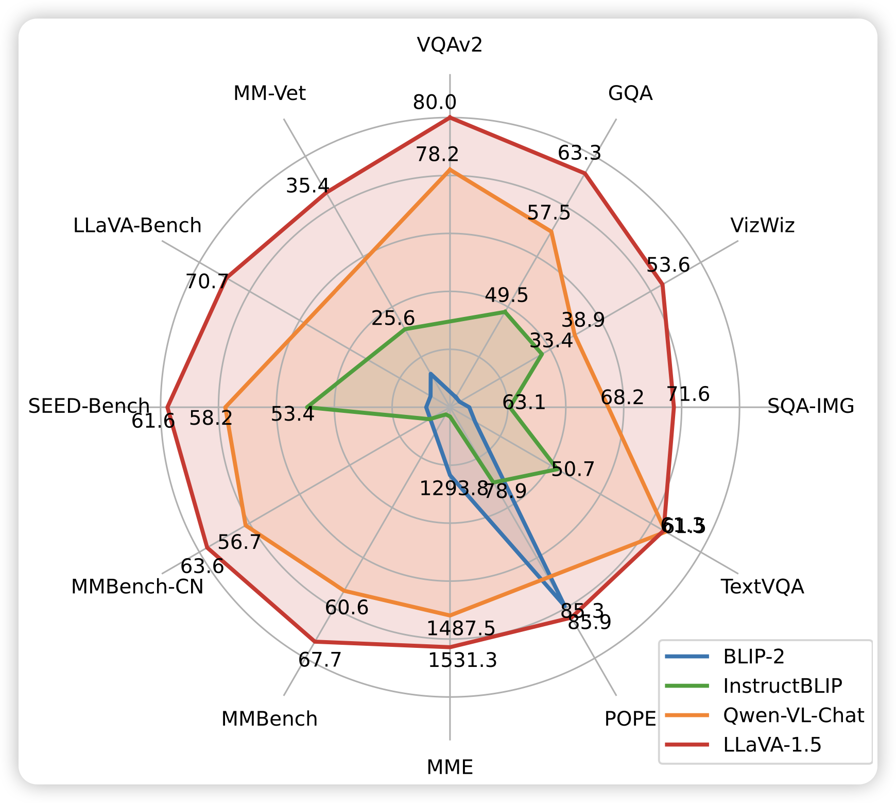
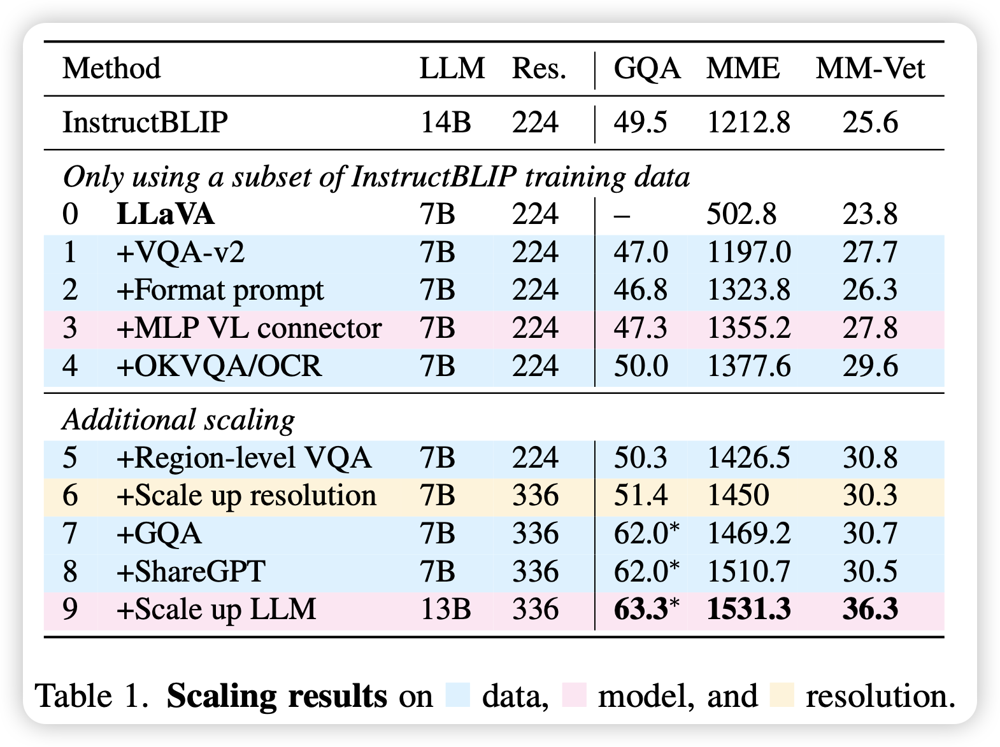
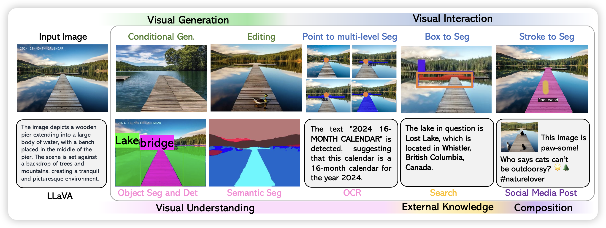
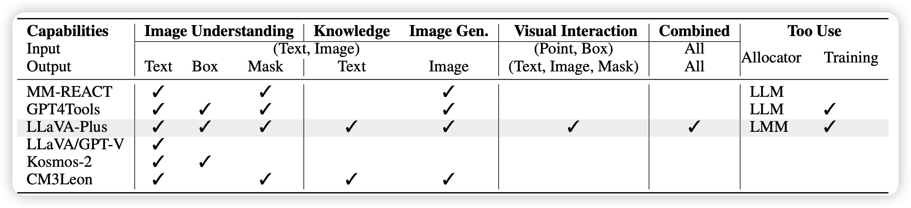
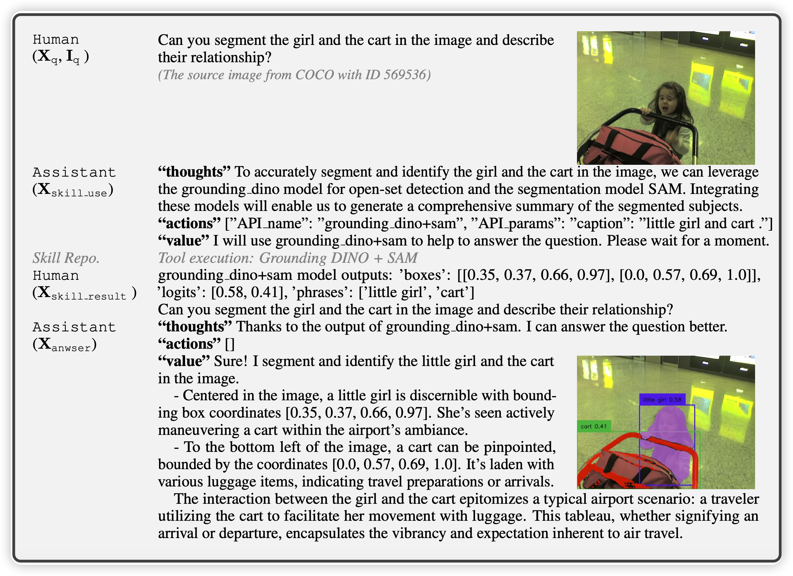

昨天刷到新挂的LLaVA-Plus的Arxiv论文，讲怎么做多模态的ReACT与训练模型。正好发现LMM(Large Multimodal Model)系列的模型似乎怎么讲过。那么LLaVA系，三篇论文，今天一次说完。

> [Visual Instruction Tuning](https://llava-vl.github.io)
>
> [Improved Baselines with Visual Instruction Tuning](https://llava-vl.github.io)
>
> [LLaVA-Plus: Learning to Use Tools for MulitModal Agents](https://llava-vl.github.io/llava-plus/)

~~flamingo、Kosmos 2.5下次有时间说啊~~

<!-- more -->

首先，在作者上，这三篇论文基本上是一脉相承，没有出现LLaMA的黑吃黑现象。他们的鼻祖LLaVA一代发表在neurIPS 2023 Oral，上Arxiv的时间是4月份。当时LLM基本还是蛮荒时期，大家都是被GPT-4V发布时的惊艳骗进来，想搞个猴版，技术路径和研究思路有迹可循。不像现在成熟以后，论文都是天马行空地说，很难把握住核心思想。

## LLaVA

所谓的large multimodal model, 就是想把LLM的能力范围再往前推一步，让他可以"see and hear".

LLaVA的主要思路是：由用一个CLIP作为image encoder，然后训一个轻量级的链接器，把clip embedding连接到一个LLM的空间，由此让一个LLM理解图片，进而变成LMM。

上面的这套流程，重点就是需要图文数据集，而且需要是instruction-follow数据集。目前的图文数据对大多是image caption的，文字主要是描述文字内容。另外有一些VQA的数据集，其问答式针对图片里的一些元素，总体还是比较简单。

LLaVA的作者对上面的思路做了一下梳理，构造了一个数据集。里面所有的数据的格式都是类似于下面这样
$$
X_q X_v<STOP>\text{\\n Assistant} : X_c <STOP>\text{\\n}
$$
其中最前面会有一个图片，然后会有一个问题，接下来是回答。总体是多轮对话形式的。作者定下了三种数据类型，共158K数据

- conversation：58k
- detailed descrption: 23k
- Complex reasoning: 77k

### model and training

模型结构上，非常简单。作者使用CLIP ViT作为image encoder，用LLaMA作为LLM。然后clip embedding通过一个Linear层投射到word embedding层。接下来直接将他作为一个word embedding和其他word embedding一起去跑LLM后面的流程

作者设计了一个两阶段的训练任务。第一阶段是对齐文本图像空间。作者直接使用图文数据对作为数据集: 图在前，文在后。然后训练的时候只训练W的权重。

接下来是instruction follow阶段。这一部分训练image encoder和W的权重，用他的158k数据集训练出来的instruction follow模型

训出来的模型基本都是按照这种形式。可以看到，传入的图片基本上是一个原图，加上一些的形式bounding box，然后几种数据格式在表现上就是对话。作者在训练的时候，只有answer的部分是有loss的。

LLaVA是一个很干脆的论文，把一个思路清晰的做了出来，并且比较重视原始数据。

## LLaVA 1.5

到了二期，论文只有短短5页。作者在方法上没什么更新，只是把LLM基座模型换成了13B，把image encoder换成了更大更强的CLIP-ViT-L-336px，然后把连接层的Linear换成了双层MLP。

另外作者还观测到之前LLaVA由于图片分辨率的问题，会看不清楚输入，新的image encoder可以看得更清楚

作者从scaling的视角来看他们的方法， 提出了一个问题：158k数据够了吗？

作者把数据集混入了一些VQA、OCR的数据，另外对instruction-following prompt中要求对response给出格式要求，这样更方便模型对学习，比如说：

> *Answer the question using a single word or phrase*.

作者在上图中报告了对于数据、模型大小，和图片分辨率做scale后的效果。看起来提升模型大小是涨点最有效的办法

最后用最大最强的模型去刷了个榜。这篇论文就是经典的二期论文的写法：找到最严重的问题，并修复之。另外，从scale的视角看整个问题，很好的视野。

## LLaVA-Plus

在LMM基座模型效果提升了以后，作者瞄准了现在比较火的工具学习场景：能不能让LMM去通过工具调用来进一步提升task solving的能力？由此写出了LLaVA-Plus(Plug and Learn to Use Skills)

既然立足是一篇Agent的论文，作者论文写法都变了，用了story oriented的写法，故事性变得很浓。可见作者的写作功底还是很好的。在Introduction中甚至搬出来了祖师爷"Society of Mind"的理论(1988)

> Society of Mind: each tool is originally designed for a specific skill and by itself is only useful for specific scenarios, but the combinations of these tools lead to emergent abilities that show signs of higher intelligence.

LLaVA的总体流程和ToolBench非常相似，具体可以看这个 。大致上就是

- 先找了一些target image
- 找GPT4对image造出来一个query too observationl answer这样的tuple
- 把这个tuple弄成一个数据集。以此作为训练数据，训练出来LLaVA-Plus

具体的数据格式看起来和ReACT完全一致，经典的thought、action、observation、answer。作者一共制作了一个LLaVA-158K的数据集，另外把测试集搬出来做了一个叫LLaVA-Bench的测试系统。

作者说明，训练出来的模型达到SOTA水平。

## 我的思考

可以看到，从今年4月走到11月，作者在LLaVA的道路上一路深耕，提高基础能力。再基础能力提上去以后，逐渐做到Agent能力。估计后续随着能力进一步提高，也许可以尝试多步工具调用以及多模态planning。LLaVA是一种lightweight的多模态连接方式，对text encoder和image encoder的模型结构都不做要求，从结果来看，效果还挺好。

为什么不在预训练阶段就用多模态的模型？一方面，作者在论文里说到的一个问题其实很有道理：目前的多模态数据主要就是图文caption对，这样的数据可以让模型去理解图片，但也没有进一步的能力需求了(不像纯文本数据那样需要推理等)，即使是VQA也以简单的数数、区分左右等等为主。训练数据决定模型学到的能力，我们可能得找到更好的多模态预训练数据。另一方面，多图多文结合也是一条路子。像GPT-4v就是天生多图的，这样的多图数据某种意义上和多步推理有着更紧密的联系。

最后，我很喜欢scaling的视角，我觉得scaling的结论是最可信的结论，也最有可能是未来大规模应用的前提。也不知道以后的LMM到底是单模态模型的整合，还是预训练级的多模态……
