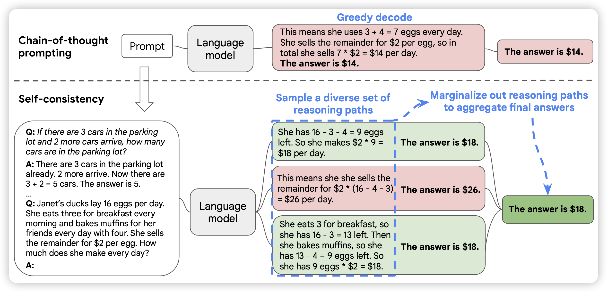
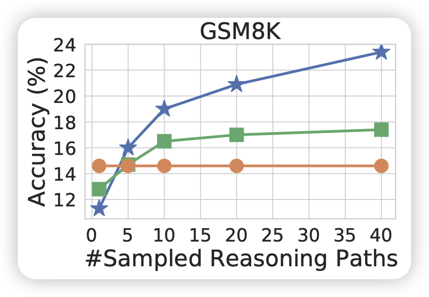
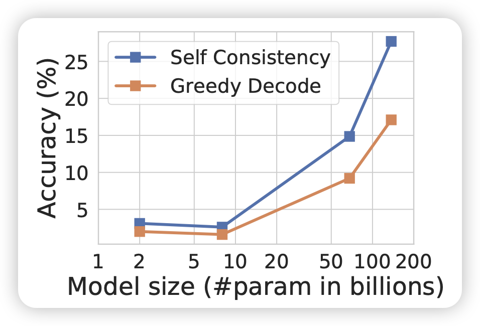
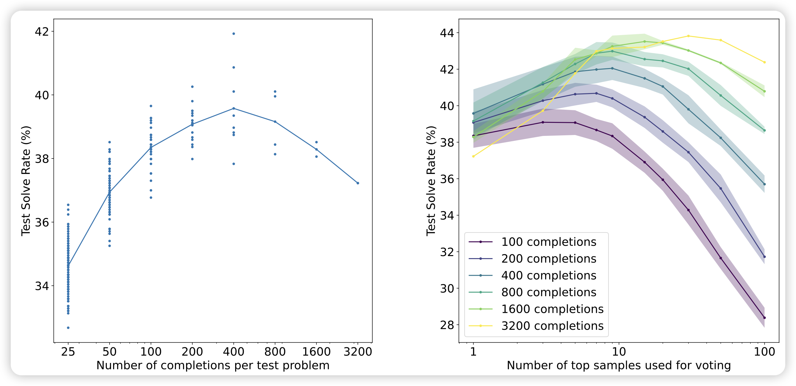
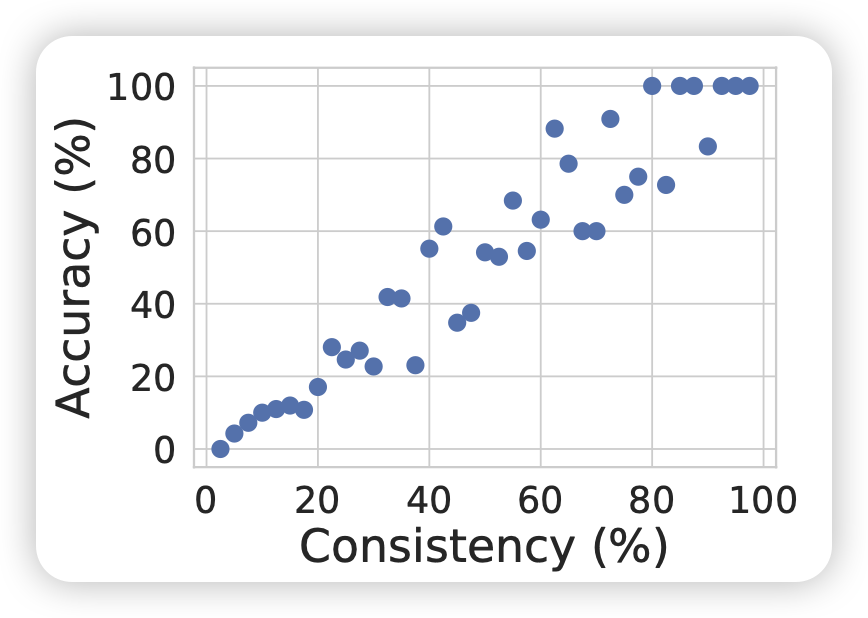
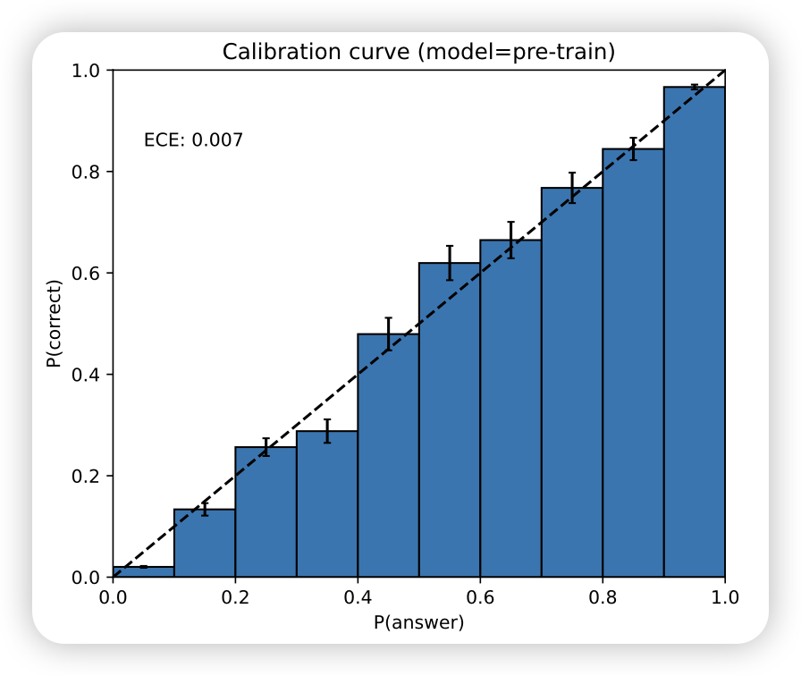

好久不更新了，看到之前大约都是15天更新一篇笔记，最近不知道咋回事竟然一个多月没更新，正好这两天刷到了"More Agents is All You Need"，就来讲讲“时间换效果”的鼻祖——self-consistency。如果让模型sample多次，然后做major-voting，效果会更好吗？

参考文献：

> Self-Consistency Improves Chain of Thought Reasoning In Language Models
>
> Escape Sky-High Cost: Early-Stopping Self-Consistency for Multi-Step Reasoning
>
> Universal Self-Consistency for Large Language Model Generation
>
> More Agents is All You Need
>
> Unlock Predictable Scaling from Emergent Abilities

<!-- more -->

## Self-Consistency

什么是self-consistency？要从CoT算法说起，之前CoT的思路是：如果让模型在输出答案之前，先说一些rationale，最终就能得出相对更准确度的结果。用类似于"Let's think step by step"的prompt，就能激发模型进行对应的CoT输出。

而self-consistency则更进一步，如果用更多的CoT放到一起，能不能进一步提高效果？具体来说，模型按照某种随机解码算法，比如p-sample进行多次解码，最后根据多个结果做去重，最后给出众数作为结果。一个经典的例子就是数学计算题

神奇的是，随着sample次数N的增长，最终的准确率就会逐渐提高，比如下面这个图对比了下面几个东西

<table>
<tr>
  <td></td>
  <td></td>
 </tr>  
  <tr>
    <td>随着sample次数的提高，SC算法的效果逐渐提升</td>
  <td>在一定的范围内，越强的模型受到sc的增量越多</td>
  </tr>
</table>

- 橙色线：greedy-decoding的结果，和N无关
- 绿色的线：voting-with-ppl：sample N次，提交对应的ppl最小的，即token-level信心值最高的
- 蓝色的线：self-consistency，提交结果的众数

实际上，self-consistency是一个时间检验的算法，对于各种场景都能几乎稳定地获得提升。早在2021年OpenAI的GSM8K论文，就报告了类似的结果：他们先使用打分器选出最高的topk个样本，再在他们之中选择Major-voting的结果(下右图)，效果比单纯对打分器选择top1的效果好很多

## Self-Consistency之我见：Instance-Level Calibration与集成学习

为什么self-consistency效果会这么好？我下面来聊聊我的看法。

首先，self-consistency论文中报告了一个有趣的结果：他们发现结果一致性越高的query，真实的准确率也越高

<table>
<tr>
  <td></td>
  <td></td>
 </tr>  
  <tr>
    <td>sc中，结果一致性越高，真实准确率就越高</td>
  <td>GPT4 report：选项一致性越高，结果准确率就越高</td>
  </tr>
</table>

这其实和后来大家发现的calibration现象很像：对于4选1 multi-choice QA场景(比如MMLU)，模型对于4个选项token里信心最高的选项的prob越大，对应题目的最终准确率就越高

> 实际上，calibration的这种方式在"selective prediction"领域又被称为MaxProb算法，calibration领域大概是"重新发现"了他……

这就促使我去思考，self-consistency既然在instance-level选择概率最大的，并根据可以报告instance-level MaxProb。是不是就是在模拟instance-level的calibration呢？

instance-level的一致性该怎么表示？如果从刚才maxProb的角度思考的话，直观的想法是使用PPL最低的样本。其实，这个方法也被self-consistency原始论文报告了(绿线)。可以发现，这个算法的效果虽然比greedy-search好，但并不是scalable的，甚至在n很大以后效果会更差。这个现象和GSM8K中best-of-ORM-verifier是一致的，都是随着N的增加先增后减。这是因为ppl或者verifier都是不够鲁棒的。举个例子，对于math场景，ppl的大小不仅受到模型对于expression的信心值，还受到expression表达方式的影响，考虑下面两个句子：

> 3*5=15
>
> 3乘以5的结果是15

对于模型来说，ppl是生成每个token的平均概率。这两个句子虽然表达相同的意思，但是表达形式不同，"乘以"、“的”、“结果”这几个token的信心值都会很高，所以导致两个句子的ppl差很远。然而，其实模型对于3*5=15这个表达式的信心值是固定的。这也就会导致，best-of-ppl的算法在N很多以后，模型可能偶然发现一些很简单的表达形式，ppl很低。但这个这只是模型对于“表达方式”的信心值。类似的，best-of-verifier也会有类似的情况，这就是bad-heuristics，或者叫adversarial-solutions的问题。除此之外，还有rationale方式的问题，一个结果可以用不同的思考路径所表达，就像是一个题目会有多种方法去做。

相比之下我们发现，Multi-choice QA场景没有表达形式的bias，因为四个选项都是使用一个token表达的。因此，直接使用选项token的maxProb就可以做出相对很准确的准确率估计。

major-voting是一个道理，如果我们sample N次对结果划分出不同等价类的话，可以发现，我们实际上得到了不同结果的频度。当N变得很大时，这个趋向于了不同结果的概率分布。从这个instance-level概率分布取最大概率，就是instance-level的maxProb。他不会受到表达形式的影响，因为大家都是按照同样的算法采样，每个算法都有可能以困难的形式被表达，也有可能用简单的方式表达。

> 从直觉来看，self-consistency的效果提升其实也很容易被理解。我们可以类似于shengding学长的论文去定义出pass-until：sample N次，其中答案正确的比例。
>
> 假如pass-until = 60%，那么显然self-consistency一定会把正确答案投票出来。但如果只sample一次，就有40%的概率做错。对偶的情况是，pass-until != result-maxProb时，self-consistency一定做不对。但是如果只sample一次，有可能反而能找到正确答案(虽然这个概率估计很低)。

self-consistency的提升点，实际上是在两种情况的博弈。想要观察self-consistency的提升点，也许需要列出来一个数据集中所有样本的pass-until的直方图来观察。实际上，这个直方图恰恰就是上面展示过的"带权"版本的sc-consistency图。另外，我认为实际上应该使用self-consistency的结果（而不是greedy-search）作为模型对于一个数据集的performance。

另外，self-consistency主要是考虑用同样的随机解码算法做拟合，能不能考虑算法本身的异构呢？

- 用不同的模型结果做综合
- 不用的解码算法的结果做综合
- 不同的system-prompt的结果做综合
- 甚至是multi-agent system中不同agent通过类似debate的形式做沟通博弈...
- google还做过综合不同的reward model来进行RLHF训练

这些思路也自古有之，叫做集成学习。出自一个朴素的直觉：条条大路通罗马，不同的方法都相对认可的东西，实际正确率也更高。所以说，self-consistency集成不同的思考链，其实是集成学习的一种in-context版本的特例，自然也可以集成更diverse的自由度。

最后，self-consistency根据结果的等价类做划分，得出来了instance-level的calibration，这个事情能不能再step-level做呢？虽然没有人formalize这个问题，但我在一些独立的工作中看到了类似的解决方案：

> 1. shunyu yao的ToT：其中的BFS baseline在step-level进行self-vote。对偶的，可以设计self-consistency。
> 2. 所有的PRM相关论文：let's veriffy step-by step 、Step-Aware Verifier、math-shepherd、Discriminator-Guided CoT、outcome-supervised verfier等等，都可以在step-level设计look-ahead搜索算法
> 3. More Agents is All You Need中的hierarchical sample-and-voting

再推广一步，到最细力度的token-level，一致性是天生就存在的(logits)。那么就会有beam-search等算法去寻找ppl最低的结果

## Self-Consistency的应用与改进

self-consistency有两个巨大的问题和一个小问题。改进方法大致也从这些问题出发

### 大问题1：需要某场景可以划分等价类

对于数学场景，可以认为结果相同就是一个等价类。但对于很多free-form的场景，比如数学证明题，比如写代码，比如机器翻译该怎么办？写代码任务，类似于google AlphaCode，会根据代码中每个测例的输出，按照对拍结果划分等价类。这依赖于一个外置的执行器。

既然ToT可以做self-vote，那self-consistency能不能行呢？最近，denny Zhou做了一篇工作，可以让模型根据多个样本都放在prompt里，然后让模型自己说一个最一致的结果出来。那么，代价是什么呢？需要模型可以同时存下所有的结果在context里！

另外，刚才提到了step-level的self-consistency，这个更复杂，依赖于对step划分等价类。首先，不是所有任务都能像ReACT场景一样划分成天生多步的。其次，很多任务的多个执行链其实不是按照树的格式组织的，是按照图的形式组织的。所以，更细粒度的step-search依赖于更细粒度的等价类划分

### 大问题2：需要更多的计算资源

self-consistency动辄就需要一个query sample N=40次。对于GPT4来说，在MATH数据集sample 40次，需要大概2000美元。这显然不可接受，最近有很多工作试图减少self-consistency的效果。

从直觉上来看，如果只sample 10次，结果都是一样的。理论上这个很可能是就是众数结果，最极端的情况是出现类似斯诺克中的"超分"：即使后面所有的结果都是目前第二大的，也不能超过最大的。从统计学上对这个直觉做建模，就是狄利克雷分布。很多工作会涉及一些基于熵的算法去拟合self-consistency的一致性要求。

### 小问题：需要一个场景的天然假阳率不大

最后这个，本质上不是一个问题，而是一个现象。举个例子，对于判断正误的问题，答案只可能是对或者不对，就两种可能。随机猜都有50%准确率，这时候有非常多的假阳情况。self-consistency拟合出来的一致性，就会受到影响：假阳的样本往往都是eazy-heuristic，一致性都挺高的。

所以，应用self-consistency的时候，可能还需挑场景，最好选择类似计算题的场景：结果正确，那么基本上过程也是正确的。

## 我的思考

之前的论文阅读笔记大多是照着论文的展开顺序讲。最近读的多了以后，渐渐感觉很多东西和某些别的领域有更多的相关性，把别的领域的直觉拿来解释，可能相对更清晰。这也是我现在读论文的一个经验。比起理解论文的素有方法，更重要的是理解论文背后的直觉：

- 一方面，理解了直觉理论上可以把论文的方法重新推导出来
- 另一方面，论文的方法不一定都是管用的，有一些“为了创新而创新”的工作量证明的部分。从直觉出发，更容易剔除掉这些"noise"……

> 对于这个问题，有人说：AI的论文没什么内容，创新都很简单。我认为恰恰相反，理解起来简单是因为讲得好。如果一个论文讲的神头鬼脸、玄之又玄，那大概率是作者自己都没搞清楚自己论文的“first principle”——背后的直觉到底是什么

最后，self-consistency是一个时间检验的方法，对于所有模型、对于所有场景都能有提升。之前jason wei发了一个twitter，认为CoT和self-consistency的效果提升来源于数据和问题的固有熵，对此我产生了一些不同的见解，贴出来我的看法：

I don't entirely agree with this viewpoint, here are some of my insights: 

1. CoT aims to use a nearly identical, substantial amount of computation for both difficult and simple problems to ensure performance. Thus, recent works like GSM8K-zero ([https://arxiv.org/abs/2401.11467](https://t.co/JJO0tQkHSP)) have found that CoT can waste a lot of computational resources on simple(trivial) problems. 
2. The information density in the corpus(the varying difficulty of predicting each token) is an intrinsic property of datasets (e.g., predicting the answer-token on MMLU is harder than predicting query-tokens), which is why speculative decoding succeeds in some settings and not in others. 
3. Instead of fitting corpora with uniform information density, it's better to retain the dataset's intrinsic properties and instead adapt the model computation to fit the difficulty of the corpus, i.e., adaptive computation. 
4. On the instance-level/step-level, this is what "flow-engineering" is about: Allowing for dynamic decision-making on the complexity of CoT based on the task. 
5. At the token-level, there are passive solutions like pause-token ([https://arxiv.org/abs/2310.02226](https://t.co/dYnr2CEAqI)) that use more forward passes on some manually selected tokens. There are also active solutions like early-exit ([https://arxiv.org/abs/2402.00518](https://t.co/5TNCd76Zcy)), which allow the model to freely decide the computational effort for each token. And, though speculative decoding has a different goal, it acutually achieves the purpose of adaptive computation. 
6. Besides point 5, I also think Mixture of Experts (MoE) technology has achieved part of this goal: Firstly, early works in MoE could dynamically decide the activated number of experts and implement heterogeneity of experts (different experts have different size) to achieve the purpose of adaptive computation. Secondly, OpenMoE ([https://github.com/XueFuzhao/OpenMoE](https://t.co/li4vngcGYr)) discovered that even with a fixed number and all the same size of experts, a phenomenon occurs where "one expert is always responsible for some tokens". And we all that token-id represents part of the predictive difficulty (e.g., predicting punctuation is often easier than predicting numbers)... 

I believe that future models can freely and acitvely decide on computational complexity based on the task's information density, just like us: Think Before You Speak.
