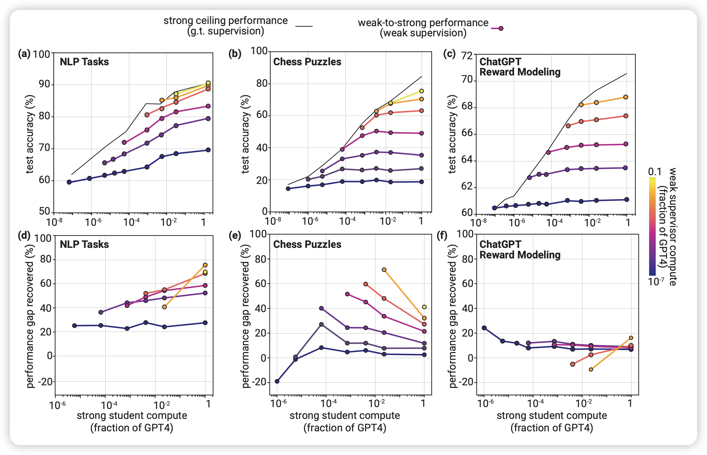

昨天OpenAI一口气更新了两篇论文，暨DALL.E 3之后的又一更新，其中一篇讲述了一个朴素的问题：如果未来的模型超越人类了，我们该怎么给他们提供监督信号？（毕竟我们只有人类——一个相对更弱的模型）

OpenAI把这个问题叫做weak-to-strong generalization在这里做了一些简单的尝试，对于这个问题的性质进行了一些探索。我们来一起学习一下他们看问题和解决问题的思路吧！

<!-- more -->

作者首先映入眼帘的就是ilya Sutskever，这个老哥真是为人类尽心尽力呀……OpenAI官网写的这个论文的作者是"Safety&Alignment"

而他的primary authors Jeff Wu更是重量级，我不多评价，直接列出其最近的publication，可以说是群星璀璨了……我什么时候能发12篇论文都有这个质量呀

## introduction

回到正题，作者提到目前的研究更多focus在RLHF，既模型向人类偏好对齐，这套框架最终可以发展出一个类似于人的通用人工智能。然而，到此为止了：想要训练、对齐一个超越人类的智能，目前的方法都不再适用了，因为我们最高也只能用到人了。举个例子:

> 我们可以要求模型写出一个100万行的很复杂的代码来完成一个任务，然而让人去看代码好不好是一个很难达成的任务。

因此，目前还没有关于superalignment（对齐一个超越人的模型）的研究，并且，我们更希望其对应的方法可以不止适用于目前的模型，更适用于未来的模型(consistency)。在本篇工作中，作者类比了人类监督超人模型的问题，提出了一个类似的问题：可以用GPT2监督GPT4吗？

> 具体来说，能不能用GPT2在某个任务的trainset上finetune，然后给trainset重新打一遍标签。让GPT4在GPT2打标签的trainset上训练，然后观察GPT2和GPT4在testset上的表现？

这是一个很直观很容易实现的setup，作者把这个set up叫做weak-to-strong learning。

听起来这个weak-to-strong generalization似乎是不可能的，不过作者进行了一些解释：在学习过程中，我们不是预期弱模型教会强模型知识(这些知识是强模型本来就会的)，而是希望弱模型教会强模型这个任务的概念是什么，和一些intension，因此这个过程更像是激发"elicit"。用刚才那个例子来说，如果强模型已经能写100万行的代码，那他肯定有潜力去理解人类的目的是什么。因此即使弱模型给的标签有误差，应该不影响一个更鲁棒的强模型去理解，这就是作者预期出现的结果。

作者在传统NLP task(二分类)、chess puzzles(选出最优步的生成任务)、human preference modeling(二分类)上做了实验，并得出一些结论：

- 强模型在weak-to-strong generalize以后基本都会超越帮他标数据的弱模型。？？？
- 直接做weak-to-strong generalize的效果并不好，比强模型+oracle-label finetune 差很远，可能需要一些额外的优化
- 一些很简单、很直觉地方案对于这个任务的提升很大。这说明这个领域还有很大的进步空间

## method

像刚才Introduction里提到的，这个setup是很简单的。不过，比起一般论文讲完方法讲实验，作者额外说了一下这个setup的优点和问题。作者额外说了一个他们观察的指标performance gap recovered(PRG)：假设weak-to-strong训练比小模型效果好，那他能恢复强模型直接训练的几分风采？注意，这里面PRG=1代表和强模型直接训练等价，PRG=0代表和小模型表现一样，完全没有generalize。

> 为什么要和 “强模型+orcale finetune” 去比？虽然现在的setup是数据集，因此有orcale 标签可以做"强模型+orcale finetune"的上限实验。但事实上所谓的"orcale 标签"也是人去打的标签，未来的模型在完成超人任务时就没有标签了，或者说只有人去打的"噪声标签"。
>
> 这种情况下，我们可以预设有"外星人打的oracle标签"跑上限实验，也就是说：我们更关注超人模型的能力上限能不能被激发出来。PGR可以看做一个"激发比例"

优点：总体来说，就是这个方案更有利于scaling

- 对于模型不可知，任何的 强-弱 模型对都能跑这个实验，也不需要一定要有GPT4。另外，这个路径不需要人，因此实验很快
- 对任务不可知，任何任务都能跑这个setup
- 这里面得到的关于超人模型的结论，即使现在也能用的上：未来对齐GPT10的方法，不妨现在就用到GPT4里？

> 这也许暗示着目前OpenAI内部已经有超人模型了……

缺点：

- Imitation saliency：这个我觉得很难翻译，就直接摆原文了。这里讲的是未来的超人模型和今天的GPT4存在统计学的巨大差异。对未来的超人模型来说，理解人类的想法是一个很简单的问题，但GPT4去理解GPT2可能没那么简单。并且，GPT2犯的错误类型和人类犯的错误类型也有很大区别，因此目前的结论更多是研究GPT2错误，会有统计学差异。
- 数据泄露：目前的setup里面的oracle标签可能或多或少在预训练数据里出现过。未来的模型不存在"超人的预训练数据"，因此实验结论可能和现在有偏差

总体而言，超人模型长什么样、有什么现象现在仍未可知。作者提到，我们更需要对于未来的所有模型都跑一跑现在的实验，观察一下实验结论是否是稳定存在于所有模型中的……怎么有一种三体人的水滴在破坏物理学规律的感觉……

## experiment

作者在附录里讲了实验细节，大致有如下关键点：

- NLP task中，作者选取了29个有代表意义的task，都转换成了2分类任务，为了简化整个setting。
- 在模型方面，作者使用GPT4架构，构造了和GPT2、GPT3、GPT3.5、GPT4相当计算量的模型(但都是GPT4架构)。作者去掉了decoder最后的那个unembedding layer，换成了一个二分类头做实验
- 数据方面，作者把数据做了一些清洗，使得数据集中两个类的标签数量接近，然后有数据分类风险的数据们都在train test的其中一个split上

另外两个setup：

- reward model：作者直接使用了训练ChatGPT的SFT数据集，里面有数据对以及human给出的偏好。可以看成一个很复杂的二分类任务。这个的训练方法和正常的reward model一样，把unembedding layer改成一个N->1的linear来输出一个float当做score。最后用两个candidate的score谁大来作为预测
- chess puzzle：很多象棋的棋局，作者希望模型给出第一步，最优解是什么。这个可以看做一个生成任务，因为可选位置有很多个。原始数据大概长下面这样

> 我猜测，作者选这几个setup是基于这样的考虑：
>
> NLP task，大小模型做的都不错。
>
> chess puzzle，大模型做的不错，小模型做不了。 
>
> reward model，大小模型做的都不太好

由此，作者

- 首先构造了大小不同的多个GPT4架构的模型。这些模型都是做过预训练的，使用的预训练数据和GPT4一致
- 对于每个setting，作者分别跑了刚才提到的四步测试
  - 小模型在trainset真实标签上做训练FT
  - FT的小模型给trainset重新打一遍伪标签
  - 大模型在带噪的trainset上训练，同时做一个真实标签FT的上限训练
  - 测量三个模型在testset的表现，计算出PRG

论文的主试验就是下面这个图

这个看着有点费解，后面的所有图都用了相同的画法，我在这里解释一下：

- 纵着看，每列代表一个task。(29个NLP task被划到一起了 )
- 横着看，上面三个图报告的是数据集上的performance，下面三个图报告的是PRG
- 每个图里面的横轴说的是学生模型的大小，标准是GPT4相对计算量。注意，学生模型一定比老师强
- 图里的一条线代表的是同一个老师监督不同大小的学生的水平。老师越大，线越亮。注意，老师永远小于学生，因此这个图差不多都在右下三角半区
- 上面的三个图里最上面的线是大模型的上限实验结果。

作者观察到几个关键结论：

- PRG基本永远大于0，学生总是强过老师。
- 老师变大或者学生变大，PRG基本都会增大。对于最强的学生，PRG甚至会超过50%：这也许预示着，对于超人模型来说，weak-to-strong generalization实际上很简单

- chess puzzle任务上，这些现象更显著。当学生很小时，PRG接近0，大小模型做的都很垃圾。并且，这个任务上的PRG和前面相反，出现了inverse scaling现象？即同一个老师，学生越强，PRG反而越低了？

- 对于reward model任务，PRG一直都很低。对于所有setting，PRG都低于20%

作者特别强调了一下，PRG>0这个事情基本一直成立，这个现象其实很神奇，因为也没做什么特别的优化。这个现象预示着superalignment的可能性，也需要在相关领域有更多的研究

## 如何提高weak-to-strong generalization的表现？

做完主试验，一个显然的思路就是：如何优化他？作者在这里简单地想了几个办法。在这里，我们看一下OpenAI研究员的"注意到"是什么样的吧？

### bootstrapping：级联

注意到：刚才提到老师和学生差距太大，以及老师/学生提升，PRG效果都会变好。那么，如果用小老师监督稍微强一点的学生，再把学生当成新老师，监督更强一点的学生……如此反复，效果会更好吗？

作者在chess puzzle进行了实验，图里面的虚线是主试验里面的小老师直接监督大学生，实现是级联监督的结果。作者发现：

- 当最开始的大小gap差距小时，这个办法是优化
- 当最开始的大小gap差距大时，这个办法是负优化

尽管在chess puzzle看起来效果不错，但作者发现这个办法在NLP task提升不大，在reward modeling没有提升。对于这个现象。作者"注意到"：主试验中，Chess这个场景gap越大PRG越小，其他场景都是gap越大PRG越大。因此级联方法缩小gap，对于Chess才有帮助。 

> 可是，主试验又为什么会有这样的现象呢？

### auxiliary confidence loss: 学生要学会质疑

注意到：强模型是在弱模型打得标签上训练的，因此强模型不得不去学习弱模型犯的错误。我们更希望强模型从噪声标签中学习任务的intension，而不是学习弱模型的错误(因为对强模型来说，理解弱模型犯的错误也是一个简单的事情)。但目前的训练框架没法区分这两者。

作者想了一个朴素的办法，把强模型自己的confidence loss加入进去作为辅助loss，和弱模型的标签loss形成一个对抗，对冲一下"学习犯错"带来的影响。
$$
L' = (1-\alpha)\text{CE}(f(x), f_w(x)) + \alpha \text{CE}(f(x), \hat{f}_t(x))
$$
其中$f_w(x)$是老师的logits， $\hat{f}_t(x)=I[f(x) >t]$是给学生模型的预测按照阈值t做了离散化后的标签。$\alpha,t$都是超参数

注意到，上面的公式等价于下面这个，思路和self-training有点类似
$$
L' = \text{CE}\left(f(x), (1-\alpha)f_w(x)+\alpha\hat{f}_t(x) \right)
$$
这个新loss相当于噪声标签和学生自己打的标签的一个加权平均。最开始的时候学生啥都不会，应该把$\alpha$调小，后面再慢慢增大，作者在实验中就在前20%训练中把$\alpha$从0提升到0.75，后面维持0.75不变

> 如果老师和学生模型的算法相同，也许可以不再标签层面做平滑，可以直接用logits做平滑，去掉一个超参数t。作者估计是为了保证scaling的通用性，就没这么优化。

类似上面，作者在NLP任务上做了实验，发现这个优化对于NLP任务的PRG提升很明显，甚至从25%提升到了80%……作者认为这个结论是符合直觉的：aux loss可以减缓学生在"weak error learning"上的计算资源，减缓对于老师的错误的拟合

上篇也写了4000多字了，就讲到这里，在下篇我会分享作者对于这些现象，以及superalignment问题的理解，再说一说我对这些问题的看法，以及我对于这篇论文研究思路的思考。
