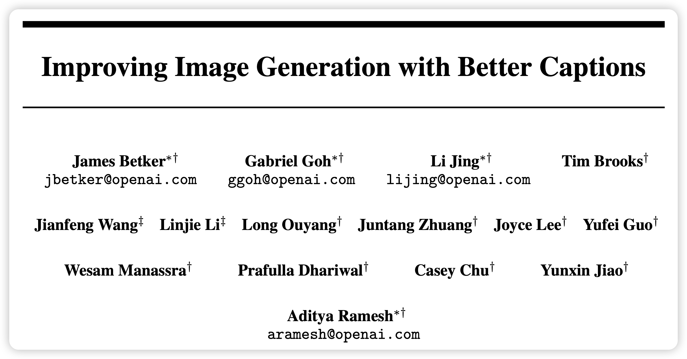
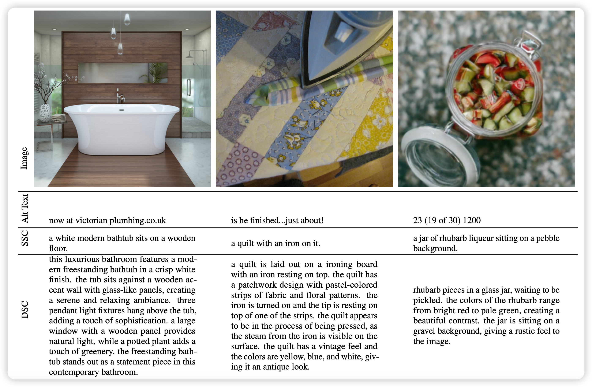
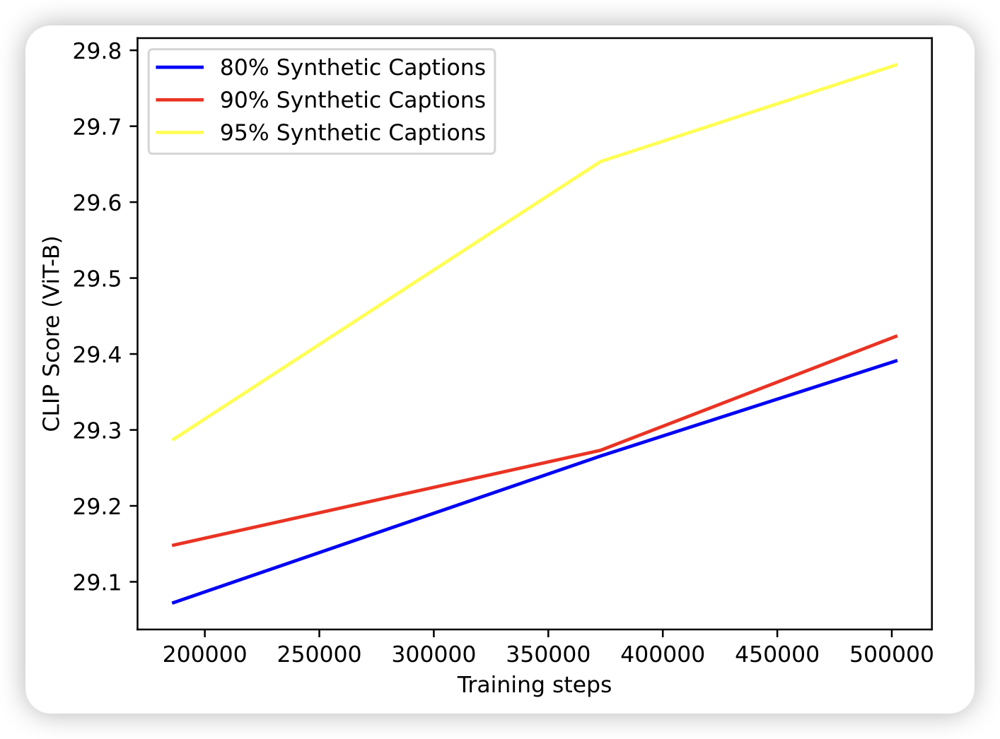
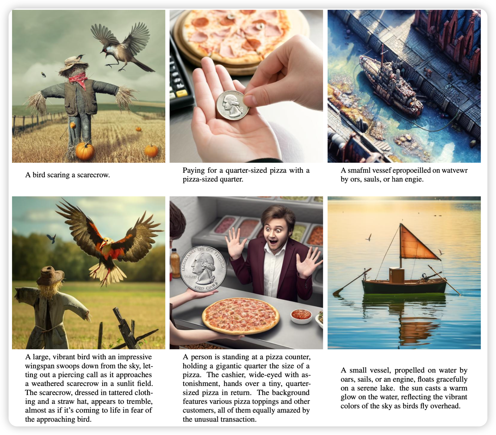

最近Sora巨火，仿佛开启了AIGC的新时代。Jason Wei表示："Sora is the GPT-2 moment" for video generation。我在sora发布的大约第5个小时读了technical report，里面最打动我的其实是没提什么细节的recaption技术。让我回想想起了之前读DALL.E 3论文时的愉快体验。

所以今天来分享一下DALL.E 3论文里的recaption细节，并讨论几个问题和我的看法：1)OpenAI教你为什么要"先查看原始数据，再做创新" 2)Recaption和大家一直在聊的"training on synthetic data"是一回事吗? 3)recaption技术是否已经在(或者即将在)被其他领域使用？

另外，我总结了一下上篇笔记阅读量大的关键：语言表达要浅显易懂些，所以这篇笔记我可以声明一下：**没学过AI也能看懂**(我在博客里加了这个标签"from scratch"，所有我认为不懂AI或者只知道一点点的人也能看懂的博客都会加上这个标签)

参考文献：

> https://openai.com/sora
>
> Improving Image Generation with Better Captions
>
> Automatic Instruction Optimization for Open-source LLM Instruction Tuning
>
> WaveCoder: Widespread And Versatile Enhanced Instruction Tuning with Refined Data Generation
>
> Reformatted Alignment
>
> Rephrasing the Web: A Recipe for Compute and Data-Efficient Language Modeling

<!-- more -->

## DALL.E 3

论文的标题明确指出了关键点"Better Captions"，说白了就是教你(叫你)去清洗数据。我们也许可以从这篇论文里，大致窥探到OpenAI世界第一的数据工程insights。

作者指出，在DALL.E 2以后，text2image得到了学界越来越多的关注，大家想要开发更好的模型结构、使用更大的参数量和训练量。另外，学界很多工作帮助指出DALL.E 2中存在的问题：忽略text中的要求、和text中的语义不符，图片里出现诡异的文字等等。

怎么办呢？继续扩大模型规模，可以在一定程度上缓解这个问题。不过，作者在查看了原始数据后发现了根源：巨量的互联网 图片-文本对 数据里的图片和文本在大多数情况下并不对应，比如下图，虽然图片相对高质量，但是对应的alt text实际上都和图片没什么关系。实际上，上面提到的text2image model中的问题，其根源在于数据集的质量。

### re-caption

所以，作者有了直觉的想法：

1. 先训练一个caption model，可以输入图片数据输出高质量文字描述
2. 把他们的整个数据集的所有文字描述全部重跑一遍，所以这个过程叫做(re-caption)
3. 在新生成的数据集上训练text2image model。保证训练数据是高质量的

这个思路没什么难的，实际上学界也早有了相关的思路，OpenAI只是把这个方法扩展了起来。作者分别标注了short-description和detailed-description两个小数据集，端到端的训练了一个caption model，然后把每条预训练数据集里面的图片都生成了SSC和DSC两种。

然而，作者敏锐的察觉到了上面这种方法里存在的问题：人类世界的caption虽然质量不一定高，但足够泛化。机器生成的caption虽然质量高，但他的多样性受制于caption model训练数据的多样性。比如说，如果caption model永远输出"a xxx"开头的caption，那么如果用户运行时的输入不是a开头的，模型是不是就会爆炸了？所以作者希望数据集中的caption要尽可能接近人类生成的text

这个问题其实也好解决：把原始数据和recaption数据掺在一起训练！作者由此开展了一系列实验。另外，作者尝试了使用GPT-4V作为image caption，效果实际上也很不错

### Blending synthetic and ground-truth captions

作者经过一系列实验，发现基本上使用更多的synthetic data，在in-domain的测试里效果会更好。作者由此训练了DALL.E 3发现效果比DALL.E 2有了明显的提升。不过作者也同时指出了，DALL.E 3仍然有很多问题，并且这些问题本质上是image caption model暂时学习不到的性质

1. get不到caption里面的空间信息，比如谁在谁的前面/上面等等，作者发现caption model也往往说不对这些关系
2. 图片里面的文字会丢失字母等等：作者认为这是text encoder是基于t5的。他的encoder是基于token的，模型需要学会把tokenizer里面的token(含多个char)映射到图片空间，这实际上非常难(比如说"图片要求写一个"play"，每个字母用不同的颜色，每个字母分别倾斜30度"。这个描述本身被tokenizer时"play"会是一个token，)。以后也许会训练基于char的model来解决
3. 专业知识性的caption说不对，比如各种罕见的鸟的类型生成不对：作者发现这是因为caption model也说不出来，因为这需要更多、更高级的世界知识理解能力。作者认为需要更强的caption model(比如GPT-4V)

## DALL.E 3还有后手？

通过上面的讲解，我们应该发现：DALL.E 3的训练数据的文字部分，绝大多数(95%)都是recaption出来的。这对模型的影响有多大呢？

作者列出来了dalle.3使用正常caption和详细caption下的实际表现，确实在prompt following能力上天差地别，使用更符合DALL.E 3训练数据格式的prompt会让他的表现好很多。实际上，很多text2image目标用户过去一年里的很多学习，或者说网上找的教程都是在学习"如何写好的prompt"。这和"模型更好的遵从prompt"是一个双向奔赴的过程，但是只有OpenAI自己知道他们的闭源的recaption训练数据到底长什么样：我们其实很难针对性的写出符合DALL.E 3预期的prompt。这也就是上面论文里提到的问题：真实人类需求和训练prompt的分布不一致，会导致模型部署时崩溃风险高。

怎么办？OpenAI帮我们想了一招：写prompt的也是OpenAI-model就好了！所以我们会发现，现在使用DALL.E 3都是基于网页端的，我的需求会被GPT "re-caption"成真实的需求。比如这张图片：

1. 我写的要求：帮我生成一张图片，描述weak2strong generation里GPT2监督GPT4

2. GPT4实际生成的prompt：Imagine a futuristic, abstract scene where GPT-2, represented as a wise, older robot with classic design elements, is mentoring GPT-4, depicted as a sleek, advanced robot with cutting-edge features. The setting is inside a vast, digital library, filled with glowing books and holographic data streams. GPT-2 is shown pointing towards a holographic display that illustrates complex algorithms and data structures, while GPT-4 observes attentively, its sensors and circuits illuminated by the holographic light. The atmosphere is one of collaboration and knowledge transfer, highlighting the evolution of technology from one generation to the next.

通过这种方案，就不怕分布不一致了。OpenAI的这个设计实际上让我产生了两个联想：

1. 对于用户来说，prompt是什么本身比并不重要。prompt只是链接需求和成品的桥梁，用户关心的是自己想要的图片完成没有而不是prompt好不好。
2. ChatGPT目前做的事情更像是链接了 用户需求 -> text-prompt。这本身不是最直观的方法，因为GPT和DALLE本身是没有交互的
3. 我们可以把DALL.E 3部署时产生的数据定义为三元组 (多轮对话, text-prompt, target-image)。如果这个数据量scale起来，数据量达到二元组数据规模以后，是不是可以直接训练一个端到端的模型呢？他可以同时生成文字和图片，理解文字和图片。直接和你的对话去理解你的那种虽然抽象、但乐于通过对话表达出来的需求(比如要多少号多大的猫)，甚至通过多轮的图片生成去一点点猜测你的真实意图。

> 在DALL.E 3论文里用GPT4生成caption的实验里展示了这种野心的一角，这可能才是text2image下沉市场(直接使用图像的用户、而不是基于图片去二次创作的画家们)的更广阔的未来

## Sora的recaption又玩出了什么？

Sora在技术报告里提到使用re-caption技术为视频创造文字描述。实际上这个领域和text2image完全不同：

1. 互联网能找到大量的图片、文本对，但很难找到大规模的 视频-文本对
2. 图片和文本基本上是一一对应关系：有一个很精确详细的文本描述以后，其对应的图像基本也就只能长那个样子，对图片进行裁剪会导致清晰度丢失严重，并且丧失语义丰富性。但视频是可以"降采样的"，一个视频的任何片段还是视频，大概率还会有语义，可以做re-caption。
3. 除了降采样，实际上还可以拼接。比如Sora里提到了模型有能力融合两个视频变成一个语义通顺的更长视频。这种方式，在理想情况，对于数据的利用效率会从O(n)变为O(n^n)。如果显卡足够，简直无法想象

所以，sora里面很可能更大比例的使用re-caption技术来获得准确高质量的视频描述。这个描述不仅仅是空间尺度的，甚至还有时间尺度的，比如"在14秒时，屏幕上出现一只猫，在17秒时跳走了"。然而，如何高质量的降采样、拼接，使得视频仍然是保有语义的，OpenAI不知道做了多少数据工程。

> "保有语义"这个描述可能不太准确，实际上是：希望视频描述和真实用户在要求sora生成视频的需求尽可能接近。比如可能没人希望生成"两瓶可乐在打架"的视频，虽然确实是有语义的……可能，也有人？

Sora技术报告对这些细节语焉不详，我们只能期待学界的开源工作在这方面做出更多更有趣的探索吧。

## recaption：my insights

我认为，代码、图片、视频，(甚至我研究的tool-call-chain)都是和文字独立的其他模态的数据。他们有自己的模式，目前我们对于语言模态的模型训练效果最好，或者说，在语言模态找到的auto-regressive训练方法对数据的训练效率最高。

### recaption is only training to align? 

想要习得一个新模态的能力，我们需要的是pair数据：不放设想一下，我从出生开始，虽然到现在也才20多年，但是我经历的数据是 (文字-图像-视频-声音)等等完全对齐的，脑子里甚至在同时产生无穷无尽的CoT来解释目前看到的这一切

所以对于模型来说，学习别的模态是一个比学习语言模态更困难的任务：image2text做的好、text2image不容易。所以大家训练dalle想要的做的事情可能**并不是让模型学会图片模态，而是希望模型更好的把自己对于文字模态的知识映射到图片模态**。对于这种类似于“align”的任务，最好地办法就是给出更准确的align数据。什么叫更好的align数据？没有歧义的数据，比如说一个文字描述，你能画出多少图片，他们之间的差异有多大：画一个人、画一个男人、画一个小男孩、画一个华裔小男孩、画马斯克、画埃隆马斯克……可以认为，更详细的文字描述是在减少歧义，同时通过传入更多的信息去**定点地激活对应的文字模态的知识**

当然，OpenAI做recaption的思路其实有点违背了预训练的初衷：更多的数据、更少的干预、更少的归纳偏置。当然，这种初衷是希望模型获得通用的世界知识建模能力，如果我们认为模型(T5-encoder)本来就有世界知识，我们只是在"elicit"激发他的知识，那另说。

在很多情况下，我们希望模型去学习到很多通用的、语言没法表达的世界知识，比如几何题做辅助线、一堆水滴落在水面的样子等等，我们恰好发现。我们发现，这些知识正好都是目前的多模态模型很差的地方……也许，获得这些能力，是需要我们跳出"align"、re-caption的观点，去开发一种直接瞄准获取多模态通用知识的方案。这种方案，简单来说就是"没有输入，直接输出"，和GPT4的训练方式一样

我认为，在视频模态训练sora是可行的，原因在这里：对于图片生成，尤其是Diffusion model，一个模糊的图片变成清晰一点的图片，在我看来对于语义的依赖性没那么强。反而是视频模态，生成后面的视频，对于前面的依赖性很强，也就是说模型必须在auto-regressive训练中直接捕获到一些世界知识，考虑下面这个：

> 你从一个鼻子模糊的图片里，参考前面的草图把鼻子画清楚。关键是你猜到这里是鼻子，你本来就会画鼻子，你从中学到的知识并不精确
>
> 看到两个球碰撞前的视频，预测出来碰撞后的样子。你需要理解速度、中心、碰撞点等概念，从中学到的知识表征了世界的更多属性。

### recaption is NOT "training on synthetic data"

最近另外一个比较火的关键词是在合成数据上做训练，recaption算是"在合成数据上做训练"吗？我认为不是，因为recaption是在对已有的数据做改写成更符合要求的形式，本来就有数据。Sora中使用虚幻5渲染出来的视频做训练才是真正的"training on synthetic data"。我认为在合成数据上做训练，本质是想要让模型grokking：希望模型通过更多的数据，最终捕获到了更高级的heuristics。

举几个例子：

1. 牛顿被苹果砸了，发现了万有引力。只需要一个公式，就能预测所有苹果落地的trace。所以这个高级的heuristics需要更少的计算量就能表征更多的数据
1. 小明算1+2+3... +10需要点点算，高斯发现了这个算式可以变成 (1+10)*20/2.很快算完了。但他俩结果是一样的

2. 虚幻五是一个渲染视频的引擎，如果"虚幻5"本身是一个模型，用户只需要输入操作虚幻五的"action trace"，就能渲染出一个视频。从compression的角度看，虚幻五把视频世界知识压缩进了自己的参数里，可以把一个长视频压缩到"action trace"这么少的数据量里。Sora很傻，他一直看虚幻5生成的视频，为了对虚幻五进行拙劣的模仿，目前还学的不太对

> 目前的AI还没有牛顿这么聪明，可能被砸一亿个苹果才会突然顿悟，发现公式，这个事情在学界叫做grokking。从这里，我们发现的事实是：在我不知道万有引力时，我可能通过一堆低级方法生成苹果降落的视频，来一直砸牛顿，反正总有一天能砸对。
>
> 在更高级的模型看来，虚幻五也是"傻子"，需要下载好几十GB才能渲染视频，没准他用100M就生成比虚幻五好多了。更高级的模型没准觉得人类也是傻子，测出来卡西米尔效应是-1/12但解释不了，自己知道为什么，只是没办法用自然语言表达……因为人类的数学体系太烂了，整个"数学词表"也就这么大，还是离散的。
>
> 可悲的是，人类自己本来有机会grokking的，但是每个人只能活100年，柯洁学10000年围棋真的还下不过alpha-zero吗……类似的有教育意义的案例，可以参考漫士沉思录对于哈马努金推导的讲解 [全体自然数之和等于-1/12？真相远没有那么简单！](https://www.bilibili.com/video/BV1si4y1p75k)

所以，1)找到高级heuristics很困难。2)高级和低级heurisitic生成的数据都是正确的。3)越多的原始数据，越多发现高级herusitics的可能。从这三个观点出发，就产生了"training on synthetic data"的想法：盼着模型去grokking。我十分同意这个观点，也相信这才是AGI最可行的路线。

不过话说回来，不管怎么看，这和recaption都不是一回事，在根本目的上就不一样。

## recaption is all you need?

recaption本身有没有在学界的其他领域使用呢？我认为这是一个范式：A是一个比B更难的任务，A->B 的模型效果不好，就反过来训一个 B -> A的模型，为(A-B) pair提供更多的数据。这个思路很简单、很scalable，并且实际上很多工作都在用，我这里举一些例子：

1. WaveCoder：根据query生成code很困难。那么我先找一堆code，对着他生成、改写query，再训练code模型。
2. CoachLM：SFT中根据query生成response很困难：那我找到已有的query-response数据对，把query改成更好的、更没有歧义的格式，再训练模型去生成response
3. Reformatted Alignment：推理领域，根据query生成CoT很困难。我把原始的数据格式改写一下，让query里告诉模型该怎么写CoT，再生成CoT。由此finetune模型，效果会更好吗？

我相信，这种范式会在未来变得越来越普遍，甚至扩展到预训练场景(比如CMU今年出的Rephrasing the Web)

