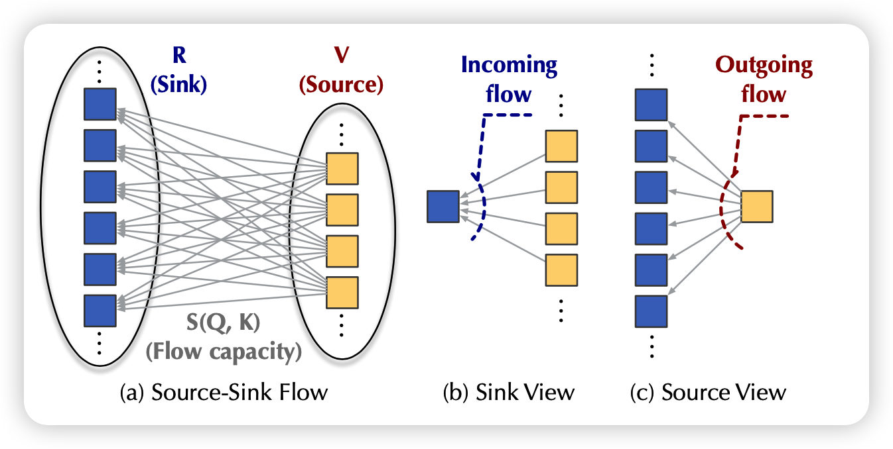
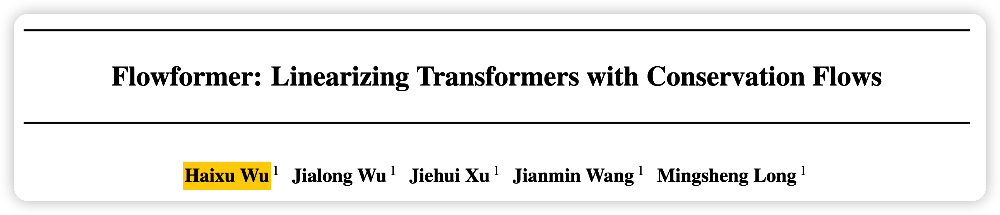
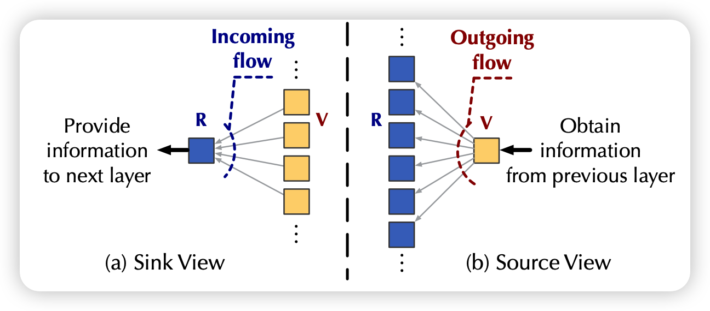
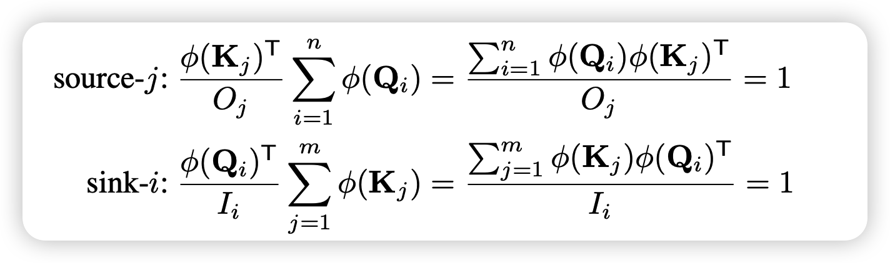
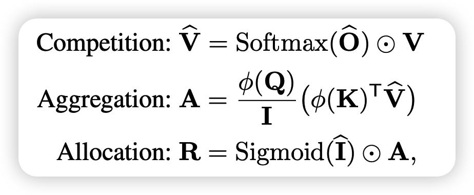
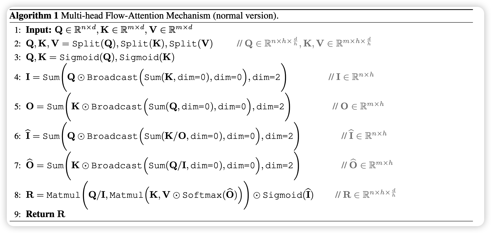

本来想写 [Self-Consuming Generative Models Go MAD](https://spaces.ac.cn/archives/9687) , 结果突然发现被苏老师抢发了，那就换一篇。

来讲讲软院去年ICML的Flowformer：如果把流图的思想引入到Attention算子中来。

这篇游神在知乎讲过一遍，我来主要分享一下在设计结构时我觉得比较好的一些思想，以及我对于线性attention的一些看法。

<!-- more -->

作者团队是软件学院

## attention线性化

这篇文章中，主要讲了线性attention的问题。self-attention算子的一般计算是
$$
attn(x) = \text{softmax}(\frac{Q_x K_x^T}{\sqrt{d}})V_x \\
Q_x = Qx,K_x = Kx,V_x = Vx,\\
Q_x,K_x,V_x \in \mathbb{R}^{[batch,seq length,\text{hidden dim}/\text{head count}]}
$$
其中最后一个维度是把原始的hidden state分成多个head，然后每个head分别计算attention，所以会除以 head count

这里就会发现，x的维度是[batch_size,seq_length,hidden_dim /head_count]，所以整个计算的复杂度里对于seq_length这个维度是$O(n^2)$复杂度，当length很长的时候，这个是不能接受的

> 想想claude 2 的100k seq_length，来个 $O(n^2)$复杂度……

能不能把这个复杂度化简一下呢？这个问题就是学界一直在研究"attention线性化"的问题，但是往往复杂度下来了，效果也就下来了。

这里我们来一个思维实验，对于一个正常的LLM模型，比如说LLaMA

可以看到，65B模型，64个head，所以最后一个维度是$8192/64=128$,是不是比seq_length小多了？我们再来看看原式子

如果没有这个softmax，我们的计算就大概是$Q_x K_x^T V_x$，我们其实可以先算后面两个，变成一个 $\mathbb{R}^{batch,128,128}$维度的矩阵，再和Q相乘，一下子就变成针对seq_length的$O(n)$复杂度

> 所以说，这个$O(n^2)$，就是因为非要算一个softmax?

softmax的过程可以看做对一个变换$f: x_i, x_j \to y\in\mathbb{R}$的结果进行竞争，这里取得核函数f是"点乘的e指数"
$$
softmax(x)_{i,j} = \frac{e^{x_i*x_j^T}}{\sum_{x_k}(e^{x_i*x_k^T})}
$$
其实，如果这个变换是可以分解的，也就是说是某个变化的点积
$$
f(x_i,x_j) = <\phi(x_i),\phi(x_j)> = \phi(x_i)\phi(x_j)^T
$$

> 当然Q、K不一定用同一个变换函数$\phi$，但道理是一样的

那么attention就是可以线性化的，用下面的式子化简：
$$
\begin{aligned}
attn(x_i) & = \sum_{j=1}^m \frac{f(Q_i,K_j)}{\sum_{j'} f(Q_i,K_{j'})} V_j \\
 & = \sum_{j=1}^m \frac{\phi(Q_i)\phi(K_j)^T}{\sum_{j'} \phi(Q_i)\phi(K_{j'})^T} V_j \\
 & = \frac{\phi(Q_i) * \sum_{j=1}^m(\phi(K_j)^T V_j)}{\phi(Q_i) * \sum_{j=1}^m\phi(K_j)^T}
\end{aligned}
$$
发现没，我们可以先花两倍的线性时间把$\phi(Q),\phi(K)$算出来，再花线性时间算出来$ \sum_{j=1}^m\phi(K_j)^T$，再花$O(nd^2)$时间把$\phi(K)^TV$算出来

最后用线性时间就能把每个位置的attention算出来

一个最简单的想法就是：$\phi(x_i) \equiv x_i$恒等变化。然而，这样的话，$f(Q_i,K_j)$有可能是负的，这明显不可行

当然，这种变化需要保证仍然能满足softmax的一些性质，比如非负性、归一化、以及希望绝对值大的时候代表注意力高等等

之前苏老师提到了一种变换：
$$
\phi(Q) = \text{softmax}_2(Q) \\
\phi(K) = \text{softmax}_1(K)
$$
注意这里, K是在seq_length维度做归一化，Q是在d维度做归一化

可以发现，如果他们分别这样做了归一化以后，其实$\phi(Q)\phi(K)^T$天然就在seq_length维度上是归一化的

## Flow Attention

其实上面提到的变换就和Flow Attention有点像了，在这篇工作中，作者思考了一个问题？

> 为什么要用softmax这个变换呢？

其实softmax是一种赢家通吃的竞争思路，尤其是在引入e指数以后，就更放大了这种"贫富差距"。

其实，流图就是一个天然的竞争场景，假如每层有m个源和n个池，两两之间都有一个流，因此所有池子的总流入量等于所有源的总流出量。

发现没，这时每个流的大小其实是天然符合attention定义的：注意力高就是流量大、天然的归一化、自带的竞争关系

作者就把流的计算方式定义成了乘积。K代表源，Q代表池子，从K流向Q：
$$
\text{I}_i = \phi(Q_i) \sum_{j=1}^m \phi(K_j)^T \\
\text{O}_j = \phi(K_j) \sum_{i=1}^n \phi(Q_i)^T \\
$$

其中$\phi$变换保证变换结束以后每个元素都是恒正的

如果有很多层的话，其实上一层的池子就是下一层的源，一个简单的归一化方法就是要求每个节点: 流入量\=\=流出量\=\=1。作者就想了个归一化方法，除号是每个元素两两相除
$$
\frac{\phi(K_j)}{O_j}\quad \frac{\phi(Q_i)}{I_i}
$$
此时，再来看流入流出量

这个恒1能保证，是因为要预计算所有的流量，然后求和再除回去

此时咱们来看流的大小
$$
\hat{I} = \phi(Q) \sum_{j=1}^m\frac{\phi(K_j)^T}{O_j} \\
\hat{O} = \phi(K) \sum_{i=1}^n\frac{\phi(Q_i)^T}{I_i} \\
$$
注意看，这个式子和上面的不一样 (求和的对象变了，所以不是恒等于1)

接下来，作者按照softmax的特性定义了三个操作

最后算出来的R就是attention的计算结果，这里面的哲学思想是这样：

- 竞争：每个V都是QK流竞争以后的结果
- 综合：A是每个源综合所有池子
- 申请：如果有某个池子的流很低，那么这个池子就抛弃，类似于之前说的"带1 softmax"

其中每一步操作都是线性的，综合的计算形式是这样：

实验部分就是把tranformer里的attention算子换成这个，然后在很多seq2seq下游任务上做了实验，发现效果都挺好

## 我的思考

flow attention方法虽然用流的思想包装了一下，但是计算形式其实和前面提到的双维softmax算起来比较接近。

>  他们都是为了解决所谓的"trival attention"的问题(attention矩阵变成所有位置都相同)，因此要引入竞争。

我们从这个角度继续思考一下：softmax这个操作，其实是在每个元素自己向量的基础上，在向量间做了一个"归一化"，然后再在Q K上分别做乘积。

一方面，我认为，这种思想甚至是不是能拓展到head之间呢？正常transformer是每个head内基本没有什么关系，是在attention算完以后再拼回去做变换。但其实head间也是可以竞争的，有些情况head1的结果更重要，有些时候head2的结果更重要。每个head在Q K V变换之前，以及attention的A矩阵计算之后，都是可以先拼再拆地计算结果，这样是不是可以让transformer的表示能力更强呢？

> 魔改版的MOE?

另一方面，我个人感觉transformer精巧的设计有三

- 一个是这里讲的竞争使得模型不会退化
- 另一个是先从低维的word dim变换成高维的hidden state再做head拆分，不丢失信息
- 最后一个是残差连接使得训练非常稳定

