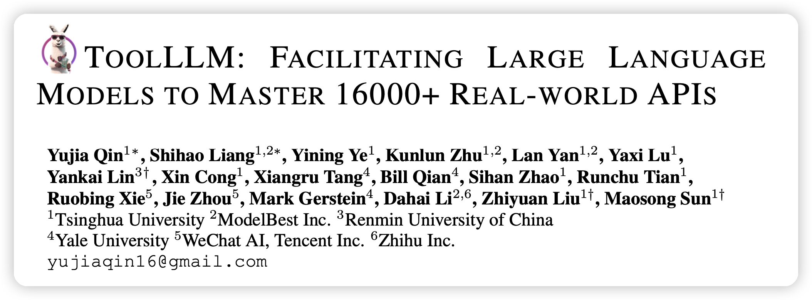
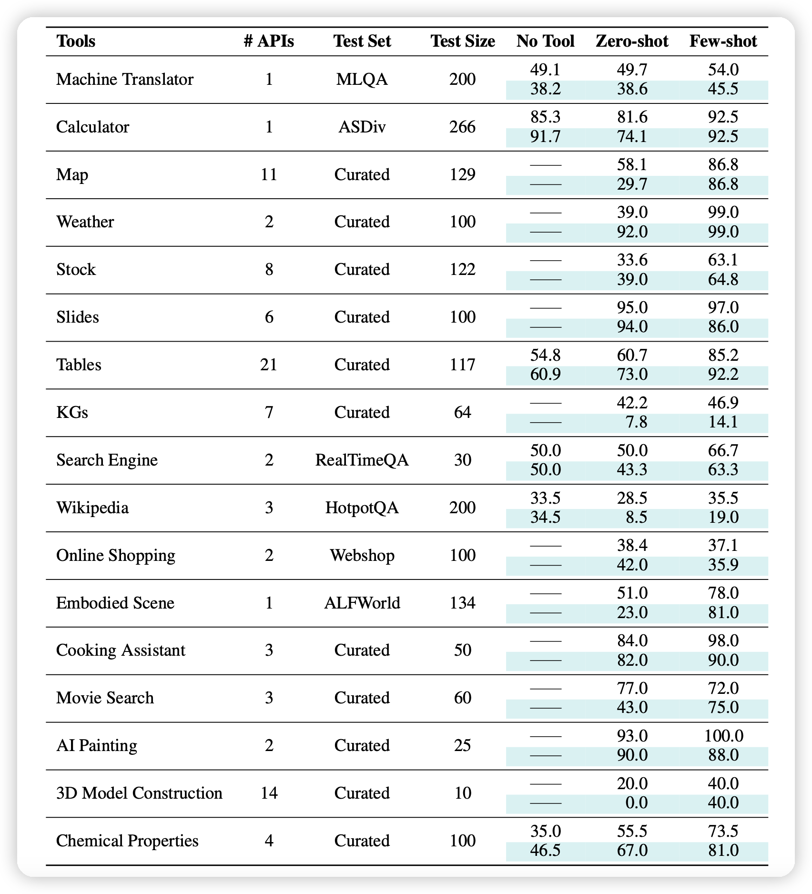
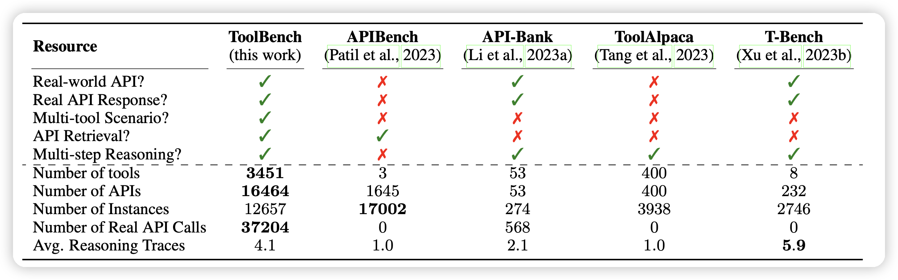
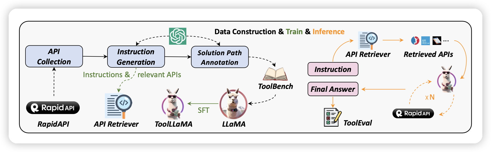
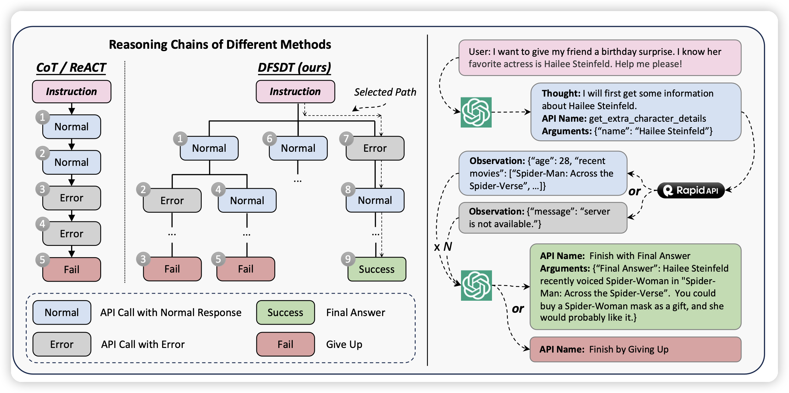
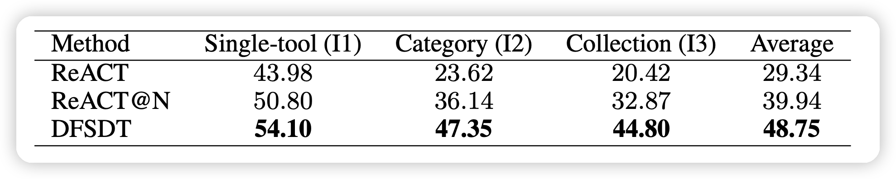
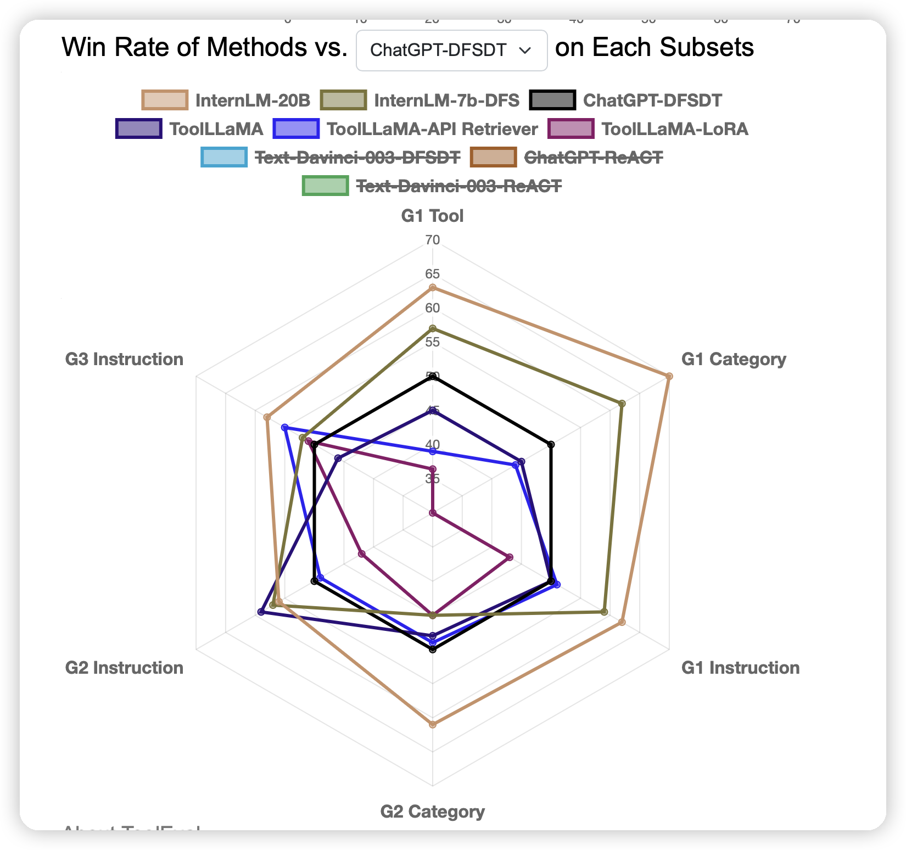
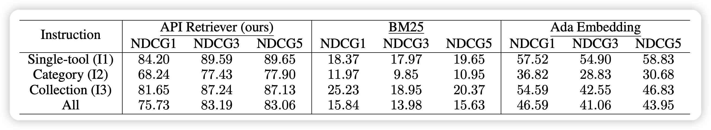
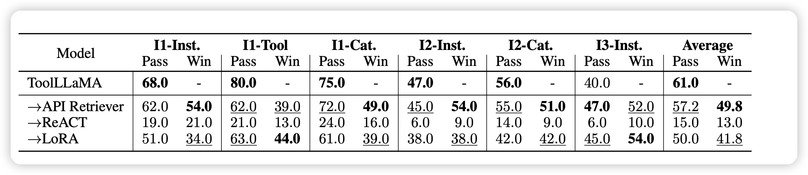

作者团队就是我们tool learning小组




## Introduction

我们在之前(4月)的一篇综述论文里探讨工具学习场景的一些任务的困难

> [Tool Learning With Foundation Models](https://arxiv.org/abs/2304.08354)

当时我们定义出来了两种典型的场景

- Tool Augmented: 较为简单的场景，工具是为了模型服务的。模型通过调用工具来增强语言对话能力。比如Toolformer通过计算器拿到精确数值计算结果，或者现在比较火的 retrieve-augmented LLM的概念(通过一个外置的知识库增强事实等能力)
- Tool Oriented: 较为困难的场景，模型是为了工具服务的。将大模型作为工具的组织者，目标是为了完成c端用户的具体需求

不管是哪种场景，在运行难度上都是 多工具>单工具，多步调用>单步调用。在之前的论文中，我们基本只是探讨了单工具的场景，发现 ChatGPT is all you need



在本文，我们进一步拓展了应用场景，在多步、多工具的场景中探索了Tool Oriented任务的执行效果。


### RapidAPI

首先，我们找到了一个开放的RestAPI平台RapidAPI，他们包含大约50000个API，其中有很多类型的请求。我们只使用了他们的所有GET请求，剩下了大约16000个API

> 这一个简单的sift背后其实有深刻的原因：我们的工具是不是有状态的？POST请求是会对真实世界产生影响的，也就是说，同样的请求可能会随着逻辑执行的顺序有区别。这在实际执行中会带来比较大的问题，最终我们把任务做了一定的化简，只采用了GET请求。

其中，所有的这些API是按照层级进行组织的。最顶层有49个category,每个category下面含有多种多样的tool，每个tool包含一个或多个API。

据了解，这应该是第一篇把真实世界工具做到这个数量级的工作：



由此出发，我们首先通过self-instruct构造多种不同难度的query，然后用ReACT以及新版的DFS、ToT算法对query进行了标注，造出了(query-answer)数据集。再在数据集上进行训练Llama最终达到了接近ChatGPT的效果。工作流程如图所示：



我们开源了代码、模型权重、数据、评测平台(ToolEval)


## Method

从上面的讨论中，我们可以发现，其实我们要做的任务就从任务定义、到数据集、到评测都是全新的，都需要我们去创新。因此我们进一步把workflow划分为5块，也就是下面要讲的5个部分

### query generation

首先是，作为测试集的query如何构建？这个问题涉及到了：我们使用RapidAPI具体是想要打成什么目的？

>  我们是为了帮助解决通用任务

在query构造时，我们使用self-instruct的方式，给定工具和对应的描述，让模型去构造对应的query。对于工具的粒度不同，我们划分出了三个难度的query：

- G1:单工具。对着同一个工具下的所有API去拟合query
- G2：对着同一个category下的不同工具下的所有API去给调用
- G3：对着不同category下的不同工具下的所有API去给调用

三种query的难度逐次增高，对应的工具选择能力需求也更强。

通用任务也有高下之分。有具体的任务"帮我找找附近好吃的粤菜馆"，或者”帮我赚10000美元“。从任务的角度理解，其实他们对于工具的需求是不一样的：

- 具体的任务，可能在找到对口的工具时就已经完成了80%的工作，比如导航工具
- 抽象的任务，可能找到对口的工具只能完成10%的工作，比如在纳兹达克开户……

因此，其实工具能力可以进一步划分出两个子能力：工具选择能力和工具使用能力

在query构造时，我们选用了self-instruct的方式，对着tool反向构造query，再让模型看着query选择到这个工具去执行。

### answer generation



再构造出query以后，下面就是如何进行answer的标注，我们的标注模型使用ChatGPT-turbo。其中，使用了他们的function接口。对于OpenAI-function接口来说，只要给出了输入的json-schema，模型就会自动选择调用是什么、以及输入的参数是什么。从这个意义上来看，其实function接口既能表达出工具选择能力，又能表达出工具调用能力。

### ReACT

经典的工具调用manner可以使用CoT，或者说开源工具包langchain类型的ReACT算法

> [langchain](https://github.com/langchain-ai/langchain)
>
> [Synergizing Reasoning and Acting in Language Models](https://arxiv.org/abs/2210.03629)

他的运行逻辑是：模型按照一个链式的模式一样调用工具，每一步先给出一个thought，再给出一个工具调用。一个openAI json描述如下图所示

```json
{
    "name": "Prefix",
    "url": "https://entreapi-faker.p.rapidapi.com/name/prefix",
    "description": "Randomly generate a prefix (e.g., Mr. Mrs., etc.)",
    "method": "GET",
    "required_parameters": [],
    "optional_parameters": [
        {
            "name": "gender",
            "type": "STRING",
            "description": "Optional gender.",
            "default": ""
				} 
    ],
    "tool_name": "EntreAPI Faker",
    "category_name": "Data"
},
```

这里的所有description和json-schema是按照RapidAPI接口官网的信息转化成的，因此我们需要先把官网所有的描述都爬取下来再做一次clean。


### DFSDT

从CoT出发，后来的有些工作探索了ToT、PoT、HoT、SoT之类的新方法，我们也采用了一个ToT的DFS算法，主要是想解决CoT的以下问题

- 误差累积：对于CoT来说，因为是一直向前的manner，误差会逐渐累积。也就是说，如果某一步开始的工具调用失败了，后面其实会陷入到这种“陷阱”里，最终到达一种“持续进行同样的错误工具调用”的死循环里
- 探索范围，单次的CoT其实探索范围很窄，但是很多情况下需要多次的探索才能把任务完成

所谓的ToT，其实就是把thought当成边，把tool当成点，然后把整个的探索过程组织成一颗树，进行树搜索。经典的树搜索有DFS和BFS两种，我们采用了DFS，主要是基于以下原因：

> 我们希望算法尽可能快速的结束：对于简单的query(CoT就可以做出来的)，可以在类似CoT的执行时间内就做完。相比之下， BFS可能对于所有query都会在类似的时间内做完

传统的DFS算法，需要在每一步的时候生成多个候选，然后选择一个最好的，但在我们的探索中，我们发现，其实模型投票的时候，大多数情况下会认为第一个候选是最好的，这是因为模型本身生成时是根据logits最大化来的，先生成的其实有一定的calibration性质。

因此，我们最终选择DFSDT，执行上是一个先序遍历的方式。前向时每次只给一个父节点生成一个子节点，到返回到该节点时才生成第二个节点。这种算法，在CoT时间内和CoT算法的行为是完全一致的，只是在CoT执行结束以后才会开始回退，做一些DFS的处理



我们在几个粒度上都尝试了DFSDT算法，发现基本都达到了远超CoT的效果

### evaluation method

之前一直提到了效果，但直到现在都没讲这个score到底是怎么算的。其实Eval想要达成几个目的：

- 一个query是否是可解的。有些query由于给的信息错误，天生不可解决。比如"帮我导航去西餐馆"，没说是哪个西餐馆。或者说了一个根本不存在的地方
- 一个query是否被解决了
- 一个query的两种解决方案，到底哪个会更好

因为这几个问题其实都是动态的，对于每个query的情况各不相同。我们的主要评判方法是模型评测，由此诞生了ToolEval



我们是由人标注了一波数据，然后在上面评判拟合的prompt，用一个和人工具有最高一致性的方案。最终得到了一个相对比较稳定鲁棒的评测方法


### tool-retrieve system

其实还有个重要的问题是，RapidAPI有16000个API，模型不可能在context里全部看到，我们必须帮模型去化简难度。由此我们就加了一个retrieve的模型，分别把query和API-doc编码成为向量。训练时由query自带的一些relative API作为正例，随机采样一些其他API作为负例来做对比学习，和Sentence-BERT一致。实际测试时就直接用embedding来相似度匹配，准确率还是很高的

作为Baseline方法，我们也对比了ada-embedding直接把所有的工具描述的ada embedding都搞出来算相似度、以及BM25经典方案。



其实ada embedding直接做效果也挺好，但还是比不过我们寻模型的方法。

### model training

最后，就是我们拿我们的生成出来的大约20万的query-answer对去训练Llama，使其掌握RapidAPI的能力。



另外，我们在训练时发现，其实效果达到最大值附近，需要用到的数据并不多。也许工具学习任务和RLHF任务类似，反而需要小而精的数据保证。


## 我的思考

这篇论文可以说是之前一个开源项目的二期成果，之前我们做了一个BMTools工具包，手动实现了一些工具比如Google-Search等。后来我们发现，线性地去实现工具其实是很低效、很工程的事情。最好是可以把语言模型直接去对接到工业界、学术界已有的工具平台，最终找到了RapidAPI这个平台。

大模型使用工具是一个很大的话题，找到通用性的工具调用方法更是很难的课题。思考人学习工具的方法论，很多老师傅"言传身教"的所谓经验都是很难用语言去表示的。目前的预言模型主要是基于语言去训练，对于这种更加抽象的能力是否掌握仍是未知数。

我们在探索中也发现，对话场景下表现相似的ChatGPT、Claude、Llama2，到了工具场景，能力却变得天差地别。这种区别，一方面说明了工具能力也许是比语言能力更困难的能力，另一方面也许揭示出来：ChatGPT，尤其是ChatGPT-function，可能已经在这个领域从预训练模型的角度做出了一定的探索。
