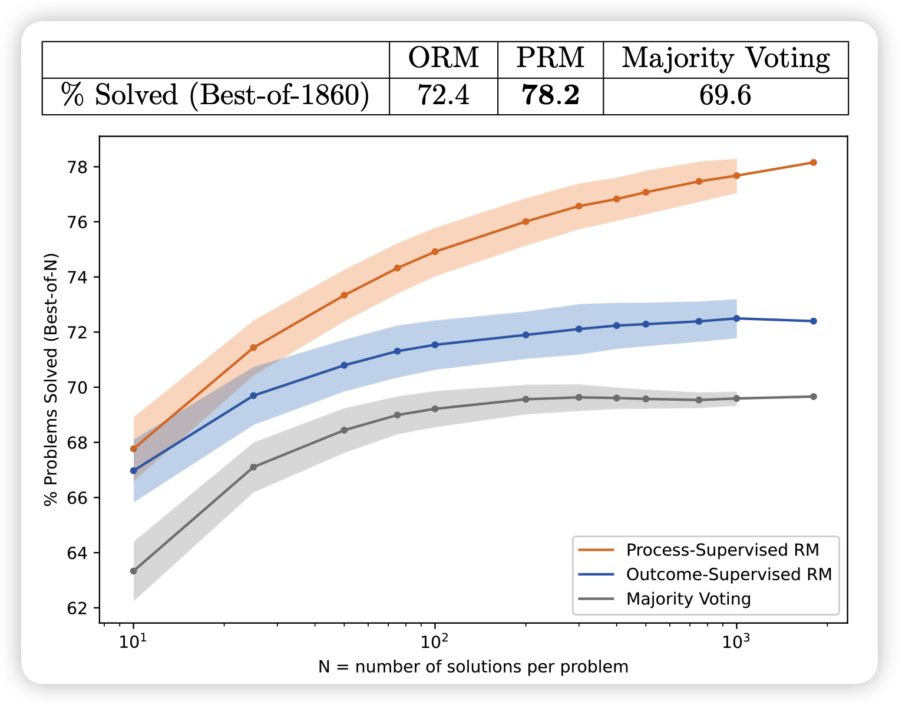
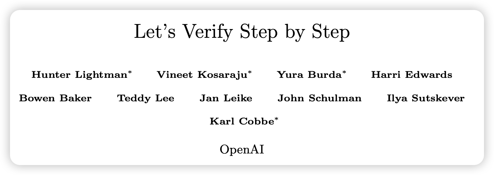
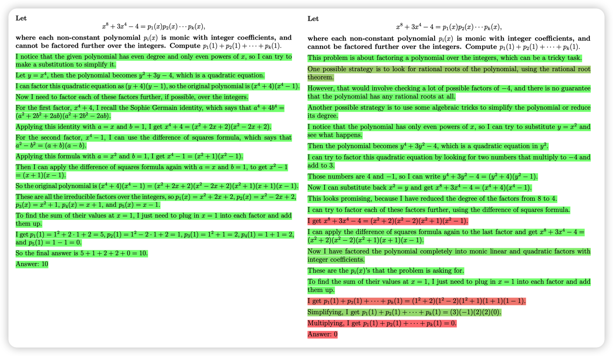
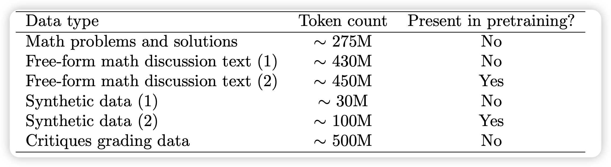
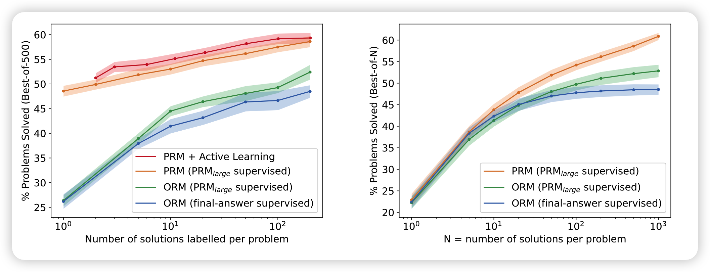
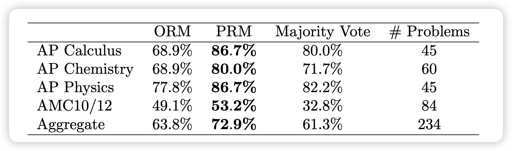

今天聊聊OpenAI 5月份发的一篇老论文：过程监督。这个说法是针对RLHF等技术的结果评价来讲的。他们使用过程监督的GPT4，在数学数据集上极大程度地战胜了结果监督的GPT4

<!-- more -->

作者团队来自openAI。其实openAI今年也没发几篇论文，我基本上都看了。今天正好分享一下这篇吧，以后有机会把别的也讲讲。

## Introduction

这篇论文里讲到了相对的两个概念：过程监督和结果监督。

对于一个经典的对齐场景(和人对齐)来说。正常的RLHF其实是需要人类先标注样本组谁比谁更好，由此训练一个reward model，这个打分的对象是针对样本而言，换句话说就是只有生成完全结束以后，才能打出一个分数。作者认为这种打分就是结果打分。

相对的，是不是还可以进行过程监督呢？比如给每句话都打一个分数，是不是就比结果判断要更准确呢？

听起来挺合理，但是对齐场景这个不太好实现，毕竟我们也不知道到哪里可以算是一个"step"

作者另辟蹊径，找了一个好判断的场景：数学题。作者把解决一个问题需要多步推导的每一个步骤视为一个step，由此进行了一波人工标注。

总体而言，

- 由过程监督的数据训练出来的打分模型和由结果监督的数据训练出来的打分模型，在learning-from-best-of-N实验中差异巨大，过程监督效果更好
- 持续的打分、对抗、打分过程可以加速收敛
- 作者开源了带有过程标注打分的数据集

## 方法

### 说明与预处理

作者把两种模型分别称为ORM(outcome)、PRM(process)。

所有的训练使用不同大小的原始GPT4模型进行(而不是RLHF版本的GPT4)。

> large model就是完全体GPT4。而小号模型是一个用了1/200训练资源的小号GPT4

作者把生成数学题答案的模型称为generator。所有的generator是不优化自己参数的，因为本论文聚焦于对比过程打分和结果打分。

> 其实有了这个模型，是可以由此进行一个多步的RL训练的。参考之前的trlx库的实现

在所有的实验开始之前，作者先对所有模型在一个叫做mathMix的充满数学题和解答的数据集(1.5B)进行了一波finetune

👆🏻数据组成是这样的。不幸的是这个数据集没开源，只能参考一下。

接下来，作者从Math数据集选了个测试集，和上面的finetune数据集去重了一下，保证没有交集。

对于generator，作者为了保证模型生成的答案是一行一行的。作者找了Math数据集的训练集，让里面的解答都是一行一行的形式，在上面微调了一下。这样generator的输出就永远是一行一行的了。

最终正式开始实验

### PRM800K数据集

这一个环节，作者要制作训练数据集。假设已经有了一个generator。

首先让generator对问题生成一些多步的解答，然后作者要人工标注员来标注中间打分。对于每一个中间过程分为三类：

- positive：对的过程，对解答有帮助
- negative：错的过程
- Neutral：对的过程，但是对解答没啥帮助

作者提到了一个提高训练效率的trick：convincing wrong-answer 。

> convincing wrong-answer ：PRM模型打分很高，但最终把答案做错的case。

作者优先喂给human这个case来打分，相当于把数据集生活过程和PRM model耦合了，这会带来bias，但不知道严不严重。

因此总体的过程是一个多步的：generator生成一波、标一波、训个PRM、找出convincing wrong-answer再标、再重训PRM、再找...看作者的仓库，这个过程整个持续了10轮。

> 折磨标注员……

### PRM and ORM

接下来作者讲解PRM和ORM都是怎么训练的

- ORM和RLHF的reward model训法很像：

首先对于基础模型，最后的hidden_state后加一个linear(n,2) + softmax映射到2分类概率，然后对于语句的所有位置都有个概率，作者希望所有位置都要优化都有loss，和最终解答本身的类型一致。在测试时，作者选择EOS token位置的分类概率作为最终的得分。

> 作者提到了假阳问题：过程错了，但有的时候结果不会错，负负得正了。这个bias是ORM方法本身没法解决的

- PRM训练方式有所不同：作者只关注第一次出现错误的step位置，后面的step只能都丢掉，因为第一次错误以后后面的步骤就没法判断了。因此数据全是一些step，前面全是positive、netrual，最后一个negative

同样的模型结构，但是每行文本作者只计算最后一个token的分类概率算loss。

## 实验

### 大模型实验

作者先做了一个大模型的实验，即两个完全体GPT4分别作为generator和监督模型，所有的方法都是对抗攻击的形式。有以下几个变体

- ORM：一道题生成多个解答，调出所有解答里得分最高的作为答案
- PRM：一道题生成多个解答，调出所有解答里得分最高的作为答案

> PRM怎么给一道题的得分呢？作者说到对于每个step，都能做三分类。如果negative概率>20%就算这个step错，否则就算对。第一次输出"错"时结束。因此评价两个解答可以用 "对"标签的总数量

- majority voting：生成多个解答，选择数量最多的相同答案作为答案

测试时作者只检查答案是否正确，由此就跑出来了首页的图：

- PRM > ORM $\approx$ major
- PRM和ORM的差距随着采样次数的增多被进一步拉大

> 一道题用GPT4采样1860次，只能说：this is openAI

以上实验都是展现OpenAI雄厚财力和资本，后面是openAI研究员敏锐思路的展现。

### 小规模对比实验

作者谈到，上面的实验对ORM并不公平，因为：

- 构造训练数据时是针对PRM做了对抗的制作，因此数据集肯定对训练PRM有利，并且没做出正确答案的题目的数量更多，对ORM来说标签不平衡
- 训练ORM时判断标签用的是自动化检查，检测答案对不对，因此有假阳。对ORM训练不利

怎么做出公平的实验呢？作者说：用大模型监督小模型。作者把上一节训出来的完全体GPT4-PRM称为PRM-large,由此做消融实验

#### PRM vs ORM

作者现在用小模型做generator，生成一堆答案，用PRM-large给出三种标签：

- PRM-large给出的过程标签：和大模型实验方法相同
- PRM-large给出的结果标签

> PRM-large怎么给结果标签？作者说方法是：当且仅当所有step都打出"对"标签

- 自动化answer检查给出的结果标签

拿到这些标签，就当是人标的，训练一个小号的PRM-small、ORM-small，然后用小号的generator-small做best-of-n实验对抗rm-small

由此，作者跑出来两个图：

- 左边的图横轴是训练PRM-large用的一道题用generator采样的样本数，纵坐标是正确率。

> 采样的样本数越多，越容易作为对比看出来一道题的答案的泛化性，另一方面也要消耗更多的标注资源

- 右边的图横轴是“一道题sample多少个样本”(测试资源消耗)，纵坐标是正确率。

可以看出来，大模型试验得到的性质在严谨的消融实验中仍然保留

> 不过这里也可以看到，用小generator以后，这效果直接腰斩了。比如N=10时，大号是68%，小号是22%，可以说是天壤之别。插一句：难道这也是emergent ability?

#### Active Learning

这一部分作者去消融上面提到的选数据的问题。首先训一个小PRM，每道题一条数据。然后给generator生成的每道题1000条数据打分，选出来一些数据：

- 80%是convincing wrong-answer
- 20%是剩下的最convincing的答案

挑出来这些数据的子集，再训练新的RM-small，由此做出来的上面的图左(横轴是挑选的训练数据规模)

- 这个场景叫做active learning: 因为所有数据都是小reward model认为 convincing的，并且80%都是错的。和真正标注PRM800K时的比例一致。

- 没有用这个挑选trick，而是随机挑选同样大小的数据集，就是阴性对照。

对比图做的两条线，作者说：active learning方法有2.6倍的数据效率，即仅用1/2.6的训练数据就能得到传统收集方法的效果

## OOD

数据外分布测试：作者尝试了Math以外的数据集(和PRM、ORM的训练数据不一致)

可以发现数据规律和前面的实验一致

## Discussion

这一部分作者谈了一些思考

> Credit Assignment：这个概念是强化学习、多智能体博弈里的。是说如果一个智能体发现别的智能体都干得很好，自己做了就是多做多错，那最后干脆就学着不干活了。

一方面，PRM能减少Credit Assignment问题，因为即使做错了题目，最起码前面一些step是对的，换句话说，能区分出来错是错在哪。

相比之下，ORM只能看到对或者错，如果数据里错的>对的，那最后就学着不干活了。换句话说，这种情况下，ORM的错误标签基本没有有效、的可以学习的信息

另一方面，RPM能指导对齐领域的发展。嗯，我感觉still a long way to go……

最后，作者还谈到测试集、预训练集重合的问题。作者说没法完全保证不重合，只能说做了去重。嗯，好像也没啥别的办法了

## 我的思考

- 很好的工作，方法好、思路好、结果好，我们都相信过程监督>结果监督，但他们第一个标完数据做了一篇工作出来。而且，discussion部分谈到的"惰性"、"有效信息"的观点我很喜欢，感觉科研思路又被拓展了一个方向
- 类比人学习的方法论：我们有接受到过程监督吗？其实玩LOL，老输老赢就是结果监督。如果你下去自己复盘、或者找同学复盘，就是过程监督，看起来我们早就在这样做了

> 但是人可以自我复盘，模型可以吗？reflexion方式？

- GPT4真强啊，Math数据集都打到快80%……我自己能做出来50%吗……
