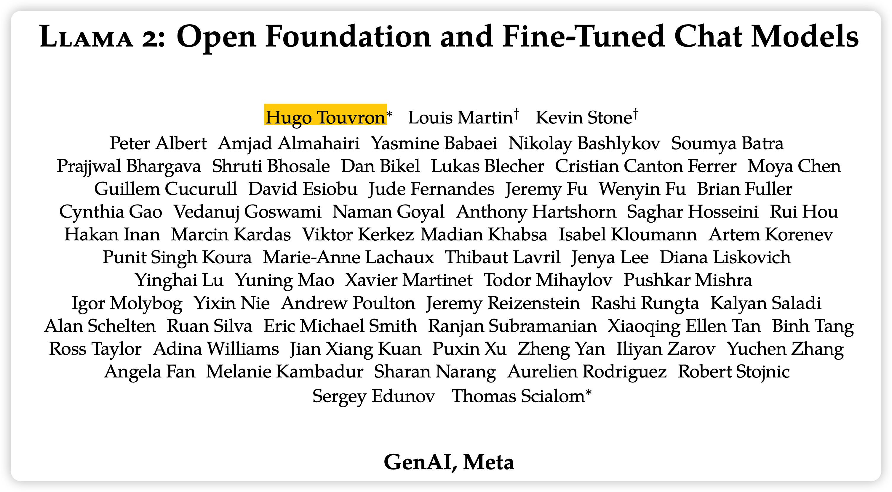
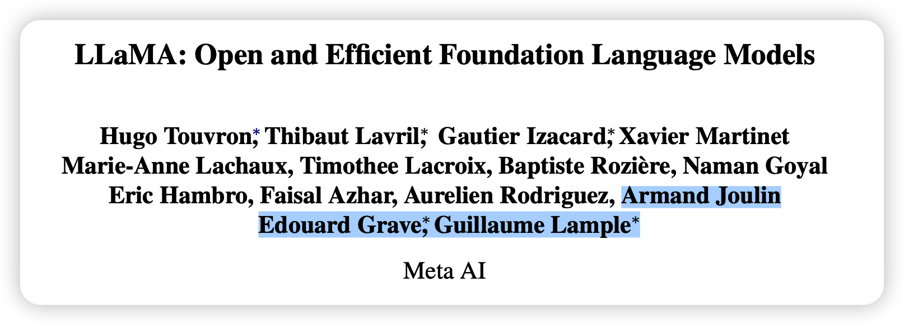
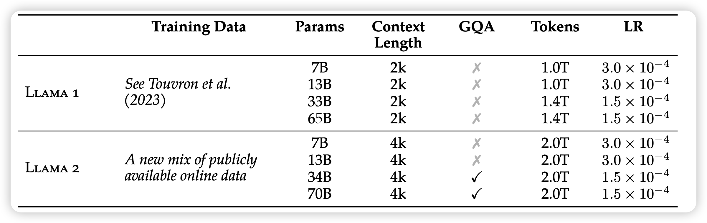
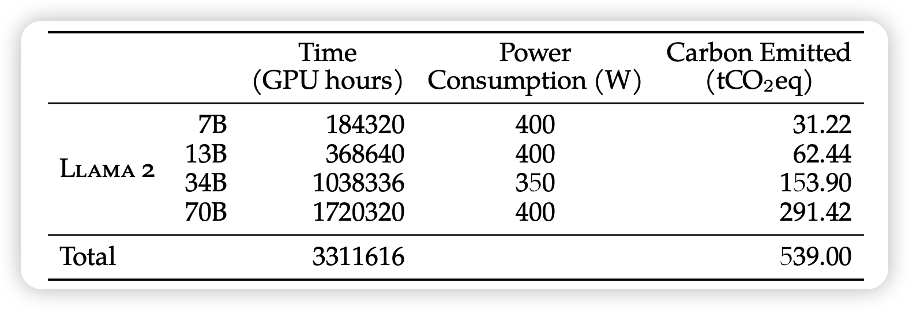
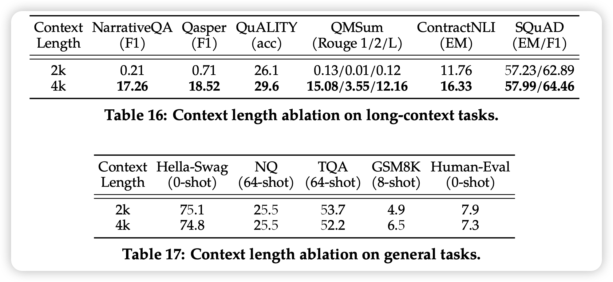
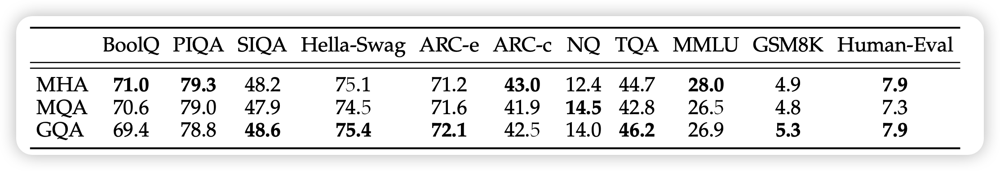
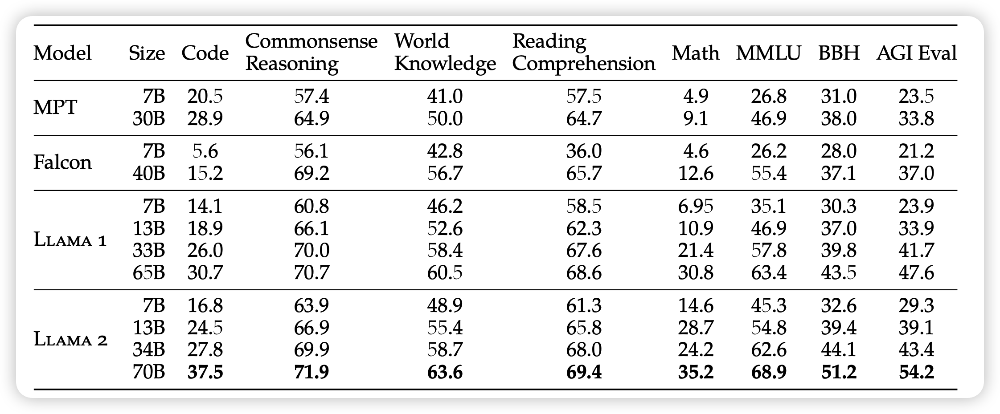
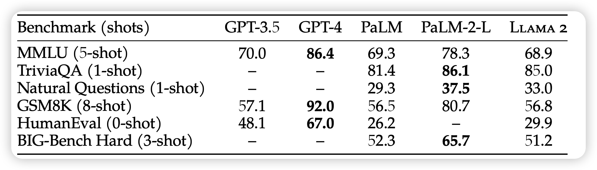
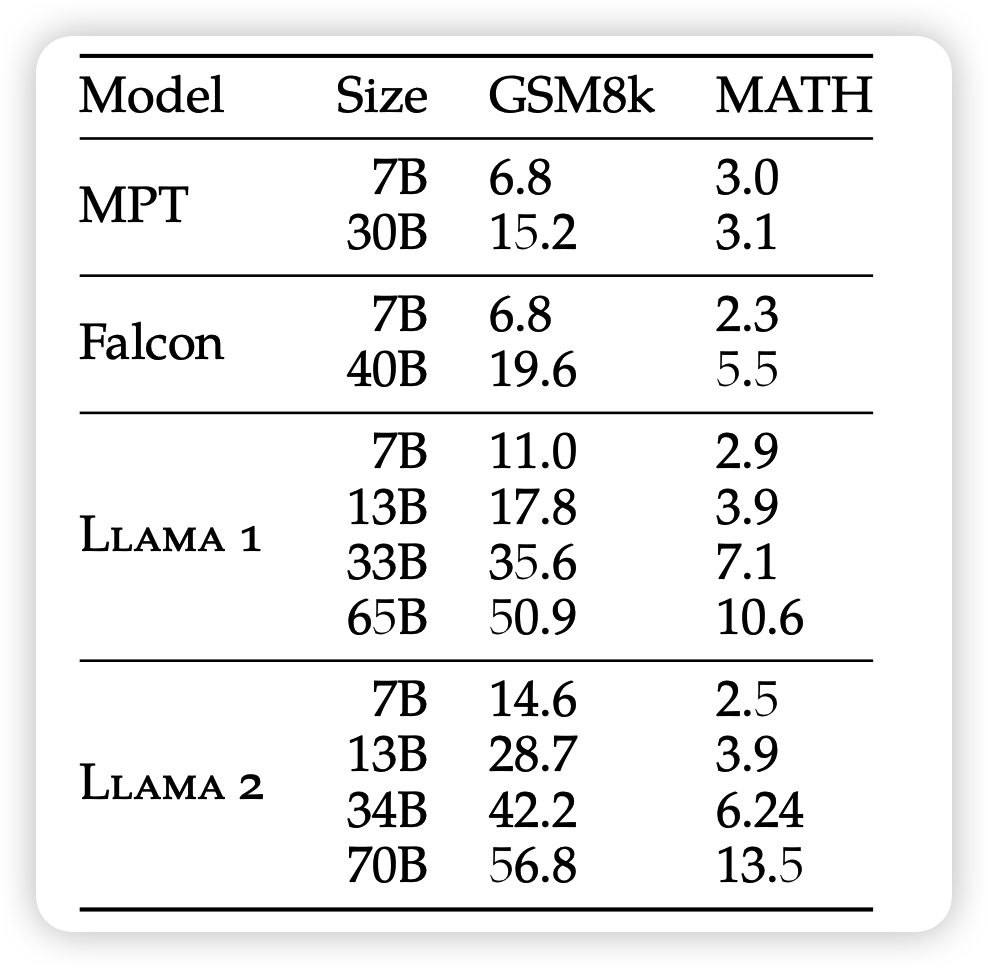

从影响力上，他是你应该第二个知道的大模型(第一个是GPT)，前两天刚被人用C重写了一遍；从评测结果上，其效果超过ChatGPT-0301

笔记比较长，因为我在讲解时把正文和附录揉在一起，力求讲清楚所有技术细节和创新点。

>  除了safety的部分，我确实不懂这个方向……

从论文里可以看到三个小细节：

首先在大小写上，作者把这个模型叫做"Llama 2"，但是在1代时描述是LLaMA，现在的开源社区都是用"LLaMA"来称呼，不知道后面大家会不会改

其次，这个作者团队延续了一代里的Meta，但是GenAI又是什么东西？

> GenAI其实也是Meta的部门，是小扎专门为生成式AI成立的研究所，这篇论文可以看做他们打响影响力的开山之作。

最后，LLaMA一代里的元老已经没了，这是被优化掉了？

仔细看，他们还在附录里，但作者列表直接查无此人，这就是大公司内部的斗争吗……

> ChrisMarra,ChayaNayak,JacquelinePan,GeorgeOrlin,EdwardDowling,EstebanArcaute,Philom- ena Lobo, Eleonora Presani, and Logan Kerr, who provided helpful product and technical organiza- tion support.

作者一共训练了7B, 13B,34B, 70B四个版本的LLaMA2，其中34B因为一些安全性问题暂时没有发布，其他的模型都是商业许可，填申请就能下载

## 预训练阶段

所有版本的模型都训练了2T的token量

tokenizer和一代一样，都是vocab_size=32k的BPE模型。数字单独用token，然后不能解码的UTF-8一个byte一个

值得一提的是，这次dataset不开源了，屠龙者终成恶龙？

作者在两个超算平台上训练，用了大概2000GPU，训练了3.3M A100-80GB hour的训练量完成了训练……

<table>
<tr>
  <td></td>
  <td></td>
 </tr>  
  <tr>
    <td>llama 1 loss</td>
  <td>llama 2 loss</td>
  </tr>
</table>

另外，对比一代和二代的训练loss

- 大概可以发现在训练相同的token 1.4T时，两者的loss是差不多的，这大概说明预训练数据的难度也差不多？
- 以及2代在训练的时候尖峰少了很多，大概是代码做了优化，或者小扎自己搭的超算平台真有独到之处？

从loss曲线上来看，其实训了2T token之后模型仍然没有表现出收敛的趋势，但是提前停止了训练，

> If you have money, you can continue……

作者没有纰漏预训练数据集大概多大，不过Llama1应该是训了一个epoch，只有Book和Wiki数据训了两个epoch。

> 另外，之前有个GPT4黑客爆料说用13Ttoken的数据集训了1个epoch，花了66 million $。不知道Llama 2花了多少钱

### sequence_length

把sequence-length提升到了4k。

> 值得一题的是，最近的新方法可以把2k的LLM通过finetune基本无伤拓展到16k、32k量级，参考笔记： 

作者通过150B token训练量的对比实验，发现训练4k length带来了更好的效果

### group-attention

作者在34B和70B的模型上使用了group-attention技术。这个技术是指，正常的attention要在每个head分别用不同K Q V矩阵把hidden state的某个部分做变换。为了节省参数，可以然后K V变换阵共享参数，作者使用的版本是8个Q阵对应一组K V阵的参数

作者通过相同的实验，发现GQA确实不咋影响效果

MHA是multi-head attention就是原始版本，很好理解。但是表格里面的MQA又是什么东西？

其实MQA是group attention的一种特殊情况，就是所有head的key value是相同的，区别只有Q

> GQA: Training generalized multi-query transformer models from multi-head checkpoints

### 预训练评测

接下来，作者评测了预训练模型的效果

首先作者和一些开源的模型做了比较

这里面可以看出，Llama 2比Llama 1好很多

- 在数学能力上，小模型的数学能力基本翻了好几倍。
- 在代码能力上，70B模型暴增7个点

基本可以认为，在任何场景下，Llama 2都是现在最强的开源模型

接下来，作者还和闭源模型做了比较

这次发现，LLama 2的基础能力基本上是最差的……好消息是，和GPT-3.5差不多？

除了代码能力(humanEval)，看起来Llama2的代码能力确实不行

> 这里面的GPT-3.5的效果，应该用的是GPT4技术报告里的结果，对应的模型是text-davinci-003。如果和001 002比，可能Llama 2要更强一点
>
> 另外，GPT4这个GSM8K直接干到92也太猛了……

其实作者做的每一个数值，都是一堆实验的，比如上面说的数学能力，就是下面这两个数学题数据集的平均数

其中这个"MATH"，就是之前我们讲 时使用的那个测试数据集

> 当时打到了78%

如果只想了解预训练的细节，那么到这里就足够了，下篇我将会重点讲解RLHF的部分，也是占据篇幅最多的部分
