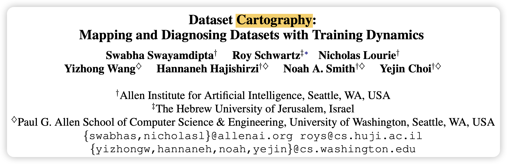
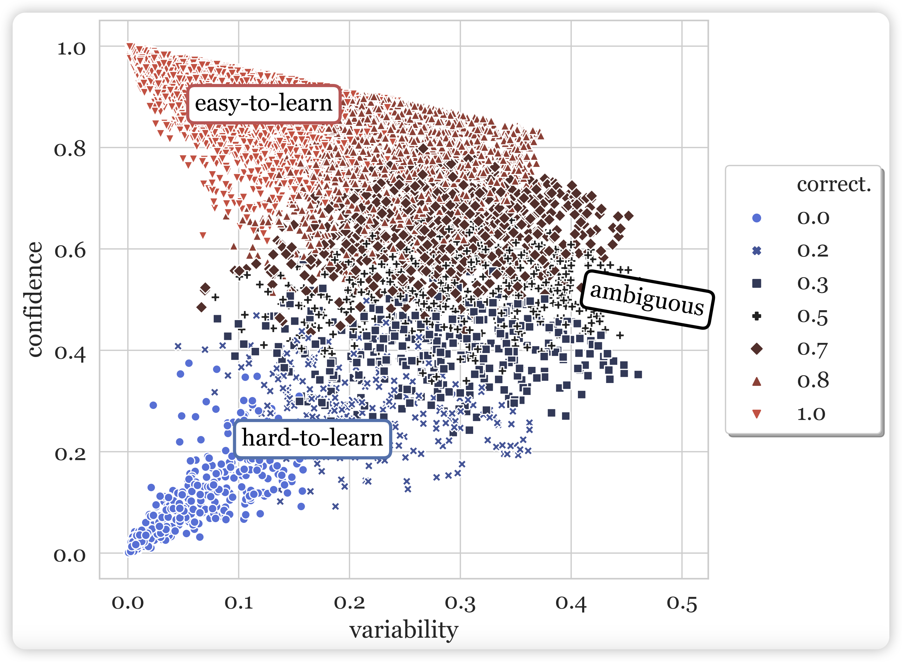
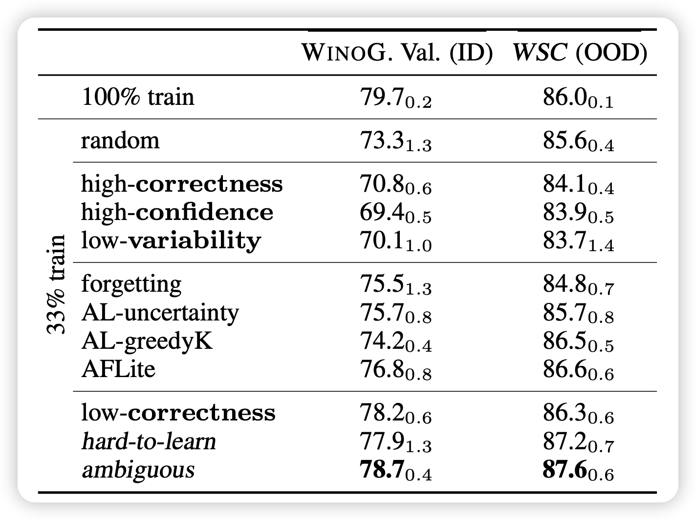
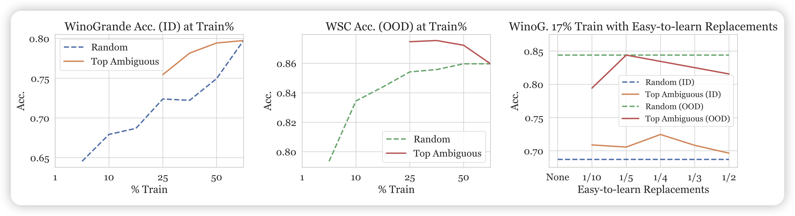
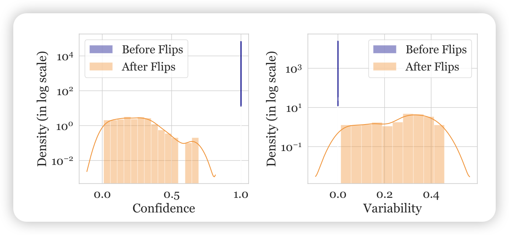
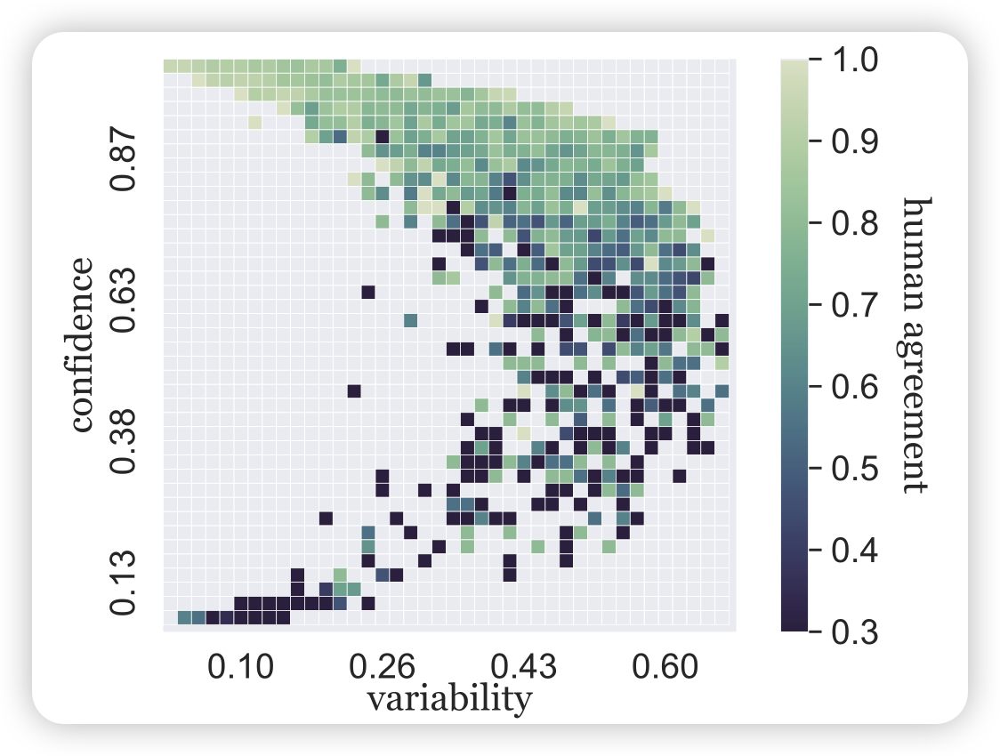

读得论文多了，写的笔记反而更少了……很多篇论文都想写，最后哪个都没写出来。今天来讲讲yejin Choi 2020年的一个论文：如何用模型自己在训练过程中的表现作为自监督信号，衡量训练集中每一条数据的质量？

> 很难想象这是yejin choi三年前思考的问题，我直到最近读到这篇论文，还觉得思路很新颖、很精妙

<!-- more -->

作者是Yejin Choi团队,一作Swabha Swayamdipta最近还做了一些有趣的工作，比如这篇：We’re Afraid Language Models Aren’t Modeling Ambiguity。都是挺有意思的选题

## data-map

回到本篇工作，作者主要探索了以下问题：目前(2020年)学界的范式是选择越来越大的数据集做训练。因为大家发现随着数据集扩大，其多样性会上升，进而促进模型的分布外泛化能力。

但是，随着数据集的扩大，数据质量一定会下降，作者想到: 有没有可能数据集中每条数据对语言模型的贡献是不一致的呢？作者希望找到一种自动地标注方案。作者直觉地想要用两个维度对数据分类：在一条数据过了很多epoch以后每次的loss对应的平均数和方差。作者把这两个轴叫做confidence(平均数) 、variability(方差)

对于比如SNLI数据集，作者尝试把RoBERTa训了几个epoch，然后统计里面每条数据在每个epoch的loss，进而画了一个散点图，其中每个点代表一条数据。作者直觉地认为，这个类似钟型曲线天然地把数据分成了三种情况：

- easy-to-learn：很快就学会了，并且方差很小，一直都做对。占大多数
- hard-to-learn：一直学不会，因此方差也很小
- ambiguous：一轮能做对一轮做不对，方差很大。模型对这种数据的判断没有把握

另外，对于confidence做离散化，还可以统计acc。作者还把 “n个epoch中一条数据acc”的比例定义为了correctness，在图中表现为了不同颜色的小点。

由此，作者把这个方法叫做data-map，和标题里的地图学呼应：地图是地球固有的属性，而数据中的confidence、variability也是模型在训练中自己表现出来的性质。

接下来，作者就要从这个现象出发，展露一下研究员的天才思路，设计一系列实验和探索。

## data-map能作为选择训练数据的指标吗？

作者实现好奇的就是：不同区域的数据，对于训练有什么贡献？实验设计很简单，就只选择对应区域的数据做训练就可以了。在训练完以后，作者分别作了in/outof - distribution(ID、OOD)的测试。

- 100 train：阳性对照

- random: 随机选33%，阴性对照

- high-correctness: correctness从高到低前33%的数据
- low-variability、low-correctness、high-confidence、high-confidence 同理
- hard-to-learn: 指的是low-confidence
- ambiguous： 指的是high-variability

作者在winoG上训练，然后分别把winoG、WSC作为ID OOD测试，神奇的现象来了：

- 仅在hard-to-learn或者ambiguous的33%数据上训练，OOD能力甚至比阳性对照还要好！
- 仅在eazy-to-learn的数据上训练，似乎对ID和OOD测试都没啥帮助……不如random 33%
- 尽管没有对选数据的方法专门做优化，但效果比几个active-learning算法的效果还要好

看起来，hard-to-learn和ambiguous的数据对模型的效果起到关键作用。ID的效果和训练集大小强相关，我们相对更关注OOD。因此作者说到这套data-map的方案某种意义上提供了一个加速训练的潜在方案。然而，从这个角度看，这个方案需要先在全集上训一遍模型，这肯定比正常训练开销更大。因此这个方法只有理论价值

## 可以抛弃eazy-to-learn数据吗？

既然上面研究发现hard-to-learn和ambiguous数据最有用，那接下来一个直观的问题就是：如果用更少、少于33%的这种数据，也能达到这种效果吗？

于是作者选了ambiguous数据的前50%, 33%, 25%, 17%, 10%, 5%，1%作为训练集尝试了实验

先看左边两个图：横轴是上面那个top-ambigious训练数据的百分比，纵轴分别是ID和OOD的效果。神奇的又来了：当训练数据低于某个阈值以后，训练就崩溃了？？另一个实验表明，相同的数据量，如果选取不是按照top-ambigious而是random，训练就是正常的

因此作者想到了一个可能：会不会是eazy-to-learn的数据虽然对于效果没什么帮助，但是对于稳定训练很有帮助？因为更少的top-ambigious显然就采样不到eazy-to-learn的数据了。于是作者点子又来了，做个阴性对照，把刚才训崩的数据比例(17%)里，随机将一部分top-ambigious的数据换成eazy-to-learn的数据？

于是就画出了右图：作者发现，哪怕在17%中，只要再掺入1/10=1.7%的eazy-to-learn数据，训练就正常了起来？？另外，如果替换的比例太高，ID和OOD的效果就又掉下去了。

作者最后又提出了一个开放性的研究问题：如何在训练中正确选择各个区域的比例？

## hard-to-learn的数据可能因为误标注吗？

想到两个点：

- SNLI画的data-map中hard-to-learn很多，winoG画的data-map，hard-to-learn看起来很少。同时我们知道winoG中的数据被人类精心clean过因此误标注更少
- 对于误标注的数据，模型显然是"hard-to-learn"的

怎么验证这个猜测呢？作者点子又来了

首先，来个模拟实验。作者将winoG中1%的eazy-to-learn数据的标注换一下，造一批”误标注“数据。在eazy-to-learn数据中采样是因为这里面大概率之前不是误标注的数据

接着作者用新的数据集重新画data-map，观察刚才那些点在新的图中的位置，作者给出了这些点confidence、variability的直方图。发现confidence显著降低、variable显著升高。这展示了数据中误标注的可能性

接下来，作者问了另一个问题：既然有潜在的误标注风险，那有可能将data-map作为一种自动的误标注识别手段吗？

首先作者把刚才的数据集(含1%人造误标注数据)，再采样了同样的1%正常数据形成了一个误标注占50%的数据集。训练一个classifier，其输入是每个instance的confidence、variability，输出2分类。发现这个classifie的测试集F1是100%？？

接下来，作者将classifier重新应用到原始winoG数据集，发现31/40k的数据划分为了mislabel。同理在SNLI上做同样的实验，发现有15k/500k划分为了mislabel。这和两个数据集的数据质量一致

最后，为了让作者的逻辑链条完整，作者开展了人类实验，找人去看classifier划分出来的mislabel数据。人类标注结果表明: classifier选出的"mislabel"数据，67%是真的mislabel。这个数字在SNLI上是76%。剩下的基本上也是比较"歧义"的instance

最后，作者谈到：data-map可以作为一种潜在的对数据集mislabel问题进行自动检测的手段，并且效果还不错。

## 模型在训练中表现出来的这种性质，和数据集固有的不确定性有关吗？

众所周知，数据集中有一些固有不确定性：有一些instance是歧义的，理论上就是填什么都可以。另外，对于模型无法预测的位置，到底是来源于数据集固有的不确定性，还是模型本身的局限性(换个更强的模型没准就会了)呢？

作者想到一个办法来衡量数据集中固有的不确定性：在数据集制作时，都是找人来标注。对于本身有歧义的例子，不同的标注员之间应该自己也有不一致性。所以作者分析了data-map中每条数据，列出了标注员当时对于这条数据的一致性

作者发现，模型划分data-map的方式，和人类当时标注时的一致性有非常强的相关性: 起码对于eazy-to-learn数据，标注员基本一致性都很高。

## 我的思考

这个论文的逻辑太顺了：一般我写笔记都会简略写experiment部分，但这次我一个都没有省，并且组织逻辑和Yejin Choi论文组织逻辑完全一致。

作者从一个现象出发，和学界已经存在的问题联系起来，探索他们发现的现象的潜在应用价值。从联系方向，到提出问题，到设计实验，到画图展示的形式，都展示了研究员敏锐的数据直觉，值得我们去学习……相比之下，再看看近两年的大多数论文写成啥样子了……

站在2023年的视角下，我只能说对这个论文提出几个潜在的研究问题：

- 在instruction tuning领域，大家逐渐意识到diversity和quality的矛盾，以及对最终训练效果的影响。相比于Wizard LM这种自动化的数据筛选。让模型自己去选择数据是一种新的思路吗？
- data-map的结果是和模型绑定的。对于同一个数据集，换一个模型可能画出来的图就会有变化。比如GPT4，可能在SNLI上画的图全是eazy-to-learn。这点对于选择数据至关重要：一条数据不适合这个模型，但有可能适合那个模型，这和模型的基础能力有关。我们不指望找到一个适用于所有模型的golden selection method(可能世界上也不存在这样的方法)，相比之下更希望能找到最适合与这个模型的训练数据
- 这两年学界出现了一个新的关键词calibration：对于很强的LLM来说，自己的confidence和acc成强相关性。作者在这片工作中发现另一个联系：自己的confidence和数据集的固有不确定性成高度的相关性。由此我产生了一个问题：既然三者都有相关性，那么，模型的calibration性质可能是来源于"在含固有不确定性的无监督corpus上预训练"吗？如果我们的corpus去掉了不确定性(比如RLHF数据集)，那么模型的calibration性质是不是就消失了呢？

最后，这是Yejin Choi三年前研究的东西，与君共勉
