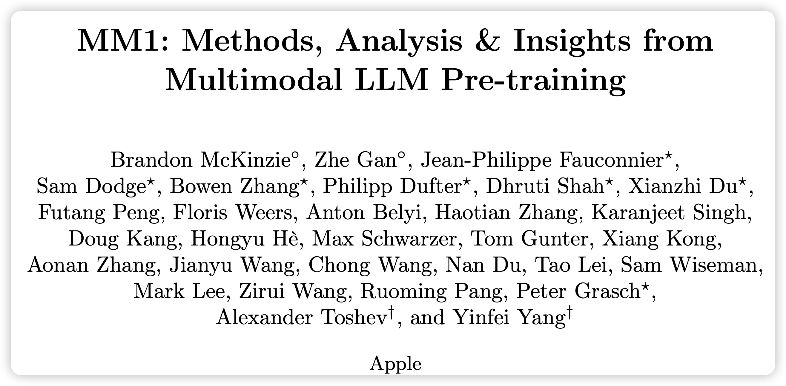
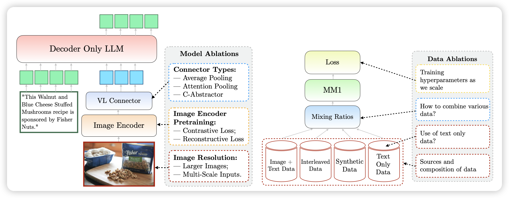
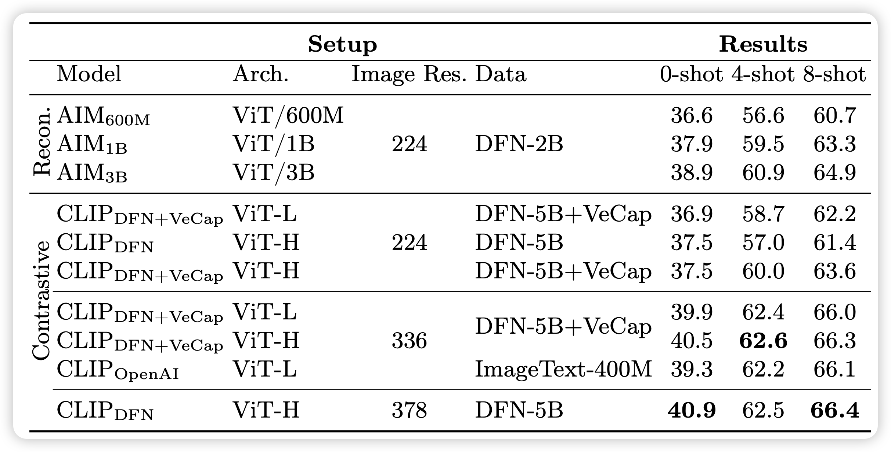
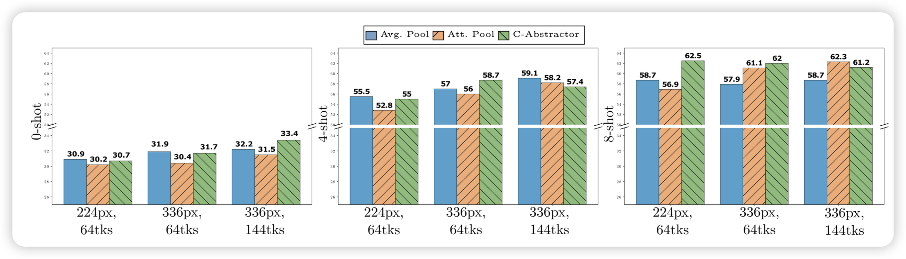
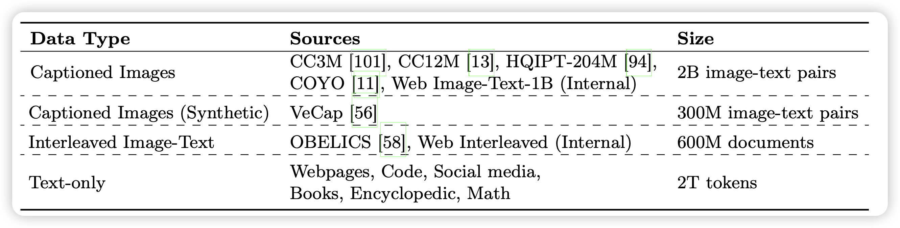
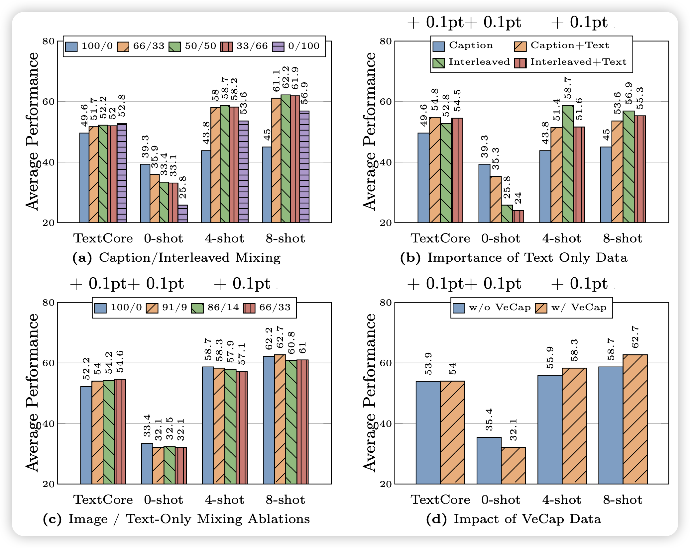
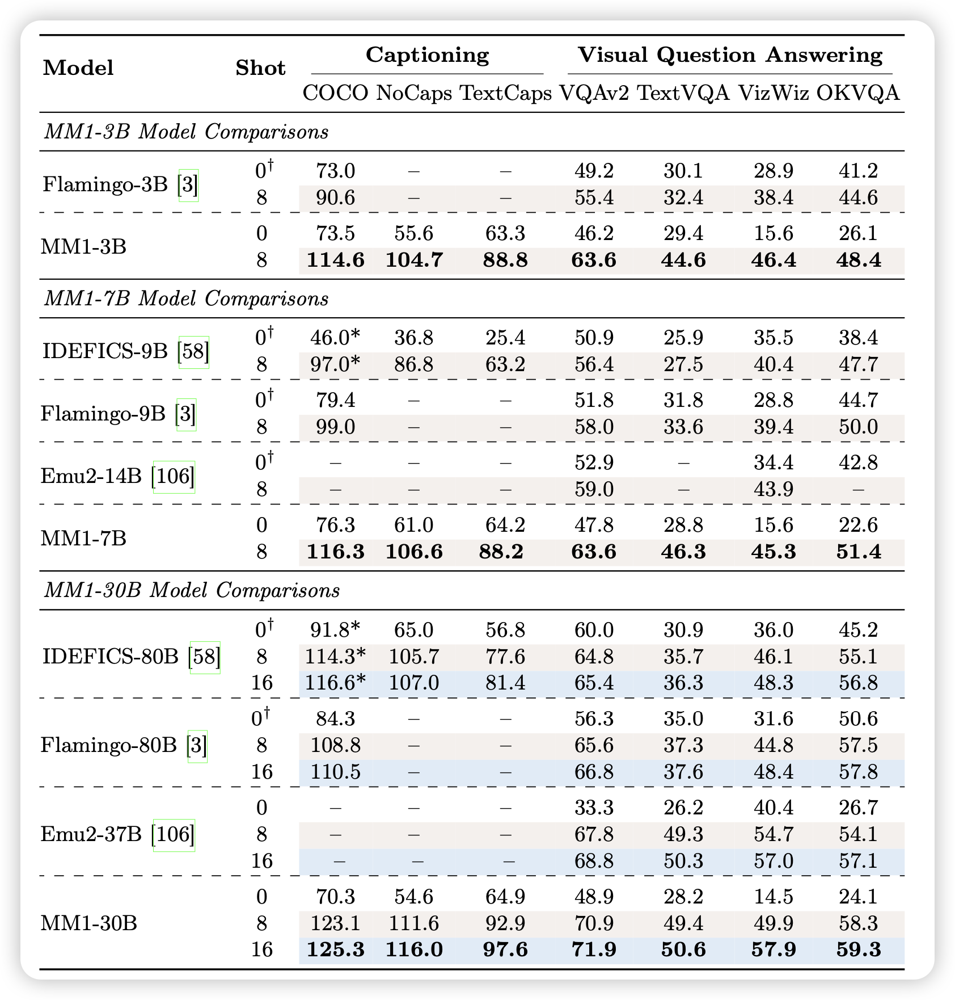
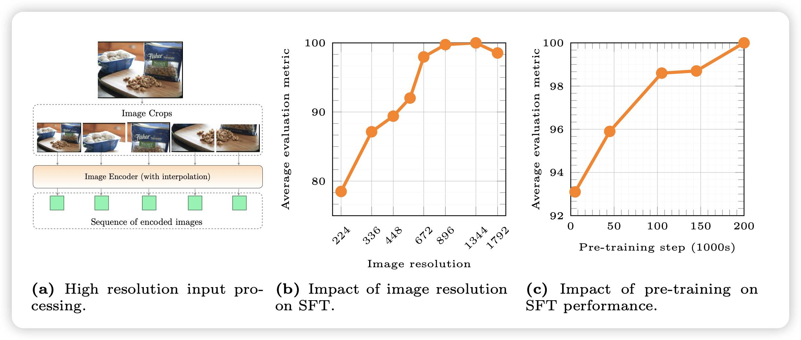
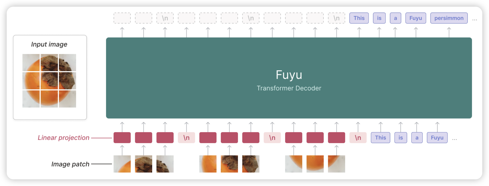

最近Apple出了自己的30B多模态大模型，涌现出了多模态的in-context learning效果，论文里一句"even better"让我想到库克那个嗓音……作者说明了很多在训练中收获到的经验教训，这是我最近几个月看的写法最清楚的一篇论文。正好借此讲讲多模态大模型：目前学界大火的VLM，到底是怎么跑的？

<!-- more -->

## Introduction

作者团队来自苹果，看来苹果说的"今年wwdc上大模型"真有希望了？

在pretrain models领域，大家一直都想把之前的所有任务的数据整合到一起，把之前一堆独立模型做的事情统一到一个模型里面,由此诞生了LLM技术。最近大家关注的重点开始转向多模态：除了文本领域的任务，能不能同时把和图片理解相关的任务也统一进去? 具体来说，如果输入同时含有图片文本，多个图片文本交错排列，模型能不能在理解图片和文本的基础上，输出文本。这就是MLLM(multimodal LLM)或者VLM(Vision-Language Model)

虽然学界、业界在这方面的探索不少，但已有的工作基本都不够开放：要么就是闭源模型给个API，要么就是开源模型只给个权重。即使有些工作会开源数据，但是没有人会开放讨论他们对于模型结构的选择、对于训练数据的选择、对于训练超参数的选择以及背后的原因。

作者在本篇工作中开放的讨论了所有的细节，结论简单来说就是以下几点：

1. 在模型结构方面，下面几个要素的重要性递减：vision-encoder的分辨率、vision-encoder大小。VL-connector选择对于最终的表现几乎没有影响
2. 在数据方面，主要有以下几种数据：text-only数据、image-caption数据、互联网文本-图片交错数据，作者发现：
   1. 互联网文本图片交错数据和text-only数据对于in-context Learning、few-shot Learning至关重要
   2. image-caption数据对于zero-shot Performance至关重要

最后，从一系列insight出发，作者scaling了训练过程，训练了3B、7B、30B的VLM，甚至在3B和7B规模下尝试了top2的MoE架构，并在各个层面上达到了SOTA的效果

> 除了没开源weight，基本全给你了……

## VLM长啥样？

目前的VLM基本都是分三个部分，如上图的左图：

1. image-encoder，负责把图片编码成为embedding，同时尽可能不要损失信息
2. VL-connector，负责把image-encoder的输出做一些转换，比如MLP，对齐到LLM的word embedding空间
3. decoder-only LLM：把上一步的输出直接作为多个Token的Word embedding输入，然后跑后面的LLM next-token-prediction。会在text输出的部分计算loss

### Image-encoder

image-encoder一般也是transformer，是一个ViT。他首先会把图片按照从左到右、从上到下切成不同的小正方形，打成多个patch，每个patch的分辨率都是比如14x14。接下来每个patch会使用一个卷积层编码成为一个vector，然后多个patch vector拼在一起当成多个“token”的word embedding，加上position embedding后直接进入transformer encoder，输出会是每个patch一个hidden state。

这个encoder有两种训练方法：

1. contrastive loss: 大名鼎鼎的CLIP。找到一大堆互联网上的挨着的(图片-文本)对作为正样本，然后随机其他的对作为负样本，然后用刚才的ViT作为image-encoder，用另一个比如T5之类的作为text encoder，拿到两个embedding，跑对比学习的loss：希望正样本-正样本之间的cosine相似度大于负样本-正样本之间的cosine相似度
2. reconstructive loss：这个就是传说中的VAE。用ViT编码完了以后会把图片变成一个embedding，为了保证这个embedding尽量信息无损，会后面再接上一个image-decoder去预测原来的图片长什么样子。预测的越准loss就越小。为了防止模型去memorize每个image的样子，还会有个辅助KL loss去保证所有image的embedding在embedding空间的分布尽可能均匀

这两种方法有个特点：都是无监督的，只要有一大堆数据就能起效果。前者需要 (图片-文本) 对，但有个好处是数据可以自己合成，可以人工在text-caption上加上各种丰富准确的细节来提高训练的要求，进而增强模型。后者只需要一大堆图片，在一些dense的任务上表现更好

作者在这里做了消融实验，最左边那列AIM是reconstruction loss，CLIP是对比学习loss。architecture基本都是ViT，H的参数量比L大。image Res代表的是训练的时候的训练数据的图片分辨率都是多少。Data是指用什么数据做的训练。

明显可以发现：

1. image res这个变量对最终的效果差距最大
2. 在CLIP中加入合成数据(VeCap)，会提升模型表现
3. 两种loss基本都不咋影响效果，都差不多

作者最终选了CLIP + 高清encoder

### Vision-Language Connector

这一部分就是输入image-encoder的output，转换到Word embedding空间，这里面有个至关重要的问题：一张图片应该转换到LLM里的多少个token？

1. 显然token更多，保留的细节更多，模型的效果理应更好
2. 然而，当token多的时候，尤其如果是多个图片(8个、16个)，很多个token其实训不起来，资源消耗太恐怖了

作者在这里消融实验了一个image对应64、144 token两种情况，然后尝试了224、336分辨率的image-encoder，以及不同的pooling策略，大致有这么几种实现：

1. Average Pooling: 由于Vit的token数大于目标token数量，就把相邻几个patch hidden-state取平均数，变成一个embedding，让数量变得一样了。再给每个token过一个MLP，作为LLM的一个token embedding
2. Attention Pooling：作者觉得vit的输出可能和llm的word-embedding不在一个子空间，需要一个Attention层变换一下。于是就加一个额外的Attention层，初始化k个query向量，然后用key、value变换阵把ViT的输出对齐过去(Attention输出在sequence-length维度上和query的长度一致)。这样Attention的输出就是k个token embedding，然后k可以取64、144，就对齐过去了
3. C-abstractor: 把输出用某种卷积层操作(ResNet)转换到word-embedding空间

作者对比了一圈发现：vision token和image resolution最重要，几种不同的pooling策略几乎没区别。即使在一个test set上好，在另一个上可能会更差

### Pretrain-data

最后，作者探索了pretrain数据对于结果的影响。这里有个歧义："pretrain"并不是真正的预训练。作者这里实际上会选取一个预训练好的LLM作为text-only decoder，然后选取一个在CLIP对比学习loss上预训练好的image-encoder。把他俩用一个新初始化的VL-connector拼在一起。把这个叫做"start training"。所以这里探讨的“pretrain data”单指VLM启动训练后的"pretrain"

VLM的pretrain-data基本分为三种：

1. image-caption: 正常VLM的预训练数据，也就是刚才CLIP里的图片文本对。作者会输入图片，让模型预测caption
2. interleaved image-text: 从互联网上爬下来的语料。这里面都是图文交错的数据，作者直接把文本提取出来，在正常图片的位置放上图片，让模型预测所有文本的next-token-prediction
3. text-only：正常LLM预训练的数据，基本上是去掉图片后的互联网语料，以及github之类地方爬下来的各种代码，以及找到的一大堆各个学科的教材啥的

其中，image-caption数据分为正常版和合成版本。所谓合成数据，就是用GPT-4v或者其他什么开源模型(这里说的VeCap用的vicuna，是一个Llama在gpt-3.5的输出上做过SFT的版本)，要求他给图片生成一些非常详细的caption，包括里面所有Object以及他们之间的位置空间语义承接关系之类的。

如果大家看过前几天写的DALL.E 3的笔记 ，就知道正常的html里来的图片文本对的alt-text质量有多差，所以需要重新clean，去重写等等

作者在这一部分做了最多的实验，因为在LLM领域现在大家也普遍认为数据是影响结果最重要的因素，大致发现了如下结论：

1. interleaved data is instrumental for few-shot and text- only performance, while captioning data lifts zero-shot performance。作者猜测是因为互联网交错数据天生具有一些in-context Learning的性质
2. text-only data helps with few-shot and text-only performance
3. Careful mixture of image and text data can yield op- timal multimodal performance and retain strong text performance.
4. Synthetic data helps with few-shot learning.

最后，作者公布了花了很多钱试出来的配方： caption / interleaved / text-only = 5:5:1

## MM1

### pretrain

由上面的结论，作者把训练做了scaling，选择了如下方案：

1. CLIP loss的ViT-H，378x378分辨率
2. 144 token，c-abstractor模式的VL-connector
3. 5:5:1的VLM pretrain-data

作者在 9M, 85M, 302M, 1.2B几个规模上做了超参数搜索，并认为学习率$\eta$应该和模型规模的对数成反比，由此预测了30B模型的最优Learning rate=2.2e-5。然后weight-decay $\lambda$是lr的1/10
$$
\eta = \exp(-0.4214\ln(N) - 0.5535)\\
\lambda = 0.1\eta
$$
另一面，作者还尝试了MoE架构，用了Mixtral-8x7B那种经典的top2 router，在3B和7B LLM规模上做了实验。3B是每两层加一个64选2的FFN，7B是每四层有一个32选2的FFN。这些FFN都是从最开始的dense FFN初始化的，随着router的训练逐渐变得差异化了。为了稳定训练，作者还加了一些平衡routing的loss

> 这方面，似乎Mixtral 8x7B report说他们没加任何其他loss，也可以正常训练？不知道是不是VLM领域有新的bug

作者发现，这样训练出来的MM1系列模型，在所有规模上基本都是目前最好的VLM。然后MoE可以让Performance "even better"

### SFT

目前的公认解决方案，都是在Pretrain完以后，把能找到的学术任务拿过来造一个大号的数据集，让模型做一下supervised finetuning，再找一大堆chat数据让模型学着遵循人类乱七八糟的指令（比如"只能回复emoji"），最后再在测试集上测试效果

类似的，作者的SFT数据构成三部分：

1. 学术数据集转换来的数据
2. GPT-4v生成的给予图片的qa chat数据
3. text-only，训练正常LLM时使用的SFT数据

所有数据掺在一起，SFT阶段随机喂数据。他们尝试了更高级的策略，发现效果基本没提升，就用了这个最简单的招

### high resolution

测试的时候，还有问题：1)测试数据很多有巨多图片输入，或者需要8-shot in-context样本，这就需要最少8个图片。2)很多图片清晰度巨高，比如3840x2160分辨率。

这方面，有一个解决方案：Sub-image decomposition, 比如对于1344×1344的图片，作者分成5张图丢给模型，每个都是672×672。第一张图是降采样的， 后面四张分别是左上角到右下角的局部

> 这里有个trick：这里的复杂度不是$n^2$,而是$n^4$。一个大图片会变成$n^2$个token，后面LLM本身又以$n^2$的复杂度跑前向，所以这个算法把一个大图变成5个小图实际上是省的。

作者通过这个方法可以支持任意分辨率的图片，实际上最高到1792x1792还是会崩。然后作者对比了SFT阶段的效果，发现了几个核心：

1. image 分辨率对效果至关重要，如果输入的分辨率本身不高，怎么训练效果都不行
2. VLM的预训练对效果很重要。作者把预训练各个阶段的ckpt都拿过来做了一次SFT实验，发现VLM预训练越久，对应的SFT Performance也越好

另外，作者发现即使SFT数据全都是单张图片输入的，MM1还是具有多张图片输入时的in-context推理能力。并且，在Pretrain阶段探索到的insight，对于SFT阶段的Performance仍然成立。最后，作者在附录里展示了很多MM1的case，感觉这个模型的效果是真的很不错

> 要是开源就好了

## 我的思考

1. 我印象中MM1是第一个正式描述自己的多张图片、图文交错情况下的in-context Learning能力的模型。我感觉这个能力对于多模态的Agent很重要，目前我看到的一堆multi-modal的ReAct算法，都是把history用文本的形式拼到prompt了……感觉不是真正的multi-modal agent
2. 另外最近有一些别的模型，比如Fuyu是一个decoder-only架构，图片的patch embedding不用走vit，直接在一个大decoder里走一次。代价是要重新预训练，好处是跑的很快……不知道哪种才是最好的方案，我猜目前这些方案是因为大家可以直接拿一个llama过来当LLM，效果比较稳？

