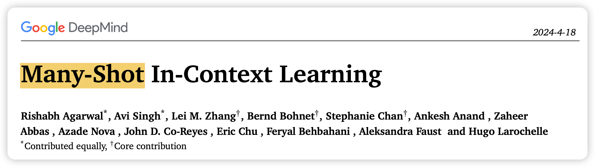
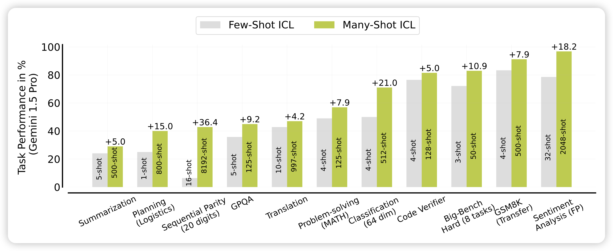
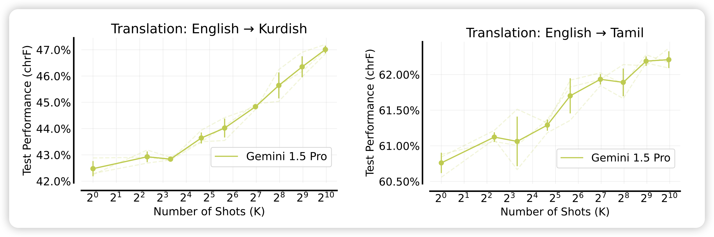
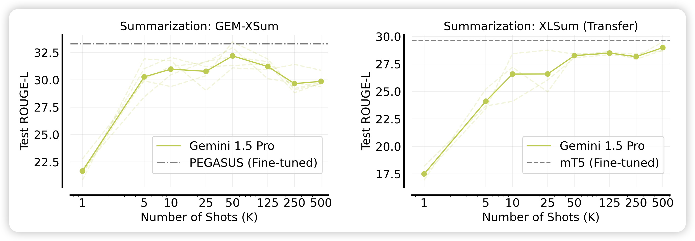
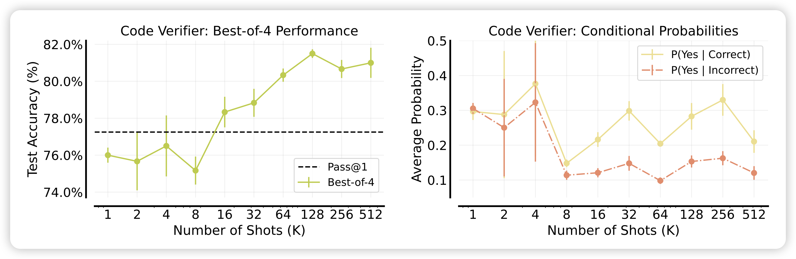
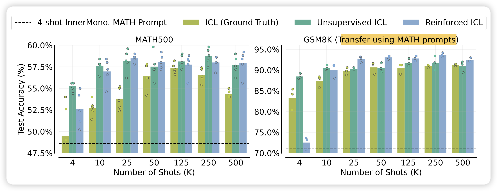
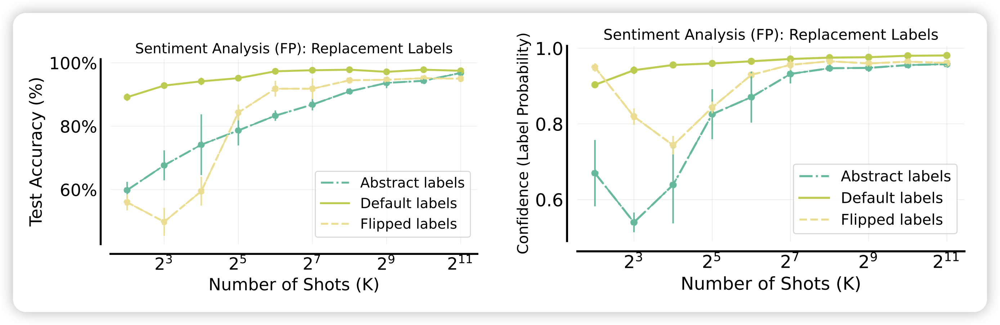
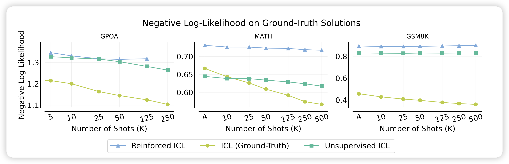
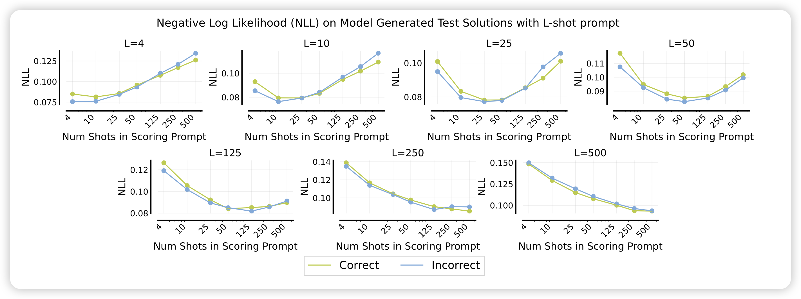

今天来讲讲[Many-Shot In-Context Learning](https://arxiv.org/abs/2404.11018)，大概是deepmind一个月前的文章，读下来和之前Jason Wei那篇"Large Models do In-Context Learning Differently"的阅读体验有点像，是一篇"暗合scaling天意"的文章。

看完了我把他和另外两篇论文联系了起来，想到了未来LLM在context重建AI的可能性。最后，推荐大家读一下原文，deepmind论文就像乐高，阅读(拼搭)体验一直很好……

参考资料：

> Many-Shot In-Context Learning
>
> Many-Shot In-Context Learning in Multimodal Foundation Models
>
> In-Context Reinforcement Learning with Algorithm Distillation

<!--more-->

作者团队来自Google Deepmind

## introduction

这篇论文方法上没什么好说的，大家都知道in-context learning: 把一个任务的很多input-output pairs放在prompt里，然后模型就可以在不更新自身参数的情况下，"现场学会"一个任务，并对最后给出的input预测出来结果。

从high-level的角度讲，我觉得这个能力是因为模型学会了所谓的”world model“。传统的AI领域，大家一般会建模出来一个任务，作为输入空间到输出空间的映射(比如情感分类)，$f: \mathcal{X} \rightarrow \mathcal{Y}$，接下来考虑如何训练一个模型$f_\theta$可以做好一个任务。对于LLM来说，从instruction tuning开始，大家开始认为整个世界就是一个$\mathcal{X}$，所有的所谓任务都只是从$\mathcal{X}$​里面的一个采样，因此只需要学会一个$f_\theta(\mathcal{X})$就可以表征所有的任务，in-context learning正是从这个情况下涌现出来的能力。

作者考虑了一个现实的问题：之前的in-context learning评测几乎都是3-shot, 5-shot, 8-shot。但是今天的LLM已经可以把自己的context拓展到128k，甚至10M(gemini)。那么，有人试过用更多的样本放在prompt里，效果会更好吗？作者把这个setting就叫做manyshot场景

作者测试了gemini在不同场景下的manyshot表现，发现几乎都比few-shot场景效果好很多。

为了解释这个看起来有点神奇的现象，作者又定义了两个阴性对照和阳性对照的setting：

- reinforced ICL：先自己生成一堆input-output，然后根据output正确性筛选出好的样本作为shot
- unsupervised ICL：模型生成一堆input，不拼output，看看能不能提升

## Performance

作者在各种场景下尝试了many-shot，然后报告了效果随着shot增加的变化情况，可以看到，几乎在所有场景下，提升shot的数量都会让效果变得更好。

作者为了进一步探索这个现象，尝试了上面提到的reinforced ICL和unsupervised ICL

并且发现比起用ground truth样本作为ICL样本，模型自己生成的样本甚至效果要更好。而且，这种样本是可以迁移到别的任务上的，右边的图是用MATH数据集生成的样本来作为GSM8K的manyshot样本。

为什么unsupervised ICL效果很好，难道只需要看到一些query？作者类似于之前那篇weak-to-strong的思路，给了一个基于直觉的解释：如果模型本来就会做目标任务，可能只需要用一些query帮助他”联想“到预训练数据中的一些知识作为锚点，来让他在做现在的input时发散更多的知识。

从这个思路出发，对于数学这样的场景，预训练见过很多了，可能非常需要这种”联想“。

还有一个最有意思的实验设计，和大家分享一下啊：作者想要证明，manyshot的效果来源于去掉了预训练数据中的bias。如果大家想证明这个结论，该如何设计实验？

作者类似于之前那个"large model performs ICL differently", 找到了一个情感分类任务，设计了对照组：

- flip：把标签反过来，即positive变成negative，negative变成positive。这个和预训练知识相反，模型不得不在context中学习
- abstract: 把所有的标签变成A、B、C这种没有语义的东西

通过这两个对照，作者就能勘测出预训练bias对效果的影响，作者发现：最开始，两个对照组的准确率都不太行，但随着shot增加，三种方法的效果最终收敛到了同一水平。这说明：manyshot场景可以逐步削减模型对于预训练和下游任务的理解偏差，进而提升任务的效果。

最后，作者报告了一个解释不了的现象：随着shot增加，作者看了ground truth的ppl，发现越来越低。但是，如果统计acc的话，实际上250-shot场景的acc是不如125的。在predict-scaling这个领域，大家往往喜欢用更弱的模型预测更强模型的效果。从scaling曲线上讲，随着几乎$ppl \propto \log (N-shot)$，预测ppl似乎是可行的。然而，更低的ppl却不能带来更高的得分，这和传统benchmark场景的结论相反。

> 为什么会这样？我想起来之前在读[Teaching models to express their uncertainty in words](https://arxiv.org/abs/2205.14334)中作者提到了ppl和1)模型对答案的信心值2)模型表达这个解答过程的信心值都有关。我们可以思考一下many-shot场景，当前面拼了非常多的样本时，模型对于1)和2)的信心值会倾向于更高还是更低呢？同样的，如果模型对于任何答案的信心值都变得更高了，那么可能就更难以区分出好的答案和坏的答案了

对于上面的问题，作者在附录中还给出模型对于正样本和负样本的NLL。可以观察到，总体而言，似乎样本越多，模型越没法使用NLL区分正/负样本

## 几个问题和我的思考

看完这篇论文确实收益良多，不过我似乎产生了更多的问题，不知道大家有没有类似的感受。

### 最像样本相似度

首先，我有另一个视角去理解这个现象：我们如果统计manyshot样本中和当前query embedding最像的top1 similarity。然后画个散点图，其中横坐标是top1 similarity，纵坐标是正确与否，然后给每个横坐标区间统计平均正确率，变成柱状图。即样本越像，acc越高。而且，我感觉对于所有shot的场景下，这个柱状图可能会遵循同一个分布……这符合大家对预训练模型的认知："LLM can't perform zeroshot, performance depends on shots in training data "对偶的说法就是"LLM’s manyshot performance depends on similarity of the in-context examples"。不过这个视角解释不了另外一个现象，就是few-shot场景下模型表现对于few-shot样本顺序的敏感性

### 和finetune的关系

再有，如果我们有1024个样本，传统的视角下，我们肯定会想要finetune，但这篇论文可能是只能访问API，没有对比finetune的baseline……如果我们相信了前文对于”概念和联想“的直觉解释，那么finetune Gemini对于Gemini到底意味着什么？

>  传统AI中，会任务finetune是在学习知识，或者说找到更泛化的概念。但是，如果LLM本身就具有泛化的概念，是否finetune这个过程只是帮助模型建立几个"思维的锚"呢？

这让我想起来曾经在delta tuning看到有个领域叫”Intrinsic dimension“，他们试图找到模型最少可以在更新多少个参数的情况下，达到全参数微调的效果的90%，并把这个数字叫做LLM的Intrinsic dimension(ID)，他们发现基础能力却强，ID就越小。这是不是从某种程度上支撑了上面的猜想：越强的模型，本身的retrieve能力越强，就越不再需要很多所谓的"联想锚点"，可以直接从当前instruction里做联想。

另一个领域是之前的weak-to-strong generalization，他们使用带噪声的数据集训练GPT4，发现GPT4自己把数据的噪声恢复了，在测试集上效果还是很好。这是不是也说明，可能answer并不重要，关键是激发一下模型对于问题的理解。也就是说，如果在weak-to-strong场景下，只在query上加loss，会不会都不用answer模型就学会了？

> 甚至可以开展一个实验，比如我有5000条数据。其中100条我在answer加loss，剩下4900条我在query加loss，这样训出来的模型和和正常训练的模型，效果上也会有个PGR(performance gap recovered)吗？

### 在context中重建传统AI、甚至世界知识

最后我想说的是，这篇工作让我发现，随着context的增加，大家其实可以在context中重建传统AI算法。这篇论文在context中添加非常多的样本，叫做manyshot，其实和传统RL中的finetune有点像。我们抽象的看，就是Gemini在接受到这些样本以后，自己抽象出来了一个"完成这个任务的模型"。

Gemini-1.5 report里其实就做了类似的东西：他们找到了一门叫做**Kalamang**的罕见语言，网络上肯定找不到资料。让模型看完这个语言的字典，发现Gemini就可以翻译kalamang了。所以，如果模型有很强的智力，他有能力通过context去理解世界。

> 这是一个很恐怖的事情：试想，如果某一天来了三体人，他们的三体模型甚至不需要微调，只是(和人一样、纯前向地)看了一下人类世界的一些语料，就可以像人一样完成人可以完成的所有事情。

在学界，其实有一些类似的工作：

- RL：deepmind曾经做了一篇叫"in-context RL"的工作，他们会把ppo、dpo等算法训练的过程记录下来，丢到一个context里，让一个长模型在这个上面做建模，看能不能进行”algorithm distillation“，学到比原来的算法更高效的"rl算法"。不过这篇论文是训模型的工作，如果我们context很长，我能不能把"一次rl训练过程”作为1-shot，然后进行manyshot，模型就可以learn to learn rl in-context了呢？

- Align: 进一步地，之前yuchen lin有一篇工作叫做[The unlocking spell on base llms](https://arxiv.org/pdf/2312.01552)，发现其实只需要找到一些in-context样本，就可以让模型在很多case上"看起来像是做过rlhf"。如果模型的context够长，我用manyshot的形式把alpaca-52k丢进去，模型就能做好rlhf吗？

  > 从这个思路继续思考：所谓的"人类偏好"到底激发出了模型的哪些"思维锚"？

未来，随着LLM的context越来越长，可能我们现在的所有传统算法(比如推荐)都可以被模型通过in-context的方式去解决。可能rag也不复存在了……"long-context LLM is many-shot learner, and zero-shot world model"
