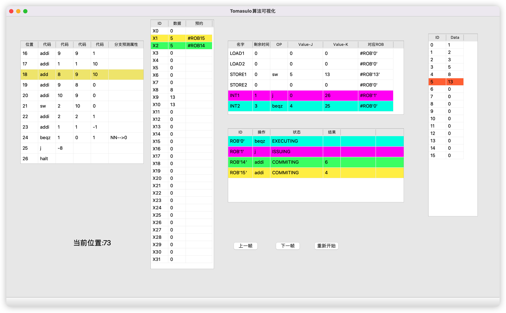

​		

​	之前对这个课的印象就是：

> 后半学期每节课只有6个人去

​	后面实际上下来感觉没有说的这么阴间。感觉还是挺对不起老师的。就去过两节，由于没有录屏也就没有拟合过上课内容。考试前一天晚上熬夜拟合了所有的PPT，做了往届题就往上怼了。但最后考试难度还行，只能说逃过一劫。

​	这个课有个午餐会，和老师吃了一顿饭，老师在课上猛批了一下子人工智能，安利了一波做编译和做体系结构。后面和快手小学期的老师聊，发现行情和他说的倒也大差不差。总之，这个老师比较喜欢夹带私货，人还挺好的，爱好多，上课也认真。

## TL;DR

一个方案、一种架构、一种机制，如果给人以简洁美、线条美、层次美，那么它注定就是好的。

## 课程内容

这个课给我的感觉像是”大合集“，里面的讲的大多数内容之前都学过：

- 基础知识部分，讲了编码方式：汇编小学期讲过 X86,mips,造机学过riscv32编码
- huffman编码：新生研讨课讲过
- 讲cache原理：造机课讲过，而且实现了一遍
- 讲流水线：
  - 普通流水线：造机课讲过，而且实现了一遍
  - 多功能流水线和调度：这个是新活，猛画自动机
- 讲令牌环与tomasulo，硬件指令级并行：这个是新活，好神奇，学完以后感觉”怎么造机的时候不知道，要不然实现一遍肯定很好玩“
- 循环展开与软件指令级并行：编原讲过一些编译优化，但没讲循环展开。循环以后感觉”没我想的那么复杂“。

> 上学期mini-decaf我开了一个编译优化分支瞎搞，当时循环展开我想的是：有些确定性的循环可以直接预计算完，这个是循环展开……

## 课程评分

55分考试 + 15分大作业 + 10分小作业  + 5分书面作业 + 10分雨课堂

- 大作业是三选一：tomasulo实现、分支预测软件卷性能、树莓派实现硬件tomasulo。都还行，”硬件“实验也没有造机硬，我选的是软件实现tomasulo，大概长这样。

- 小作业是cache测量，通过一些侧信道观察方法，找到一些电脑本机的cache配置。这个实验我觉得很有意思，虽然实际执行起来好像同学们有很多歧义，我打算写一个blog讲讲这个实验。

    

- 书面作业对着PPT和课本拟合一下就行
- 这学期考试挺简单，基本都是基础的内容。
