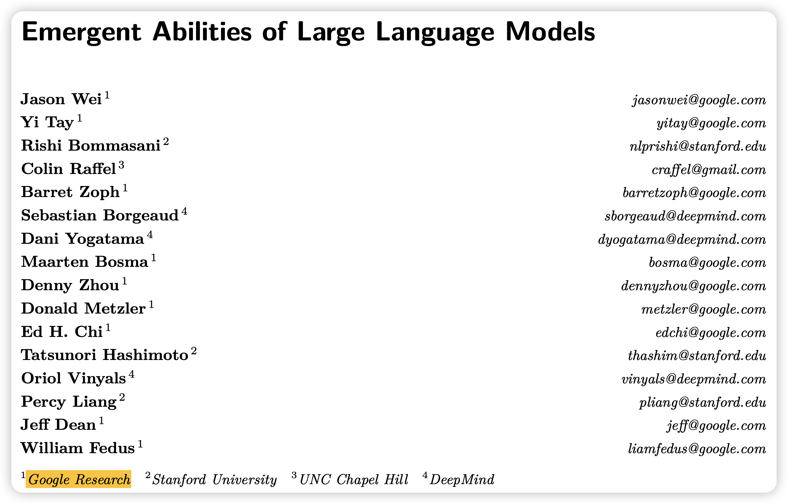
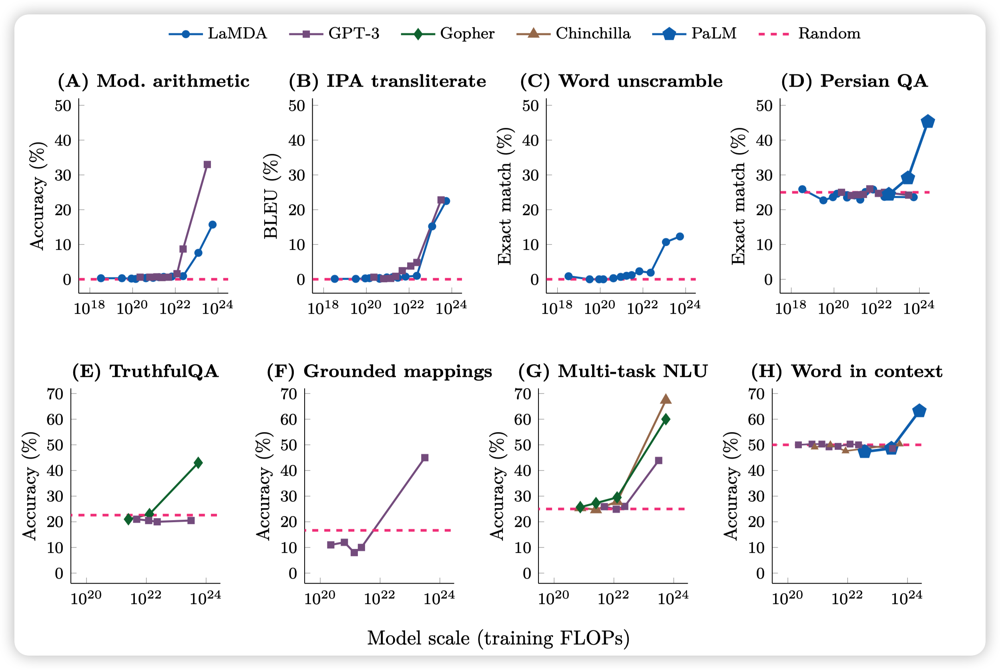
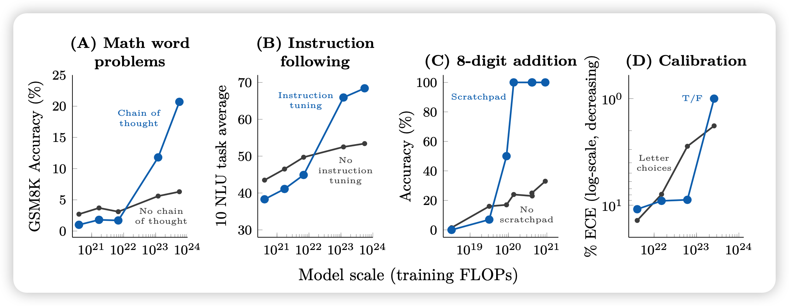
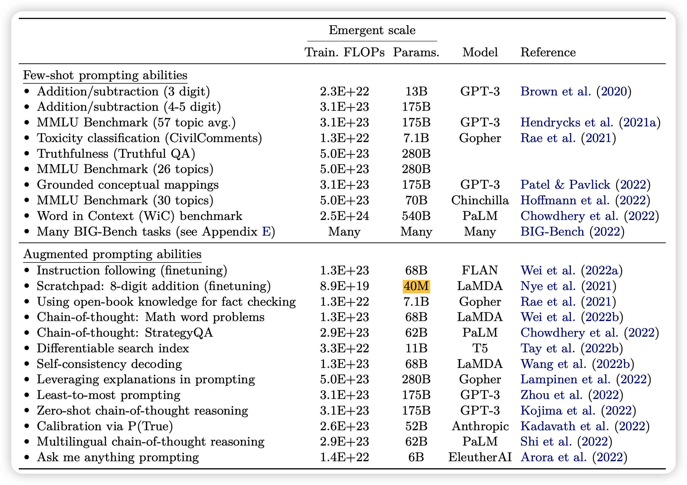
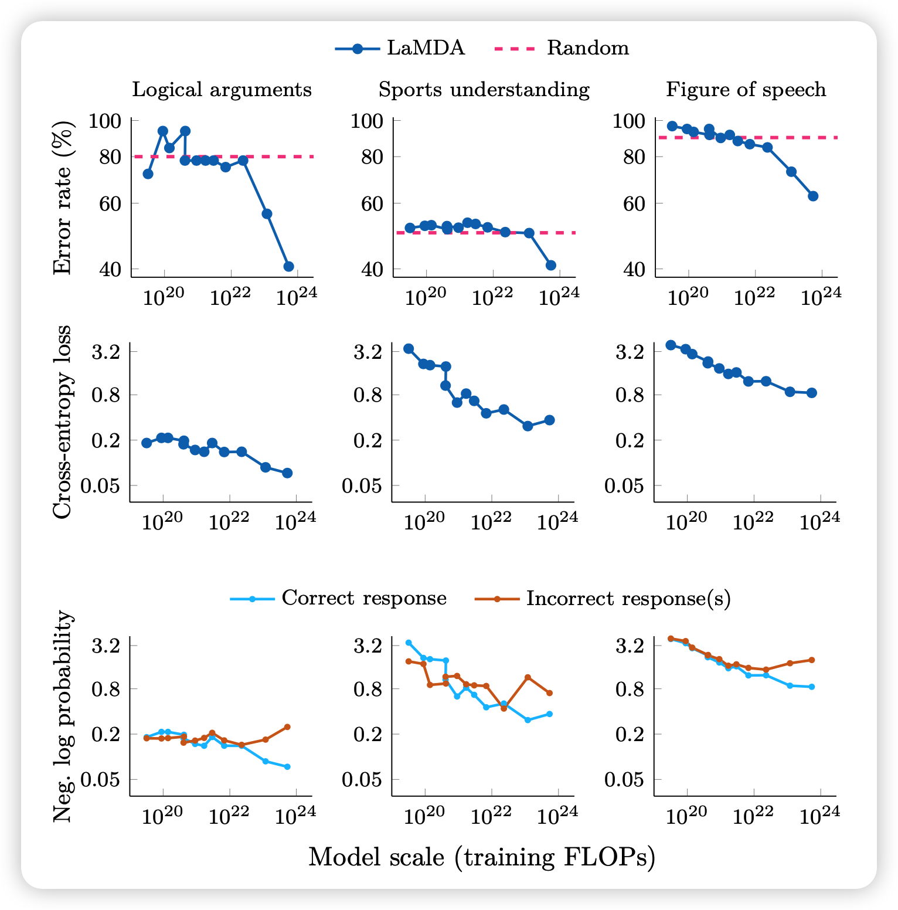
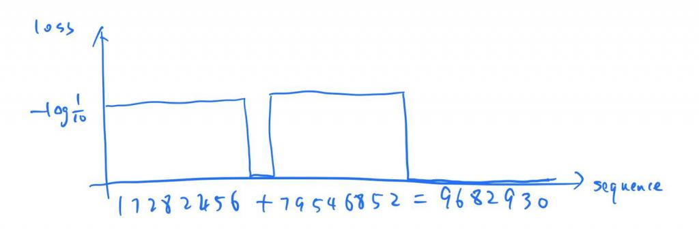

之前看了阿西莫夫的小说《最后的问题》，里面讲到了宇宙里最令人绝望的定律”熵增定律“。今天讲讲人工智能领域最让人绝望的规律”emergent abilities“，在结合最优传输说说我对这个现象的理解，最后聊几个有趣的话题。参考：

>Emergent Abilities of Large Language Models
>
>Can LLMs Critique and Iterate on Their Own Outputs?
>
>压缩下一个token通向超过人类的智能

<!-- more -->

## 定义

所谓的emergent ability，就是说大模型的很多能力不是随着规模一蹴而就的，而是当到达一定程度以后，突然间”爆发“出来的，就像是诺奖得主Philip Anderson说的

> Emergence is when quantitative changes in a system result in qualitative changes in behavior.

这种现象是不符合scaling-law的，也没有什么合理的解释。

这个现象其实之前大家都有一个模糊的认知：

- prompt、few-shot-prompt方法为什么只对很大的模型有效？

- 类似toolformer为什么只有6B模型才效果好？
- instruction tuning类的方法对于<10B的模型是负作用？

在Google research的这篇文章中，作者详细探讨了这种现象。这是一篇分析性文章，我最喜欢读分析性文章了，读起来能感觉到一种人类智能(而不是人工智能)的魅力。

## 实验

作者一共做了两大类的实验。

### few-shot prompt

这类是说对每一个任务，给一些样例输入输出对作为prompt，然后执行任务。具体来说，作者统计BIG-Bench，truthfulQA，Grounded conceptual mappings和MMLU等场景，有一种充斥着工作量的美。

最后得到了这张图

这个图里面每个都是一种任务，纵坐标是metric值，横坐标是FLOP。

> FLOP是训练资源的表示，基本上正比于花的钱。模型size大，同样的前向就FLOP多。训练看的语料多，需要的FLOP也多。类似Chinchilla的论文里面详细探讨了同样FLOP下扩大size、提高看的token数量谁更赚。这是一个开放性的领域，不在本博客的讨论范围。

然后红色虚线是随机猜测的结果，剩下的是几个经典模型的不同版本的结果。

从图中我们可以看到，基本上FLOP小的时候，模型在很多任务上都处于一种随机猜测、甚至不如随机猜测的水平。

但当训练规模增大到一定程度以后，表现突然就”涌现“了，变得很好。这就是emergence现象。

### Augmented Prompting Strategies

除了最简单的few-shot prompt方法以外，学界还有一些进阶的效果增强方法

- chain of thought(CoT)是说模型在做数学题的时候自己先生成一些思考、生成一些中间步骤，再一点点做
- inistruction tuning是说模型要做一些参数更新，使得可以更好的follow人类指令。这个需要提前做出一些instruction的数据集
- scratchpad是一种tool learning的方法。和CoT类似，也是生成中间步骤，但这个”中间步骤“是可以和tool交互的，比如写了python代码就可以真的执行
- calibration是说模型在回答完问题以后，自己对这次回答评价一下。比如说可以用这个回答是不是"True"的token概率表示。一个牛的模型，它自己的回答信心和实际的正确率是强相关的。

从图中的结果我们可以看到

- 对于垃圾小模型而言，这些进阶方法不仅没用，还是副作用
- 当训练大到一定程度以后，突然间这些方法就变得特别好使

这就是emergent ability

这里作者还详细给出了每个实验产生emergent的阈值是多少。

> 这里可以看到，tool learning方法是scratchpad的阈值比别的方法低几个数量级。这也许侧面说明使用工具是大模型的下一步方向？

在这篇文章中，作者也探讨了emergent的原因。目前没有什么公认的原因，作者给出几点猜测和验证方法：

- 也许和训练数据集memorization有关。这一点也许可以参考之前另一篇论文。大概说的是随着模型规模增大，模型记住只见过一次的数据的概率会增大(最多能到大概5%)，这可能和模型规模增大以后的稀疏性有关，这是另一个研究领域了。
- 可以尝试任务拆分，观察随着规模增大，子任务的效果有没有emergent，以及主任务emergent和子任务的关系

这些都是很好的研究方法，我个人也对这个问题很感兴趣。我认为，理解大模型emergent的原因和逻辑，也许是我们找到四两拨千斤，用更小的资源实现更大智能的关键。毕竟，扩大训练规模肯定会撞到硬件瓶颈，撞到瓶颈以后还没有”emergent“出来的能力就寄了。

> 1.值得一提的是，目前BIG-bench还有巨多任务至今模型也没emergent出来

> 2.另外，目前的国产大模型据我观察，都没有达到emergent的阈值。也许真的和训练数据有关，more code data is more intelligent?

此外，作者在附录中也做了cross-entropy loss和规模的关系

可以看到，cross-entropy-loss还是比较符合scaling-law。但performance为什么会emergence，就不好说了。

## 我的理解

以下内容是我对于emergence的一点学术理解，没有正确性保证。

之前看了一篇文章，是讲最优传输的。举个例子，如果你要传100个token，每个token都是从256的词表里的，一个朴素的方式是用8位2进制数来存储一个token，对方打表恢复。最终需要 $8*100=800$个token

大模型(auto-regressive类型)是在做什么事情呢，其实是在压缩这个长度。举个例子，假如两边都有这个模型权重，然后模型输入前缀以后，是要给next-token概率分布的。

假如现在模型的平均cross-entropy loss是3，什么意思呢？
$$
\text{cross-entropy} = - \log \text{soft-max} (\text{hidden-state}(x_i,x_{<i}))
$$

$$
\text{soft-max}(x_i) = \frac{e^{h(x_i)}}{\sum_{j \in \text{vocab}} e^{h(x_j)}}
$$

如果把softmax以后的logits当做模型的真实输出的话，相当于有个概率分布，其中真实的那个token $x_i$占了总体[0,1]区间的$\frac{1}{e^3} \simeq 0.05$的比例。这是什么意思呢？

假如说我们用一个二分查找的方式来存储token：从0.5出发，小了就变成0.75，大了就变成0.25这种，直到这个数字落到对应token对应的区域内。这个比例说明，二分查找大约需要3次就能落到正确的位置里。最后比如走的是”左右左“就能编码成”010“

**换句话说，一个token大约只需要3位就能传输**。这比起之前的8位就优化太多了。

> 用这个角度，我们其实还可以大概预判模型的初始cross-entropy loss。比如一个n分类问题(标签平均分布)，如果没啥意外的话，初始loss 大概就是 $\log n$

所以说，模型的Autoregressive训练任务(cross-entropy或者ppl)，其实就是在显示地进行模型对于数据集压缩率。没有所谓的”世界知识“学习的过程。

那么模型为什么能得到”世界知识“呢？我们先入为主的引入一个归纳偏置：只有本身理解世界知识，才能更好地压缩token。举个例子

> ”中国的首都是北京“这个串，如果你提前知道这个知识，最起码"北京"这个词的logits肯定很大，很简单就能压缩。

那么？压缩率有没有上限呢？有！因为数据集本身就是不确定的。比如说上面那句话，"首都"这个词上帝来了也预测不出来，谁知道你这里是要说”首都“还是”国旗“、”主席“或者什么其他别的词。这个例子也说明，只有更多的上下文，才能更好、更优的建模后文的token。

用博客里的图就是上面那张：一个代表加法的串，只有结果是确定的，输入谁来了也预测不了。所以说我们的模型压缩是有上限的，这个上限和数据集有关，和模型、方法无关。

某种意义上，这个和密码学是相反的

> 密码学研究怎么编码数据让别人猜不出来，LLM研究怎么编码数据自己可以更好的猜出来。

**但这和emergence现象有什么关系呢？**

我们思考一下，假如”你现在假装是大模型“，你该怎么提高数据压缩率？

- 最简单的方法先记住一些pattern，把一些词联系起来：比如”混元形意“后面大概率跟着”太极门“；”松果弹抖”后面大概率跟着“闪电鞭“。这个过程其实可以理解成”学会了世界知识“。
- 这个时候loss降一些了，但cross-entropy还要求你降，咋办？这个时候模型就必须找点别的办法了：比如逻辑推理。这在代码串里尤其有用，你只靠世界知识显然没法压缩代码数据。必须得学会一定的推理才可以。
- 想学会推理，是个随机事件。我们想想人是怎么学会推理的？你大概率也说不清楚，这是智能的一个附加产物。但对于transformer结构来说，最起码有一些点可以确定，如果模型层数少，那肯定不能实现推理，因为没有足够的空间去计算。

> 参考自动机理论：没有栈的只能做有限状态自动机DFA的任务；一个栈就能做下推自动机PDA；含有两个栈就能执行图灵机turing machine任务。计算能力上限和空间关系很大。

所以说我们对这个现象有一些理解：推理能力来源于预训练任务的数据压缩要求，一个必要条件是模型大小不能太小。换句话说，随着模型规模的扩大，到某个阈值，突然间就有能力做推理了，然后一下就emergence了。

为什么prompt方法会在大模型变得有效，也是一样的：prompt是添加token总数，对于推理模型，更多的上下文就相当于是给推理malloc空间，当然就有助于做任务了。而对于小模型，开多少空间都没法推理，所以prompt当然也没用了。

- **但为什么压缩率是scaling-law呢？** 这不冲突。因为cross-entropy loss $\propto$ 压缩率。压缩率其实不是一个线性关系，你想象一下: entropy 从3降到2是提升50%，但从2降到1是提升100%。**压缩率线性下降其实就是对应能力的指数提升**。

接下来聊聊一个更哲学的话题：**意识是怎么诞生的？通过这个“数据压缩”任务有可能诞生意识吗？**

> 先叠个甲，我不懂哲学，里面用到的词我都是采取词本身的意思，我不知道会不会和哲学里某些已有定义冲突。

这个问题我们可能得回到上个世纪人工智能“符号主义”、”逻辑主义“的一些理论，希望通过模拟人的行为达到真正的智能。但其实我个人不抱太大希望，因为学习模式是不同的：

- 人是自顶向下的。我们虽然也是从世界经验中学习，但自己也说不好意识是怎么诞生的。而且驱动行为一般都是先有意志，再有行为。
- LLM是数据建模，是自底向上的。是通过压缩大量的相似数据，总结出一些规律"推理、世界知识"，从而更好的压缩后面没见过的新数据。这个观点可以被认为是“泛化性”(generalization)。
- 意识的诞生对于数据压缩有没有帮助呢？我认为，如果答案是有，那意识有可能诞生。当然，意识本身是没有seq-length的，我觉得有长度上限的”意识“其实就是CoT那种推理。

这衍生出来另一个问题，我们假设上一个问题的答案是”有“，那么就要实现一些”意识“的必要条件，比如无限的推理空间。想象一下，“人的思考是没有边际的”，这句话等价于说”意识不受到长度、空间的限制“。

这就是靠现在的seq-length架构肯定没办法，有一个想法其实就是接近CoT的：我们能不能在压缩数据的过程中额外开一些空间让模型在中间推理呢？举个例子，模型可以自由决定在压缩数据的某一个位置进入CoT模式，然后进行一些思考，接下来的token压缩就会变得更简单。通过这种”类似tool learning“的方式，其实实现了类似于”意识“的东西。我正在做一些类似的工作，感觉还是挺有意思的。

最后一个问题：**”推理“的下一步是什么？**

- 由于训练任务的特性，模型必须想一些额外的办法去进一步提升压缩率

> LLM: 谁懂呀家人们，我都想办法学会推理了，虾头cross-entropy还在那一个劲找optimizer搞我。

- 这个问题没有答案？也许LLM想到的下一个办法，是人类也想不到的呢？
  - 我的一点理解：现在的Autoregressive还是受限于从左到右的pattern，这个归纳偏置不一定只是人大多数时候的思考方式，但不一定就是对的。类似 self-correct、reflection等论文都谈到了让模型多次输出的可能性。这种建模是一种另外的方式，也许还有更多的方式。总之，想要让模型做得更好，一个劲用optimizer push模型是一方面，提升模型的表示能力的上限是另一方面。
  - 这个研究方向，也许可以参考 meta learning研究领域？

以上。
