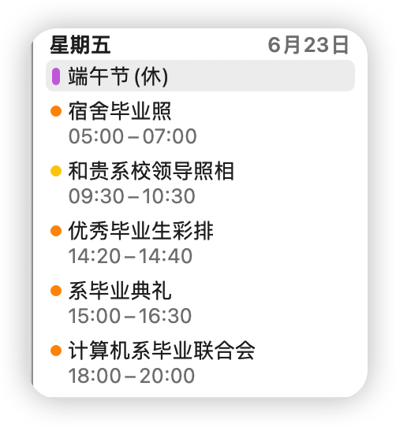

不知不觉就毕业了。

<!-- more -->

其实我是个没有啥仪式感的人，毕业的典礼等活动重点安排在了6.23-6.26，当时真的是很忙的几天，我最开始觉得很烦、耽误我科研。

但后来流程走下来觉得也挺好，似乎对华子有了点归属感。好笑的是，直到毕业才感到一点归属感。在这一点上，华子做的挺失败的，我来华子这几年确实也没培养出多少归属感：

- 从新生训练营来开始，到军训时打散班级来分成“排”，班级凝聚力的重要环节就这样丧失了。
- 军训结束大一期间大家因为分流的压力，有一种隐隐的竞争关系，其实也没什么凝聚力可言。
- 分流结束本以为会好点，结果来了贵系这边就是三把火：
  - 首先是把分流同学都分到一个班，和原本的院系同学基本不互通
  - 然后是强制要求换宿舍，闹得分过来和分过去的同学很折腾、不换宿舍但要换舍友的同学很反感
  - 最后是通知，软院那边本来一直都有辅导员通知选课时间之类的，来了这边直接没人通知靠自己发现、偷偷抢水课。我差点没选上课，算是让我对贵系的氛围有了初步的体验

> 说个好玩的，之前在树洞看到同学吐槽“贵系的同学压迫感很强”，感觉能在这种地方存活的同学，压迫感应该都挺强的吧……

- 几年就基本摆了，我连任了三届团支书(我不太想当，但因为别人都不想当)，活动也没办几个，班级荣誉不复大一的荣光，连续三年没评上甲团。班级氛围也就那样：见不到人、说不上话、只有少数一些同学给个面子捧捧场。做为班委，我也没什么成就感，估计同学也没有收获感。但听说别的院系还有同学直接质疑班委的活动组织，想想看还是感谢同学们高抬贵手。所谓人比人气死人，我们隔壁的95班就荣誉等身，一路拿到北京市优秀班集体，看来我确实没啥管理的天分
- 到最后几天，楼长一直在催着收拾宿舍、离校、给下届同学腾地方，有一种“自己已经成了累赘”的微妙感觉

除了班级氛围，院系的氛围也大差不差：一汪死水。不只是班级工作难以开展，学生会工作也是难以开展。当时开学代会换届，选代表的事情，基本上消息逐级传递，每一级都是ddl战士，每一级留给后一级的时间就更少，同学问我"为什么时间这么赶"，我只能和维特根斯坦一样笑笑，可能这就是宇宙万法的源头吧。也不怪学生会，学校决策层其实也是这样：逐级传递、逐级丢包……从班级到院系到学校，荣誉感基本都没有建立起来：之前坐出租车听着司机师傅一直说”华子和日本合作当汉奸“之类的，我也没什么维护学校荣誉感的愤怒，反而有种看乐子的局外人感觉；毕业典礼上西芹关于地外生命的讲话同学也是笑笑骂骂，总之没多少感动。

> 仔细想想，可能还是在软院那一年生活最顺心。 

院系氛围虽然很一般，但自己的小圈子还是挺快乐的。大学几年认识的人虽然不多，但相处挺愉快的。看来人文关怀不能指望院系，还得下放到个人。自己变化还是挺大的，可能比起高中时情商提高了不少，虽然高中时期的我也许、可能更适合贵系的氛围..? 最后一个学期更是加入街舞社认识了很多其他院系的同学，这是最让我感觉到贵系古怪的地方：我总觉得和街舞社同学交流似乎有某种理解壁障，和本系同学说话就没有，难道是真的"鬼系把人变成鬼"？

好像说跑题了，说回我自己的学业。可能和大多数人不同，我自己对于专业还是很感兴趣的，也真心希望可以在大学期间学到最多的、最好是不同领域的知识。我其实还是选了不少有趣的课的：

- 专业内的基本上我软硬件都有涉猎，各个研究所的课都上过
- 专业外的基本上也是很多好玩的：解刨、西方音乐史、现代舞、拉丁语、相声、意大利语、围棋……

因此，我个人的学习体验也还是不错的，大学几年的知识收获是人生中最多的几年。我在高中毕业时其实很担心自己不会编程会不会跟不上、或者上完大学也学不懂。后来发现也都能跟上，而且真的能学会好多知识。知识的海洋真的是深不见底呀。

> 很多人说贵系的课太卷、太大量。前几天和叉院的同学交流，觉得这个说法是有道理的。而且这其实是恶性循环，你卷他也卷。重点是学校的评价机制就是这个基于rank的GPA机制。听说外国很多高校因为亚裔卷的问题已经把亚裔的排名拿出来单独计算了，不和别的国家同学一起计算。其实今年零字班和书院同学一起卷名额，可能也会变成这样了。这也不能说是贵系的问题，只能说贵系的课因为比较容易在客观区分表现好坏，因此把这个问题放大了。

我自己对于大学的重心其实也是有变化的，基本上前两年是以可能成绩为主，或者说重心放到课上学的知识，有时间也愿意了解一些拓展的内容。后面就转向科研为主了，重点了解NLP方向的最新论文、代码方法之类的。不知道这对不对，感觉学校应该是希望本科期间重点学习课内知识。

> 和知识交流总是比和人交流更轻松，毕竟我不需要说话反馈，只需要看它表演就行了。

总而言之，不管什么方式、不管学到什么，最终都是走到了本科的最后，都在大礼堂前扔个帽子、笑一下、拍个照。昨天打车出校园，一边回望校门，一边听着司机师傅骂清华，心情还是很复杂的：有“永别了牢笼”的解脱感，有"回家就不能以毕业季未为由继续摆"的沉闷感，有“暂失室友、npy”的惜别、有“本科生活一去不复返”的感慨、还有"未来的宿舍、室友、生活会是什么样"的期待……没有拽词，这些感觉当时真的都有，很难描述。之前初中、高中毕业的感觉都没有这么复杂，看来是真的长大了呀。

之前听过一个说法：忆往昔说明人生差不多走到顶峰了，上升期的人总是向前看。不过对我而言，"后面"是清华本科，"前面"是清华读研，其实也没理由伤感的。前几天和室友唱歌唱了我很喜欢的《平凡的一天》，就拿这里面的一句歌词收尾吧：

> 从不考虑明天应该，去哪里；因为今夜的风，太和煦。

好神奇好复杂呀，不知道人工智能，能不能体验到我现在的感情
