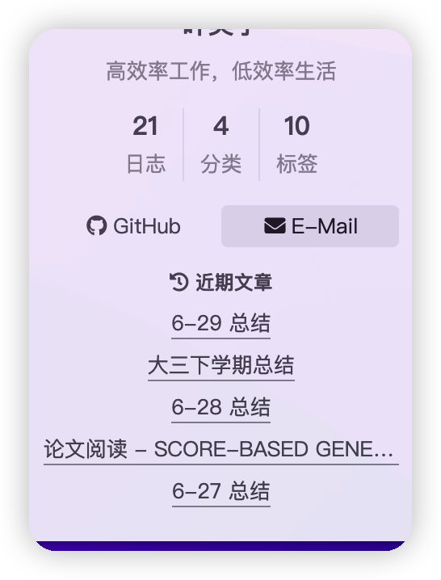
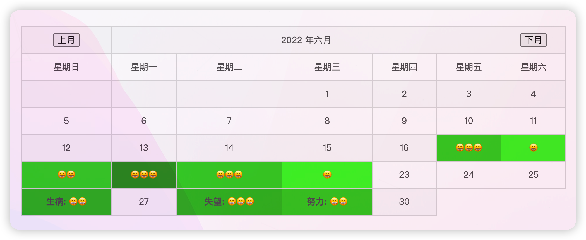

## 近期文章

今天想要在侧边栏添加近期文章，在网上找了一些已有方法，发现他们都有一个问题：

```html
{# recent posts #}

  <div class="links-of-blogroll motion-element {{ "links-of-blogroll-" + theme.recent_posts_layout  }}">
    <div class="links-of-blogroll-title">
      <!-- modify icon to fire by szw -->
      <i class="fa fa-history fa-{{ theme.recent_posts_icon | lower }}" aria-hidden="true"></i>
      {{ theme.recent_posts_title }}
    </div>
    <ul class="links-of-blogroll-list">
      
      
        <li class="recent_posts_li">
          <a href="{{ url_for(post.path) }}" title="{{ post.title }}" target="_blank">{{ post.title }}</a>
        </li>
      
    </ul>
  </div>

```

里面的循环都没有添加`toArray()`函数，不知道前面的人怎么跑起来的……最终效果如下：




## 本月更新情况添加不同月份

之前在  里面讲了怎么添加本月的更新情况。由于现在七月要到了，我们还想看上个月的更新情况，所以就添加一个按钮。简单实现一个逻辑：

```html
<form action="">
  <input type="button" value="上月" onclick="tips(-1)">
</form>
```

如果点击按钮，就触发下列script：

```javascript
<script type="text/javascript">
    var now_id = 0;
    var max_id = 0;
    function tips(num){
        document.getElementById(now_id).hidden = "hidden";
        now_id += num;
        if (now_id > max_id) {now_id = max_id;}
        if (now_id < 0) {now_id = 0;}
        document.getElementById(now_id).hidden = "";
    }
</script>
```

会把现在的id加一或者减一，然后用不同table的hidden属性切换显示……简单粗暴。需要给每个月份计算出table，然后富裕一个id。最终成品大概长这样:



